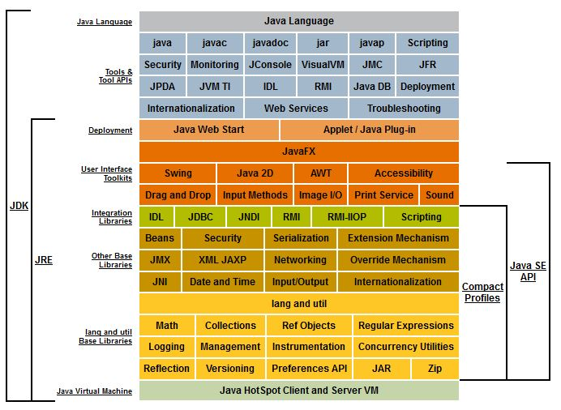

# 1장 자바 기술 시스템 소개

## 들어가며

**자바(Java)**

자바 프로그래밍 언어뿐만 아니라 여러 가지 소프트웨어와 명세로 구성된 기술 시스템

자바 기술 시스템은 크로스 플랫폼 소프트웨어를 개발하고 배포하는 데 필요한 모든 것을 제공하며, 전 세계적으로 수백 억개의 자바 가상 머신이 동작 중이다.

이처럼 전 세계의 다양한 분야에서 널리 쓰이는 이유가 뭘까?

객체지향 프로그래밍 언어라는 대표적인 장점도 있지만 이 외에도 많은 장점이 있다.

1. **Write Once, Run Anywhere**, 하드웨어 플랫폼이라는 족쇄를 제거하여 “한 번 작성하면 어디서든 실행된다”라는 이상을 실현한다.
2. 상당한 안전한 메모리 관리 시스템을 갖춘 덕에 메모리 누수 문제와 엉뚱한 메모리를 가리키는 문제 대부분을 피할 수 있다.
3. 런타임에 **핫 코드**를 감지, 컴파일하고 최적화하여 자바 애플리케이션이 최상의 성능을 내도록 도와준다.
4. 표준 API 자체가 풍부할 뿐 아니라 수많은 기업과 오픈 소스 커뮤니티에서 제공하는 다양한 기능의 서드 파티 라이브러리를 활용할 수 있다. **대표적으로 스프링 프레임워크**

핫 코드 : 빈번하게 실행되어 전체 성능에 영향을 크게 주는 코드

이러한 장점들 덕분에 자바를 사용하면 소프트웨어 개발 생산성을 크게 향상시킬 수 있다.

## 자바 기술 시스템

일반적으로 자바 가상 머신 위에서 동작하는 코틀린, 클로저, JRuby, 그루비 등의 프로그래밍 언어와 그 외 관련 프로그램들도 자바 기술 시스템에 속하는 것으로 본다. 전통적으로 자바 기술 시스템은 다음 요소들을 포괄한다.

- 자바 프로그래밍 언어
- (다양한 하드웨어 플랫폼용) 자바 가상 머신 구현
- 클래스 파일 포맷
- 자바 클래스 라이브러리 API (표준 API)
- 다른 기업과 오픈 소스 커뮤니티에서 제공하는 서드 파티 클래스 라이브러리

이 중 특히 자바 프로그래밍 언어, 자바 가상 머신, 자바 클래스 라이브러리를 묶어 **JDK (*Java Development Kit*)**라고 한다. **JDK**는 자바 프로그램 개발에 필요한 최소한의 환경이다. **JDK**는 자바 기술 시스템 전체 세대를 지칭할 때도 자주 쓰인다.

또한 자바 SE API와 자바 가상 머신, 배포 기술까지를 묶어 **JRE(*Java Runtime Environment*)**라고 한다. **JRE**는 자바 프로그램을 실행할 수 있는 표준 환경을 제공한다.



<br><br>

## 자바 가상 머신

### 클래식 VM

- 세계 최초의 상용 자바 가상 머신
- 자바 코드를 인터프리터 방식으로 실행
- 객체 접근 시 **핸들 방식** 사용
    - 핸들 방식 : 객체에 대한 간접 참조 방식. 객체 참조 → 핸들 → 실제 객체
    - 객체를 직접 참조하지 않고 핸들을 한번 더 거쳐 참조하는 방식


<br><br>

### 이그젝트 VM

- 정확한 메모리 관리(**다이렉트 포인터 방식**) 덕분에 실행 성능이 크게 개선되었다.
    - 다이렉트 포인터 방식 : 객체에 대한 직접 참조 방식. 객체 참조 → 실제 객체


- 자바에서는 객체 접근이 빈번하기 때문에, 대부분의 현대 JVM은 다이렉트 포인터 방식 사용

<br><br>

### 핫스팟 VM

- 썬/오라클 JDK와 OpenJDK의 기본 가상 머신이자 가장 널리 사용되는 자바 가상 머신
- C++ 으로 작성됨
- 기존 가상 머신의 장점(정확한 메모리 관리 등)을 계승하면서 **핫스팟**이란 이름을 탄생시킨 핫 코드 감지 기술을 탑재
    - 핫 코드 감지 기능 : 핫 코드를 런타임에 감지하여 JIT 컴파일러로 전달하면 JIT 컴파일러가 네이티브 코드로 컴파일한다
        - 인터프리터의 성능 향상

<br><br>

### 그랄 VM (graalvm)

**어디서든 더 빠르게 실행한다(Run programs faster anywhere)**

**유니버셜 VM** 또는 **폴리글랏 VM**이라고도 하는 그랄 VM은 핫스팟 가상 머신 위에 구축된 크로스 언어(cross-language) 풀 스택 가상 머신이다.

자바, 코틀린, 스칼라, 그루비 같은 자바 가상 머신 언어들은 물론 LLVM 기반 컴파일러를 사용하는 C, C++, 러스트 같은 언어들, 그 외 자바스크립트, 루비, 파이썬, R, 웹어셈블리까지도 지원한다.

그랄 VM에서는 추가 비용 없이 이 언어들을 혼합해 사용할 수 있다.

서로 다른 언어들이 데이터를 같은 메모리 공간에서 주고받을 수 있고, 각 언어용으로 작성된 기존 네이티브 라이브러리들도 사용할 수 있다.


그랄 VM은 기본적으로 각종 언어의 소스 코드(예: 자바스크립트)나 컴파일된 중간 형식(예: LLVM 비트코드)을 인터프리터를 통해 그랄 VM이 이해할 수 있는 중간 표현(IR)으로 변환하는 식으로 작동한다.

그랄 VM은 자바 가상 머신으로 활용할 수 있다. 애초에 핫스팟 가상 머신을 기반으로 탄생했으며 자바 SE와 완벽하게 호환되기 때문이다. 핫스팟과의 차이는 주로 JIT 컴파일러에서 오며, 현재 실행 효율과 컴파일 품질 모두 핫스팟보다 나은 것으로 평가된다. 그렇기에 자바 언어나 핫스팟 가상 머신이 완벽하게 대체된다면, 현재로서는 그랄 VM이 가장 유력한 후보이다.

<br><br>

### 차세대 JIT 컴파일러

서버용 제품처럼 장기간 운용되는 애플리케이션에서는 자주 실행되는 **핫 코드**를 탐지하여 네이티브 코드로 컴파일한다. 이런 유형의 자바 애플리케이션은 JIT 컴파일러의 출력 품질이 성능을 크게 좌우하게 된다.

<br><br>

**핫스팟 가상 머신의 실행 서브시스템 구성**

핫스팟 가상 머신은 기본적으로 JIT 컴파일러를 2개 내장하고 있고, 인터프리터까지 포함하여 총 3개의 실행 메커니즘이 협력하여 핫스팟의 실행 서브시스템을 구성한다.

1. **C1 컴파일러** : 컴파일 속도가 빠른 대신 최적화를 적게 하는 클라이언트 컴파일러
2. **C2 컴파일러** : 컴파일 속도는 느리지만 더 많은 최적화를 적용하는 서버 컴파일러
3. **인터프리터**

JDK 10부터는 **그랄 컴파일러**가 추가되었다. 그랄 컴파일러는 **C2 컴파일러를 대체할 목적**으로 핫스팟에 도입되었다. 그랄 VM은 자바 언어로 작성되었고, C2와 똑같은 고수준 중간 표현(HIR)을 사용해서  C2의 이점을 수용하기 쉽다.

컴파일된 코드의 출력 품질은 더 좋게 유지하면서 개발효율과 확장성 측면에서는 C2와는 비교하기 어려울 만큼 훌륭하여 이제는 대부분 항목에서 앞서 나가기 시작했다.

그렇게 그랄 VM의 여러 선진 기술 중 JIT 컴파일러와 네이티브 이미지를 OpenJDK에 반영되었다.

<br><br>

### 네이티브를 향한 발걸음

장시간 실행할 필요가 없거나 크기가 작은 애플리케이션의 경우 자바로 개발하면 본질적인 단점이 있다.

- `HelloWorld`를 실행하려 해도 100MB가 넘는 JRE가 필요하다.
- 애플리케이션 아키텍처가 **거대한 단일 아키텍처에서 작은** **MSA(마이크로서비스 아키텍처)**로 빠르게 옮겨가고 있지만, 자바는 이 추세와 잘 맞지 않는다.
    - **MSA**에서는 분할된 서비스 각각이 더 이상 수십에서 수백 GB의 메모리를 사용할 일이 없다. 고가용성 서비스 클러스터를 활용하면 단일 서비스를 24시간 중단 없이 실행하기 위해 노력할 이유가 줄어드는데, 언제든지 중단하고 업데이트할 수 있기 때문이다.
    - **하지만 자바는 구동 시간이 길고 최고 성능을 내기까지 예열이 필요하다.**

<br><br>

### AOP 컴파일

사전(ahead of time)이란 의미의 **AOT**는 적시(just in time)의 의미인 **JIT**의 상대개념이다.

지금까지 자바 가상 머신은 애플리케이션을 우선 실행한 후 JIT 컴파일러를 써서 빈번하게 실행되는 핫 코드를 네이티브 코드로 바꿔 실행했다. 하지만 컴파일을 미리 해 두면 이러한 예열 과정을 건너뛰고 처음부터 네이티브 코드를 실행할 수 있다는 점이 AOT 컴파일의 최대 강점이다.

장점이 있으면 단점도 있듯이 AOT 컴파일은 **한 번 작성하면 어디서든 실행된다**라는 자바의 특징을 살릴 수 없다. 그 이유는 다음과 같다.

- 하드웨어와 운영 체제별로 따로 컴파일해 배포해야 한다.
- 자바의 동적 링크 특성이 크게 줄어드는데, 이 말은 컴파일할 코드에 대한 모든 것을 컴파일 타임에 알 수 있어야 한다는 뜻이다.

사람들은 가상 머신 없이 독자적으로 실행되는 네이티브 코드를 기대했지만, 실제로는 JIT 컴파일 기능의 일부를 대체한 것에 불과해서 여전히 핫스팟 가상 머신에서 실행해야 했다.

<br><br>

### 서브스트레이트 VM (Substrate VM)

그랄 VM의 한 요소인 서브스트레이트 VM은 **사전 컴파일된 네이티브 코드를 핫스팟 가상 머신 없이 실행하는 기술**로 **독자적인 예외 처리**, **스레드 관리**, **메모리 관리**, **자바 네이티브 인터페이스(JNI) 접근 메커니즘** 등을 갖춘 극히 작은 런타임 환경이다.

<br><br>

**GPT 답변**

```
자바 애플리케이션을 정적으로 컴파일하여 JVM 없이 네이티브 코드로 실행할 수 있도록 지원하는 가상 머신입니다. <br>
빠른 시작 시간, 작은 메모리 사용량, 성능 최적화 등의 장점을 제공하지만, 리플렉션과 같은 자바의 동적 기능에 <br>
대한 제약도 존재합니다. 주로 클라우드나 서버리스 환경에서 자바 애플리케이션의 성능을 극대화하기 위해 사용됩니다.
```

<br><br>

그랄 VM은 서브스트레이트 VM과 사용자 프로그램을 하나로 묶어 네이티브 이미지를 생성한다.

이 때 포인터 분석 기술을 활용하여 사용자 프로그램으로부터 도달 가능한 코드만 추려 네이티브 이미지에 담는다. 또한 이 과정에서 초기화까지 수행하여 최종 실행 파일이 생성되면 초기화된 힙 스냅숏을 저장해 둔다. 이런 식으로 자바 가상 머신이 수행하던 초기화 과정을 건너뛰고 프로그램을 곧바로 실행하여 초기 구동 시간을 획기적으로 줄인 것이다.`

하지만 이 방식이 가능하려면 프로그램이 완결된 형태여야 한다. 컴파일러가 찾을 수 없는 코드나 클래스 라이브러리를 동적으로 읽어 들일 수 없다라는 뜻이다. 이 조건만 만족한다면 서브스트레이트 VM은 컴파일 타임에 대상 프로그램 전체를 탐색할 수 있기 때문에 정적 분석을 수행하여 모든 가상 메서드 호출을 직접 호출로 변환할 수 있다.

서브스트레이트 VM은 메모리 사용량도 크게 줄였다. 핫스팟 가상 머신은 그 자체로 약 수십 MB의 메모리를 사용한다. 메모리를 GB 단위로 사용하는 커다란 단일 애플리케이션에는 문제 될 게 없지만 **MSA**에서는 무시할 수 없는 비용이다.

<br><br>


그랄 VM 네이티브 이미지의 구동 시간(최대 50배 단축)

<br><br>


그랄 VM 네이티브 이미지의 메모리 사용량(최대 5배 감소)

<br><br>

오라클이 제공한 데이터에 따르면 서브스트레이트 VM에서 실행되는 작은 애플리케이션의 경우 핫스팟보다 **구동 시간은 최대 50배 빨라지고, 메모리 사용량은 최대 5배까지 줄어든다.**

<br><br>

### 유연한 뚱뚱이

예전부터 핫스팟 가상 머신은 미흡한 모듈화 수준이 단점이었다. 모니터링, 실행, 컴파일, 메모리 관리 등 여러 서브시스템 코드가 복잡하게 얽혀 있었기 때문이다. 반면에 IBM J9은 모듈화가 아주 잘 되어 있었다. 실제로도 자바 ME용 J9과 자바 EE용 J9이 같은 코드 베이스를 공유하면서 그저 컴파일할 때 선택하는 모듈 구성만 다를 뿐이었다.

하지만 연이은 리팩터링과 개방을 거쳐 핫스팟 가상 머신의 단점인 미흡한 모듈화가 점차 개선되었고, 오랜 세월이 지났지만 오히려 개방성과 확장성이 점점 좋아지면서 연동하기 쉬운 플랫폼이 되었다.

---

**JNI** : 자바는 JVM 위에서 실행되고, JVM은 운영체제의 모든 기능을 담지 못하기 때문에 구현하고자 하는 기능들을 자바로 구현하기 힘들 때, Nativce Code(CPU와 운영체제가 직접 실행할 수 있는 코드)를 사용할 수 있는 기능 (자바와 다른 언어를 연동하는 기능)

### 질문

클래식 VM이 느렸던 이유가 인터프리터와 JIT 컴파일러가 동시에 구동시킬 수 없어서 인터프리터로만 동작했기 때문에 느렸다는건지?

### 참고

[https://velog.io/@cksgh1224/JNI-사용하기](https://velog.io/@cksgh1224/JNI-%EC%82%AC%EC%9A%A9%ED%95%98%EA%B8%B0)
