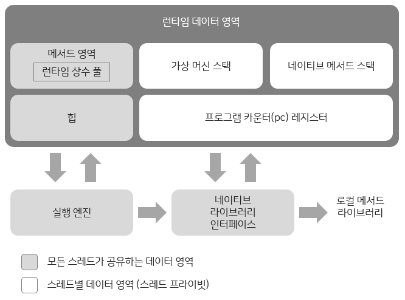

# 2장 자바 메모리 영역과 메모리 오버플로

## 런타임 데이터 영역

자바 가상 머신이 자바 프로그램을 실행하는 동안 필요한 메모리를 몇 개의 데이터 영역으로 나눠 관리하는 영역이며,
《자바 가상 머신 명세》에 따르면 자바 가상 머신이 관리하는 메모리는 다음과 같다.

### 프로그램 카운터
- 작은 메모리 영역으로, JVM 명령어 주소가 저장된다.
- 자바 메서드를 실행 중일 때는 실행 중인 바이트코드 명령어의 주소가 저장되며, 네이티브 메서드를 실행 중일 때는 undefined 값이 저장된다.
- JVM은 멀티스레드의 환경이기에 컨텍스트 스위칭이 일어날때 각 스레드의 상태를 저장해야 하는데 각자 고유의 상태를 저장해야 하기 때문에 스레드끼리 서로 영향을 주지 않는 독립적인 영역인 스레드 프라이빗 메모리에 저장된다.

### 자바 가상 머신 스택
- 스레드 프라이빗한 영역이며 스택프레임이 저장된다.
- 일반적으로 JVM의 스택 영역이라고 하면 스택프레임의 지역 변수 테이블을 가리킬 때가 많다.

지역 변수 테이블에는 자바 가상 머신이 컴파일타임에 알 수 있는 다양한 `기본 데이터 타입` `객체 참조` `반환 주소 타입`을 저장한다.
- 기본 데이터 타입(primitive type) : boolean, byte, char, short, int, float, long, double
- 객체 참조 : 객체가 참조하고 있는 인스턴스의 주소값
- 반환 주소 타입 : 바이트코드 명령어의 주소. 해당 메서드가 작업 후 반환해야 하는 주소값

《자바 가상 머신 명세》는 스택 메모리 영역에서 두 가지 오류가 발생할 수 있도록 정의했다.
- **StackOverFlowError** : 스레드가 요청한 스택 깊이가 가상 머신이 허용하는 깊이보다 클 경우
- **OutOfMemoryError** : 스택을 확장하려는 시점에 여유 메모리가 충분하지 않을 경우

### 네이티브 메서드 스택
가상 머신 스택과 매우 비슷한 역할을 하지만 차이점이 있다.
| 가상 머신 스택 | 네이티브 메서드 스택 |
| --- | --- |
| **자바 메서드(바이트코드)**를 실행할 때 사용 | **네이티브 메서드**를 실행할 때 사용 |

가상 머신 스택과 마찬가지로 **StackOverFlowError** 와 **OutOfMemoryError** 이 발생한다.
- 핫스팟 VM은 스택 용량을 동적으로 늘리지 못해서 **OutOfMemoryError**는 ****발생하지 않는다.

### 자바 힙
- 자바 애플리케이션에서 사용할 수 있는 가장 큰 메모리 영역이며, 객체 인스턴스를 저장한다.
- 힙 영역은 모든 스레드가 공유하며 가상 머신이 구동될 때 만들어진다.

메모리 할당 관점에서 힙 영역은 모든 스레드가 공유한다. 따라서 객체 할당 효율을 높이고자 스레드 로컬 할당 버퍼 여러 개로 나뉜다.
힙 영역을 다시 작게 구분하는 목적은 오직 메모리 회수와 할당을 더 빠르게 하기 위함이다.

### 메서드 영역
모든 스레드가 공유하며 메서드 영역은 가상 머신이 읽어 들인 `타입 정보` `상수` `정적 변수` `JIT 컴파일러가 컴파일한 코드 캐시` 등을 저장하는 데 이용된다.
《자바 가상 머신 명세》에서는 메서드 영역도 논리적으로 힙의 한 부분으로 기술하지만, 힙 영역과 구분하기 위해 **논힙(non-heap)**이라고 부르기도 한다.

> JDK 7에 이르러 핫스팟은 그 전까지 영구 세대에서 관리하던 **문자열 상수**와 **정적 변수** 등의 정보를 자바 힙으로 옮겼다. JDK 8부터는 영구 세대라는 개념을 완전히 지우고 네이티브 메모리에 메타스페이스를 구현했다.
> 

### 런타임 상수 풀
메서드 영역의 일부이며, 상수 풀 테이블에는 `클래스 버전` `필드` `메서드` `인터페이스` 등 클래스 파일에 포함된 설명 정보에 더해 컴파일타임에 생성된 다양한 리터럴과 심벌 참조가 저장된다. 가상 머신이 클래스를 로드할 때 이러한 정보를 메서드 영역의 런타임 상수 풀에 저장한다.

## 핫스팟 가상 머신에서의 객체 들여다보기
핫스팟이 관리하는 자바 힙에서의 객체 생성(할당), 레이아웃, 접근 방법 등 전체 과정의 상세 내용

### 객체 생성
언어 수준에서 객체 생성은 단순히 new 키워드를 쓰면 끝나지만, 가상 머신 수준에서는 어떤 과정을 거쳐 개체가 생성될까?

1. 자바 가상 머신이 new 명령에 해당하는 바이트코드를 만나면, 이 명령의 매개 변수가 상수 풀 안의 클래스를 가리키는 심벌 참조인지 확인한다.
2. 그런 다음 이 심벌 참조가 뜻하는 클래스가 준비(로딩, 해석, 초기화) 되었는지 확인한다.
3. 준비되지 않은 클래스라면 로딩을 해야하고, 로딩이 완료된 클래스라면 새 객체를 담을 메모리를 할당한다.

메모리 할당 시 2가지 방식이 있다.
- 포인터 밀치기
  - 사용 중인 메모리는 모두 한쪽에 여유 메모리는 반대쪽에 자리하며, 메모리를 할당하면 포인터를 객체 크기만큼 여유 공간 쪽으로 이동시킨다.
  - 자바 힙이 완벽히 규칙적일 때 사용
  - 여유 목록 방식에 비해 단순하고 효율적임

- 여유 목록
  - 가용 메모리 블록들을 목록으로 따로 관리하며, 객체 인스턴스를 담기에 충분한 공간을 찾아 할당한 후 목록을 갱신
  - 자바 힙이 규칙적이지 않을 때 사용
  - 포인터 밀치기에 비해 더 복잡함

**대다수 상황에서는 할당 속도를 높이기 위해 여유 목록 방식과 포인터 밀치기 방식을 혼합하여 이용한다.**

어떤 방식을 쓸지는 자바 힙이 규칙적이냐에 따라 달라지며, 자바 힙이 규칙적이냐는 사용하는 가비지 컬렉터가 **컴팩트(compact: 모으기)** 를 할 수 있느냐에 달렸다.

가용 공간을 어떻게 나눌지 외에도 멀티스레딩 환경에서 여러 스레드가 동시에 객체를 생성하려고 할 때 생길 수 있는 문제도 있다.
1. **메모리 할당을 동기화하는 방법**
실제로 비교 및 교환(CAS)과 실패 시 재시도 방식의 가상 머신은 갱신을 원자적으로 수행한다.

2. **스레드마다 다른 메모리 공간을 할당하는 방법**
스레드 각각이 자바 힙 내에 스레드 로컬 할당 버퍼(TLAB)라고 하는 작은 크기의 전용 메모리를 미리 할당받아 놓는 것이다.
각 스레드는 로컬 버퍼에서 메모리를 할당받아 사용하다가 버퍼가 부족해지면 그때 동기화를 해 새로운 버퍼를 할당받는 식이다.

메모리 할당이 끝났으면 가상 머신은 할당받은 공간을 0으로 초기화한다.
초기화했기 때문에 모든 필드가 자연스럽게 각 데이터 타입에 해당하는 0 값을 담고 있어, 자바 코드에서 객체의 인스턴스 필드를 초기화하지 않고도 사용할 수 있게된다.

마지막으로 자바 가상 머신은 **각 객체에 필요한 설정**을 해 준다.
예를 들어 어느 클래스의 인스턴스인지, 이 객체의 해시코드는 무엇인지 등의 정보가 각 객체의 객체 헤더에 저장된다.

> 자바 컴파일러는 자바의 new 키워드를 발견하면 바이트코드 명령어인 new와 invokespecial로 변환한다.
> new는 앞서 이야기한 메모리 할당 단계를 수행하며 invokespecial은 방금 이야기한 <init>() 메서드 (생성자) 호출을 담당한다.
> 
> 
> 

### 객체의 메모리 레이아웃
핫스팟 가상 머신은 객체를 세 부분으로 나눠 힙 영역에 저장한다.
- 객체 헤더
- 인스턴스 데이터
- 길이 맞추기용 정렬 패딩(alignment padding)

### 객체 헤더
핫스팟 가상 머신은 객체 헤더에 두 유형의 정보를 담는다.

1. 객체 자체의 런타임 데이터
이 부분을 **마크 워드(mark word)** 라고 하며 해시 코드, GC 세대 나이, 락 상태 플래그, 스레드가 점유하고 있는 락들, 편향된 스레드의 아이디, 편향된 시각의 타임스탬프 등이다. (JDK 18 이후에는 해당사항 없음)

2. 클래스 포인터
마크 워드 다음은 **클래스 워드(klass word)** 가 오며, 클래스 워드에는 객체의 클래스 관련 메타데이터를 가리키는 **클래스 포인터**가 저장된다.
자바 가상 머신은 이 포인터를 통해 특정 객체가 어느 클래스의 인스턴스인지 런타임에 알 수 있다.

추가로, 자바 배열의 경우 배열 길이도 객체 헤더에 클래스 워드 다음에 저장한다. 자바 가상 머신은 객체 헤더의 메타데이터로부터 자바 객체의 크기를 얻는다.
하지만 객체 헤더에 저장되는 객체 타입은 배열에 담긴 **원소**의 타입이다. 따라서 배열 길이(원소 개수)까지 알아야 배열 객체가 차지하는 메모리 크기를 제대로 계산할 수 있다.

### 인스턴스 데이터
객체 레이아웃의 두 번째 부분인 인스턴스 데이터는 **객체가 실제로 담고 있는 정보**다. 예컨대 프로그램 코드에서 정의한 `다양한 타입의 필드 관련 내용` `부모 클래스 유무` `부모 클래스에서 정의한 모든 필드`가 이 부분에 저장된다.

### 정렬 패딩
이 부분은 존재하지 않을 수도 있으며, 특별한 의미 없이 자리를 확보하는 역할만 한다. 모든 객체의 크기가 8바이트의 정수배여야 하는데, 인스턴스 데이터가 조건을 충족하지 못하는 경우에만 패딩으로 채운다.

### 객체에 접근하기
《자바 가상 머신 명세》는 참조 타입을단지 **객체를 가리키는 참조** 라고만 정했을 뿐, 힙 영역에서 객체의 정확한 위치를 알아내어 접근하는 구체적인 방법은 규정하지 않았기 때문에 객체에 접근하는 방식 역시 가상 머신에서 구현하기 나름이다.

주로 아래 2가지 방식을 사용해 구현한다.
- 핸들 방식
- 다이렉트 포인터 방식

### 핸들 방식

객체에 대한 **간접 참조 방식**이다. 객체 참조가 핸들을 가리키고, 핸들이 실제 객체를 가리킨다.
- 장점 : GC 과정에서 객체 이동 시 핸들 내 인스턴스 포인터만 변경하면 된다.
- 단점 : 객체에 접근 시 핸들이라는 단계를 한번 더 거쳐야 함.

### 다이렉트 포인터 방식

객체에 대한 **직접 참조 방식**이다. 참조가 객체의 실제 메모리 주소를 가리킨다.
- 장점 : 객체에 직접 접근해 속도가 빠르다.
- 단점 : GC 과정에서 객체 이동 시 모든 참조를 변경해야 한다.

**자바에서는 객체에 대한 접근이 빈번하기 때문에 대부분의 자바 가상 머신은 접근 속도가 빠른 다이렉트 포인터 방식을 사용한다.**
