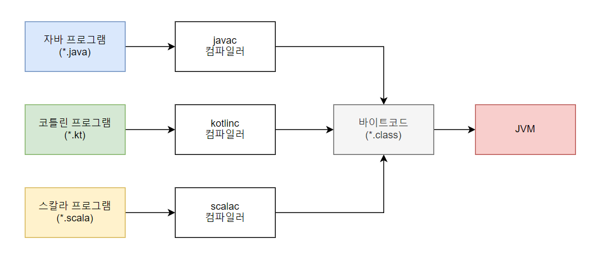
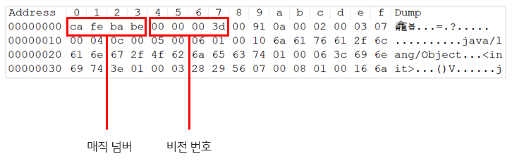
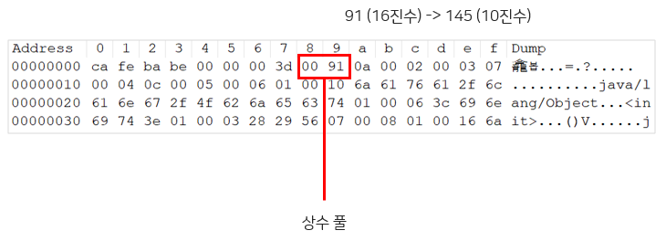
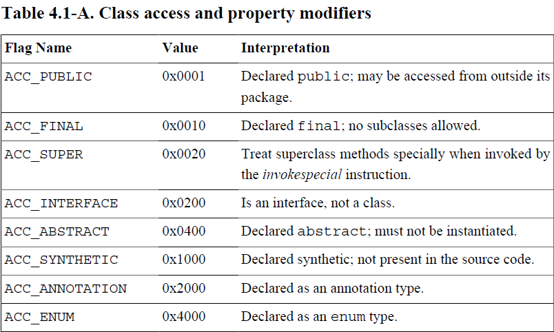
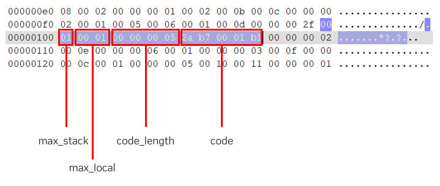

# 6장 클래스 파일 구조

# 6.1 들어가며

- 컴퓨터는 0과 1만 인식할 수 있기 때문에 우리가 작성한 애플리케이션을 컴파일러를 통해 0과 1로 구성된 바이너리 형식으로 변환해야 한다.
- 가상 머신에서 동작하는 수많은 프로그래밍 언어의 등장으로 네이티브 코드로 컴파일하지 않아도 되는 길이 생겼다.
- 점점 더 많은 프로그래밍 언어가 운영 체제나 기계어에 종속되지 않는 **플랫폼 독립적 저장 형식**을 선택하고 있다.

# 6.2 플랫폼 독립을 향한 초석

자바 가상 머신이 제공하는 독립성

- 플랫폼 독립성 : 모든 가상 머신이 동일한 프로그램 저장 형식(바이트코드)을 지원함
- 언어 독립성 : 가상 머신과 바이트코드 저장 형식이 핵심. 자바 가상 머신은 어떠한 프로그래밍 언어에도 종속되지 않으며, **클래스 파일(바이트코드)**이라는 특정한 바이너리 파일 형식에만 의존함.

클래스 파일에는 자바 가상 머신 명령어 집합과 심벌 테이블, 몇 가지 추가 정보가 담긴다.

바이트코드 형식은 튜링 완전(Turing complete)하기 때문에 자바 가상 머신에서 어떠한 언어도 표현할 수 있도록 보장한다.

> **튜링 완전** : 어떤 프로그래밍 언어나 추상 기계가 튜링 기계와 동일한 계산 능력을 가진다는 의미
> 



자바 언어의 다양한 구문, 키워드, 상수, 변수, 연산 기호는 결국 바이트코드 명령어 조합으로 표현된다. 하지만 바이트코드 명령어의 표현 능력이 자바 언어보다 뛰어나다. 즉, 자바 언어에서 효과적으로 표현하지 못하는 개념도 바이트코드에서는 효과적으로 표현할 수 있어서 자바가 지원하지 않는 개념이라도 다른 언어에서는 제공할 수 있다.

# 6.3 클래스 파일의 구조

자바 기술은 항상 하위 호환성을 매우 잘 유지해왔는데, 클래스 파일 구조가 안정적이기 때문이다. 자바는 지금까지 수없이 많이 개선을 해왔지만 클래스 파일의 구조는 초기에 비해 거의 변하지 않았다.

모든 클래스 파일은 각각 하나의 클래스 또는 인터페이스를 정의한다. 클래스나 인터페이스를 꼭 파일에 담아 둘 필요는 없으며, 동적으로 생성하여 클래스 로더에 직접 제공할 수 있다. 하지만 이번 장에서는 클래스나 인터페이스가 반드시 따라야 하는 형식을 **클래스 파일 형식**으로 지칭한다.

클래스 파일은 바이트를 하나의 단위로 하는 이진 스트림 집합체다. 각 데이터 항목이 정해진 순서에 맞게, 구분 기호 없이 조밀하게 나열된다. 그래서 클래스 파일 전체가 낭비되는 공간 없이 프로그램을 실행하는 데 꼭 필요한 데이터로 채워진다. 1바이트가 넘는 데이터 항목은 바이트 단위로 분할되며, 이때 큰 단위의 바이트가 먼저 저장되는 빅 엔디언 방식으로 표현된다.

> **빅 엔디언**
가장 큰 단위의 바이트가 가장 낮은 주소에, 가장 작은 단위의 바이트가 가장 높은 주소에 저장된다. 반대 순서로 저장하는 방식은 리틀 엔디언이라 한다.

x86이 리틀 엔디언을 이용하는 대표적인 아키텍처이며, 대부분은 빅 엔디언을 기본으로 한다.
> 

클래스 파일에 데이터를 저장하는 데는 C 언어의 구조체와 비슷한 의사 구조(pseudo structure)를 이용한다.

의사 구조에는 두 가지 데이터 타입만 존재한다.

- 부호 없는 숫자 (unsigned number) : 기본 데이터 타입을 표현한다. u1, u2, u4, u8은 각각 1바이트, 2바이트, 4바이트, 8바이트를 뜻한다. 숫자, 인덱스 참조, 수량 값을 기술하거나 UTF-8로 인코딩된 문자열 값을 구성할 수 있다.
- 테이블 : 여러 개의 부호 없는 숫자나 또 다른 테이블로 구성된 복합 데이터 타입을 표현한다. 구분이 쉽도록 테이블 이름은 관례적으로 **‘_info’** 로 끝난다. 테이블은 계층적으로 구성된 복합 구조의 데이터를 설명하는 데 사용된다. 클래스 파일 전체는 본질적으로 테이블이다.

## 6.3.1 매직 넘버와 클래스 파일의 버전

- 모든 클래스 파일의 처음 4바이트는 매직 넘버로 시작한다.
- 매직 넘버는 가상 머신이 허용하는 클래스 파일인지 여부를 빠르게 확인하는 용도로만 쓰인다.
- 클래스 파일뿐 아니라 GIF나 JPEG 등 다양한 파일 형식에서 파일 타입 식별용으로 자주 쓰인다.
    - 파일 확장자는 사용자가 마음대로 변경할 수 있기 때문에 파일 형식 식별용으로는 매직 넘버가 안정적이다.

매직 넘버 다음의 4바이트는 클래스 파일의 버전 번호다. 5~6번째 바이트는 마이너 버전, 7~8번째 바이트는 메이저 버전을 뜻한다.



## 6.3.2 상수 풀

비전 번호 다음은 상수 풀 항목이다. 상수 풀은 클래스 파일의 자원 창고라 할 수 있다.

- 클래스 파일 구조에서 다른 클래스와 가장 많이 연관된 부분이다.
- 차지하는 공간도 대체로 가장 크다.
- 클래스 파일에서 가장 먼저 등장하는 테이블 타입 데이터 항목이다.



상수 풀에는 145개의 상수가 존재하며 인덱스 범위는 1~144까지다.

0번째 상수를 비운 이유는 상수 풀 인덱스를 가리키는 데이터에서 **상수 풀 항목을 참조하지 않음**을 표현해야 하는 특수한 경우에 인덱스를 0으로 설정하도록 한 것이다. 클래스 파일 구조에서 상수 풀만이 1부터 개수를 세며, 그 외에 인터페이스 인덱스 컬렉션, 필드 테이블 컬렉션 등의 원소 개수는 0부터 센다.

상수 풀에 담기는 상수 유형

- 리터럴 : 자바 언어 수준에서 이야기하는 상수(final로 선언된 문자열이나 상수)와 비슷한 개념
- 심벌 참조 : 컴파일과 관련된 개념으로 아래 유형의 상수들이 포함된다.
    - 모듈에서 export 하거나 import 하는 패키지
    - 클래스와 인터페이스의 완전한 이름 (fully qualified name)
    - 필드 이름과 서술자 (descriptor)
    - 메서드 이름과 서술자
    - 메서드 핸들과 메서드 타입
    - 동적으로 계산되는 호출 사이트와 동적으로 계산되는 상수

상수 풀 안의 상수 각각이 모두 테이블이며, JDK 21 기준으로 총 17가지 상수 타입이 존재한다.

17가지 상수 타입 각각의 데이터 구조가 완전히 독립적이기 때문에 상수 풀이 가장 복잡한 데이터다.

## 6.3.3 접근 플래그

상수 풀 다음의 2바이트는 현재 클래스(또는 인터페이스)의 접근 정보를 식별하는 접근 플래그(access_flags)다. 현재 클래스 파일이 표현하는 대상이 **클래스**인지, **인터페이스**인지, **public**인지, **abstract**인지, 클래스인 경우 **final**인지 등의 정보가 담긴다.



+ ACC_MODULE   0x8000   모듈인지 여부

access_flags 크기는 2바이트이므로 플래그 비트를 최대 16개 사용할 수 있다. 정의되지 않은 플래그 비트의 값은 모두 0이어야 한다.

```java
public class TestClass {
	private int m;
	
	public int inc() {
		return m + 1;
	}
}
```

`TestClass` 는

- 인터페이스, 열거형, 어노테이션, 모듈이 아닌 일반 자바 클래스이다.
- public 클래스이고, final과 abstract는 아니다.
- JDK 1.2 이상 사용했다.

**ACC_PUBLIC(0x0001)**과 **ACC_SUPER(0x0020)** 플래그는 `true` 여야 하며, 나머지 7개 플래그는 `false`여야 한다.

즉, **access_flags** 값은 0x0001 | 0x0020 = **0x0021** 이 되어야 한다.

## 6.3.4 클래스 인덱스, 부모 클래스 인덱스, 인터페이스 인덱스

이어서 현재 클래스 인덱스(this_class)와 부모 클래스 인덱스(super_class), 인터페이스 인덱스 컬렉션(interfaces)이 나온다. 이러한 정보는 **클래스 파일의 상속 관계를 규정**한다.

- 클래스 인덱스 : 현재 클래스의 완전한 이름을 결정하는데 사용된다.
- 부모 클래스 인덱스 : 부모 클래스의 완전한 이름을 결정하는데 사용된다.
    - 자바는 다중 상속을 허용하지 않으므로 부모 클래스 인덱스는 하나뿐이다. (Object 클래스 제외)
- 인터페이스 인덱스 : 현재 클래스가 구현한 인터페이스들을 기술한다.

## 6.3.5 필드 테이블

인터페이스나 클래스 안에 선언된 변수(필드)들을 설명하는 데 쓰인다.

필드가 담고 있는 정보

- 필드에 접근할 수 있는 범위 제한 (public, private, protected, default)
- 인스턴스 변수와 클래스 변수의 구분 (static)
- 불변 여부 (final)
- 휘발성 (volatile)
- 직렬화 시 포함 여부(transient)\
- 데이터 타입 (primitive type, reference type)
- 필드 명

| 필드 이름 | 값 | 의미 |
| --- | --- | --- |
| ACC_PUBLIC | 0x0001 | public 필드인지 여부 |
| ACC_PRIVATE | 0x0002 | private 필드인지 여부 |
| ACC_PROTECTED | 0x0004 | protected 필드인지 여부 |
| ACC_STATIC | 0x0008 | static 필드인지 여부 |
| ACC_FINAL | 0x0010 | final 필드인지 여부 |
| ACC_VOLATILE | 0x0040 | volatile 필드인지 여부 |
| ACC_TRANSIENT | 0x0080 | transient 필드인지 여부 |
| ACC_SYNTHETIC | 0x1000 | 컴파일러가 자동으로 생성한 필드인지 여부 |
| ACC_ENUM | 0x4000 | enum 필드인지 여부 |

## 6.3.6 메서드 테이블

메서드 저장 형태는 필드 저장 형태와 거의 같다.

메서드에는 `volatile`과 `transient` 키워드를 붙일 수 없어 ACC_VOLATILE과 ACC_TRANSIENT가 존재하지 않는다.

대신, 필드에는 없던 synchronized, native, strictfp, abstract 키워드에 대응하는 플래그가 추가되었다.

| 필드 이름 | 값 | 의미 |
| --- | --- | --- |
| ACC_PUBLIC | 0x0001 | public 메서드인지 여부 |
| ACC_PRIVATE | 0x0002 | private 메서드인지 여부 |
| ACC_PROTECTED | 0x0004 | protected 메서드인지 여부 |
| ACC_STATIC | 0x0008 | static 메서드인지 여부 |
| ACC_FINAL | 0x0010 | final 메서드인지 여부 |
| ACC_SYNCHRONIZED | 0x0020 | synchronized 메서드인지 여부 |
| ACC_BRIDGE | 0x0040 | 컴파일러가 생성한 브리지 메서드인지 여부 |
| ACC_VARARGS | 0x0080 | 가변 길이 매개 변수를 받는지 여부 |
| ACC_NATIVE | 0x0100 | 네이티브 메서드인지 여부 |
| ACC_ABSTRACT | 0x0400 | abstract 메서드인지 여부 |
| ACC_STRICTFP | 0x0800 | strictfp 메서드인지 여부 |
| ACC_SYNTHETIC | 0x1000 | 컴파일러가 자동 생성한 메서드인지 여부 |

메서드 본문의 자바 코드는 javac 컴파일러에 의해 바이트코드 명령어로 변환된 후, 메서드 속성 테이블 컬렉션의 **Code** 속성에 따로 저장된다.

## 6.3.7 속성 테이블

클래스 파일, 필드 테이블, 메서드 테이블, Code 속성, 레코드 구성 요소는 모두 특정 시나리오에서 특정한 정보를 설명하기 위해 고유한 속성 테이블을 포함할 수 있다.

클래스 파일의 다른 데이터 항목들은 순서, 길이, 내용을 엄격하게 지켜야 하는데 반해 속성 테이블 컬렉션은 제약이 살짝 느슨하며 순서에도 엄격하지 않다.

최초의 《자바 가상 머신 명세》에는 사전 정의된 속성이 9개뿐이었지만, JDK 21에서는 총 30개로 늘어났다.

### Code 속성

자바 메서드의 본문 코드는 컴파일러에 의해 최종적으로 바이트코드 명령어로 변환된 후 Code 속성에 저장된다.

클래스 파일에서 가장 중요한 속성이다.

자바 프로그램의 정보를

- 코드(메서드 본문의 자바 코드)
- 메타데이터(클래스, 필드, 메서드 정의 등)

으로 나눈다면

클래스 파일 전체는

- 코드를 설명하는 Code 속성
- 메타데이터를 설명하는 나머지 데이터 항목

으로 구분할 수 있다.



바이트코드 영역이 차지하는 공간의 길이는 0x0000 0005다. 가상 머신은 바이트코드 영역의 길이(code_length)를 보고 이어지는 5바이트`2a b7 00 01 b1`을 더 읽어 들인다. 그리고 바이트코드 명령어들로 번역한다.

### ConstantValue 속성

정적 변수에 값을 자동으로 할당하도록 가상 머신에 알린다. static 키워드로 선언된 변수(클래스 변수)에만 이 속성이 붙는다.

인스턴스 변수 할당은 인스턴스 생성자인 <init>()에서 수행한다.

- `int x = 123`

반면 클래스 변수는 클래스 생성자인 <clinit>()를 사용하거나 ConstantValue 속성을 사용하는 방법 중 선택할 수 있다.

- `static int x = 123`

현재 오라클이 구현한 컴파일러는 final static 변수(상수) 중 데이터 타입이 **기본형**이거나 **String** 일 경우 ConstantValue 속성을 이용해 초기화한다.
