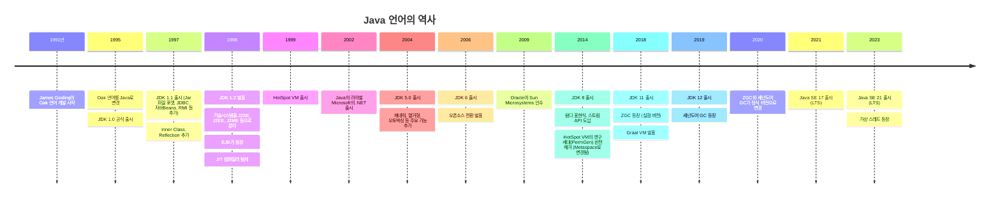

# Chapter 01: 자바 기술 시스템 소개

## 자바의 역사

### 주요하게 짚고 넘어갈 내용
- HotSpot VM과 JIT 컴파일러
- PermGen과 Metaspace
- ZGC와 셰넌도어

## Graal
### GraalVM
폴리그랏 VM(Polyglot VM)으로 다양한 언어(cross-language)를 지원하는 가상 머신
### Graal 컴파일러
GraalVM의 핵심 컴포넌트 중 하나로 HotSpot VM의 C2 컴파일러를 대체하는 JIT 컴파일러
