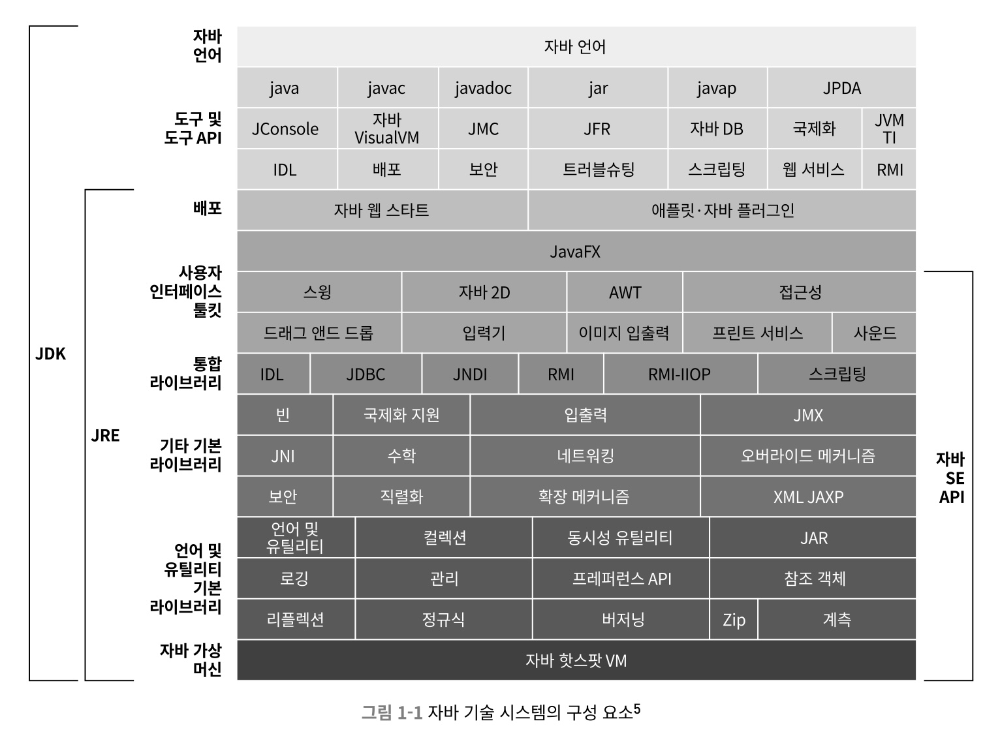
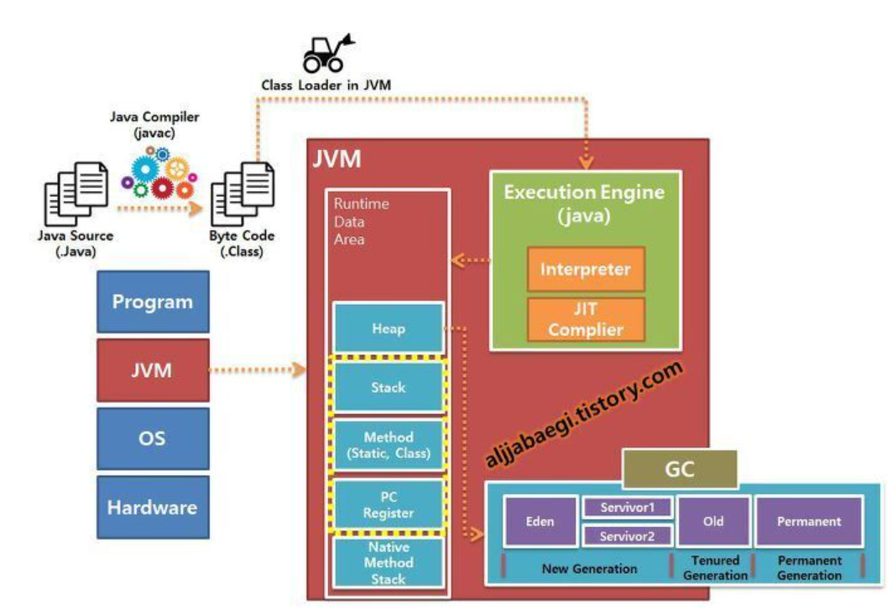

# 자바 기술 시스템 소개

## Java의 특징과 기술 시스템 구조

Java는 다음과 같은 특징을 가지고 있다.

- 한번 작성하면 어디서든 실행된다. -> Write Once, Run Anywhere
- 런타임에 핫 코드를 감지, 컴파일하고 최적화한다.

자바 기술 시스템은 다음 요소를 포괄한다.

- 자바 프로그래밍 언어
- JVM 구현
- 클래스 파일 포맷
- 자바 클래스 라이브러리 API(표준 API)
- 오픈 소스 클래스 라이브러리

이 중 위 3가지 요소를 묶어 JDK라 한다.

## HotSpot VM

JVM의 구현체 중 가장 널리 사용되며, JDK와 OpenJDK의 기본 JVM이다.

- hot code 감지를 제공한다.
    - 컴파일했을때 효과를 가장 크게 볼 수 있는 코드 영역을 런타임에 알아내 JIT 컴파일러에 알려준다.
    - (온스택 치환 기술) JIT 컴파일러가 메서드 단위로 컴파일을 수행해, 자주 호출되거나 안에 많이 시간 잡아먹는 코드가 있으면 JIT 컴파일을 수행해 스택을 치환한다. 
- 인터프리터로 코드를 실행하다가 자주 실행되는 코드를 JIT 컴파일러로 최적화하여 실행한다.

### 차세대 JIT compiler

JIT comiler중 C1 컴파일러는 빠르게 컴파일하고 C2 컴파일러는 최적화를 많이 한다고 알려져있고, JDK10 버전부터는 Graal Compiler가 추가되었다.  
Graal Compiler는 C2 컴파일러를 대체하기 위해 만들어졌으며, 이식성과 확장성이 모두 뛰어나다. 또한 부분 탈출 분석 같은 복잡한 최적화도 수행이 가능하다.

이러한 성과에 힘입어 Graal Compiler가 OpenJDK에 복귀되었다.

## MSA 트렌드에 맞추어 진화하는 JVM

현재 개발 트렌드는 MSA를 지향하고 있지만, Java는 JVM을 통해 실행되기 때문에 무겁고 느려 마이크로서비스가 요구하는 특성(가볍고 구동 시간이 빨라야 한다.)과는 배치되는 특성을 가지고 있다.

### AOT compiler

어플리케이션 실행 전 네이티브 코드로 컴파일해두는 Ahead Of Time Compiler를 사용해 빠른 실행 속도를 확보할 수 있다. 그러나 이 방식은 하드웨어 및 운영체제 별 따로 컴파일해 배포하는 과정이 필요하기 때문에... **한번 작성하면 어디서든 실행된다** 는 자바의 철학을 깨게 된다. 

### Graal VM

- Graal VM의 Substrate VM은 독자적인 예외처리, 스레드 관리, 메모리 관리, JNI 지원을 포함한 기능을 가지며, 사전 컴파일된 네이티브 코드를 핫스팟 VM 없이 실행한다.
- Substrate VM과 사용자 프로그램을 하나로 묶어 네이티브 이미지를 생성한다. 이때 사용자 프로그램으로부터 도달 가능한 코드만 추려 초기화한 뒤, 최종 실행 파일이 생성되면 힙 스냅숏을 생성해 둔다. 
- 이와 같은 방식을 사용하려면 프로그램이 완결된 형태여야 한다.  
    - 컴파일러가 찾을 수 없는 코드나 Class Library를 동적으로 읽어 들이는 코드가 없어야 한다.
- 메모리 사용량이 확연하게 줄어들었다. (최대 5배)
