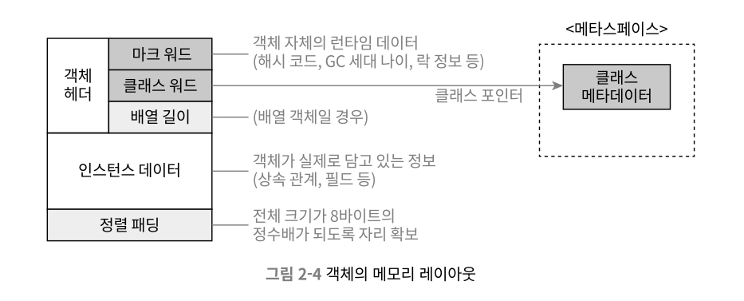

# 자바 메모리 영역과 메모리 오버플로

Java는 JVM의 **자동 메모리 관리 메커니즘** 덕에 메모리 할당/해제를 신경쓰지 않아도 메모리 누수나 오버플로 문제를 거의 겪지 않는다. 다만 메모리 문제가 생길 때, JVM에 대한 이해도가 낮다면 해결하기가 어렵다.

## 런타임 데이터 영역

자바의 런타임 데이터 영역은 모든 스레드가 공유하는 힙, 메서드 영역과 스레드별 개별 영역을 사용하는 가상 머신 스택, 네이티브 메서드 스택, 프로그램 카운터(pc) 레지스터로 구성된다.

### 프로그램 카운터

- 프로그램 카운터 레지스터는 현재 실행중인 스레드의 바이트코드 줄 번호 표시기 역할을 한다.
- 예외 처리, 스레드 복원 같은 기본 기능을 수행한다.

스레드 프라이빗 메모리 

- JVM에서 멀티스레딩은 CPU 코어를 여러 스레드가 교대로 사용하는 방식으로 구현되어 있어 특정 시간에 각 코어는 한 스레드의 명령어만 실행하게 된다.
- 따라서 스레드 전환 후 이전 실행 지점을 정확하게 복원하려면 각 스레드 고유의 PC가 필요하다.

### JVM 스택

스레드 프라이빗하며, 연결된 스레드와 생성/삭제 시기가 일치한다.

- 각 메서드가 호출 될 때마다 JVM은 스택 프레임을 생성해 지역 변수 테이블, 피연산자 스택, 동적 링크, 메서드 반환값 등을 저장한다.
    - 지역 변수 테이블 : 기본 데이터 타입, 객체 참조, 반환 주소 타입 (지역 변수 슬롯)
- 스택 프레임을 자바 가상 머신에 push하고 메서드가 끝나면 pop하는 과정을 반복한다.

스택 메모리 영역에서는 2가지 오류가 발생할 수 있다.

1. `StackOverflow Error` : 스레드가 요청한 스택 깊이가 가상 머신이 허용하는 깊이보다 큰 경우
2. `OutOfMemory Error` : 스택 확장 시점에 여유 메모리가 충분하지 않은 경우

### 네이티브 메서드 스택

네이티브 메서드를 실행할 때 사용하는 스택이다.

### 힙

모든 스레드가 공유하며, JVM 구동시 만들어진다.

- 거의 모든 객체 인스턴스와 배열은 힙에 할당된다.
- GC에 의해 관리되는 메모리 영역이다.
- 신세대, 구세대, 영구 세대, 에덴, 생존자 공간으로 나뉜다.
- 모든 스레드가 공유한다.

### 메서드 영역

메서드 영역은 JVM이 읽어들인 타입 정보, 상수, 정적 변수, JIT 컴바일러의 코드 캐시 등을 저장하는 데 이용한다.

- 모든 스레드가 공유한다.
- 회수할 대상이 거의 대부분 상수 풀과 타입이라 회수 효과가 매우 작다.

JDK 7부터 영구 세대에서 관리하던 문자열 상수와 정적 변수 등의 정보를 Heap으로 옮겼다.
JDK 8부터 영구 세대라는 개념을 완전히 지우고 네이티브 메모리에 메타스페이스를 구현했다.

#### 런타임 상수 풀

클래스 버전, 필드, 메서드, 인터페이스 등 클래스 파일에 포함된 설명 정보에 더해  컴파일타임에 생성된 다양한 리터럴과 심벌 참조가 저장된다.

### 다이렉트 메모리

JVM 런타임에 속하지 않으나, 자주 쓰이는 메모리이다.
`-Xmx`등의 매개변수를 설정할 때 다이렉트 메모리도 함깨 고려해 주어야 한다. 

---

## 핫스팟 가상 머신에서의 객체

### 객체 생성

언어 수준에서는 `new` 쓰면 새 객체 생성되는데, VM 수준에서는?

1. 매개 변수가 상수 풀 안 클래스를 가리키는 심벌 참조인지 확인한다.
2. 심벌 참조가 뜻하는 클래스가 로딩, 해석, 초기화 되었는지 확인한다.
3. 새 객체를 담을 메모리를 할당한다.

자바 힙 메모리 할당 방법

1. 포인터 밀치기
    - 자바 힙이 완벽히 규칙적이라 가정한다.
    - 사용 중인 메모리는 모두 한쪽에, 여유 메모리는 반대변에 자리하며 포인터가 두 영역의 가운데 지점을 가리키게 한다.
    - GC가 컴팩트(모으기) 동작을 가능한 컬렉터를 사용하는 경우 사용한다. : 시리얼, 파뉴
2. 여유 목록
    - 가용 메모리 블럭을 목록으로 따로 관리하며, 객체 인스턴스를 담기 충분한 공간을 찾아 할당한 후 목록을 갱신한다.
    - GC가 sweep을 사용하는 경우 사용한다.

멀티스레딩 환경에서의 동시 객체 생성 방법

1. 메모리 할당을 동기화한다.
2. 스레드마다 각기 다른 메모리 공간을 할당한다.

위와 같은 과정을 거치면, `init()`이 아직 실행되지 않고 모든 필드는 기본값이 0인 상태로 초기화된다.

### 객체의 메모리 레이아웃

핫스팟 가상 머신은 객체를 세 부분으로 나눠 힙에 저장한다.

### 객체에 접근하기

주로 핸들이나 다이렉트 포인터를 이용해 구현한다.

1. 핸들 방식 
    - 자바 힙에 핸들 저장용 풀이 별도로 존재
    - 참조에는 객체의 핸들 주소가 저장되고, 핸들에는 다시 해당 객체의 인스턴스 데이터, 타입 데이터, 구조 등의 정확한 주소 정보가 담긴다.
2. 다이렉트 포인터 방식
    - 힙에 위치한 객체에서 인스턴스 데이터 뿐만 아니라 타입 데이터에 접근하는 길도 제공해야 한다.
    - 핸들을 경유하지 않아 속도가 빠르다.
    - 핫스팟에서는 이 방식을 사용한다.