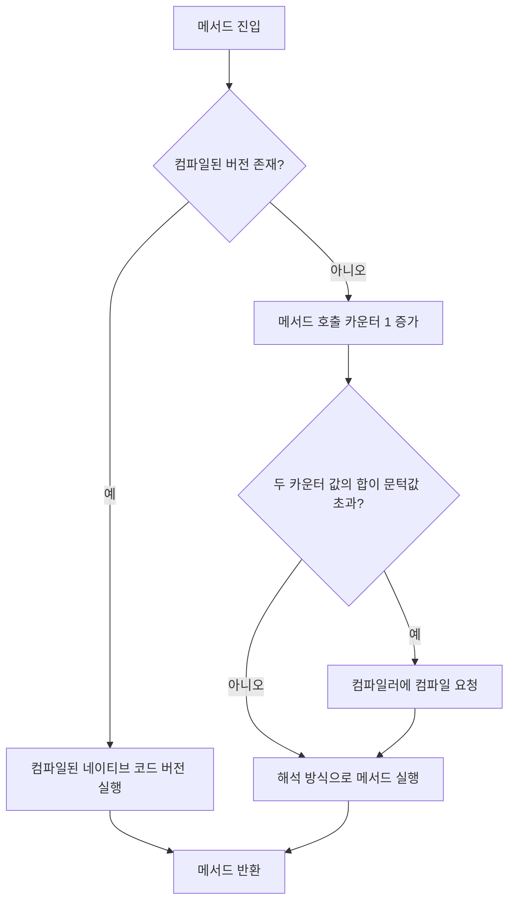
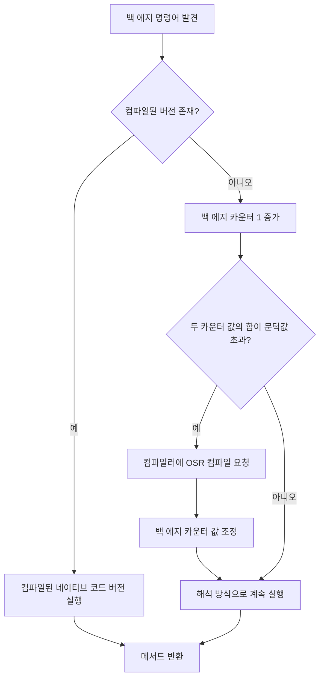

컴파일러가 클래스 파일을 네이티브 코드로 변환하는 과정을 컴파일 과정의 백엔드라고 간주할 수 있다. 

이 컴파일러의 컴파일 성능과 최적화 품질은 상용 가상 머신의 핵심 지표이다. 다만, JIT 컴파일러도 AOT 컴파일러도 필수는 아니며, JVM 명세에서 어떤 컴파일러를 제공해야 한다고 규정하고 있지는 않다.

# JIT 컴파일러

이하에서 명시하는 JIT 컴파일러는 핫스팟 가상 머신의 내장 컴파일러이다.

핫스팟과 OpenJ9는 자바 프로그램은 인터프리터로 해석해 실행하며, 자주 실행되는 메서드 및 코드 블럭(= 핫스팟 코드 , 핫 코드)이 발견되면 이 부분을 네이티브 코드로 컴파일하고 다양한 최적화를 적용해 실행 효율을 높인다. 이 최적화를 JIT 컴파일러에서 수행한다.

## 인터프리터와 컴파일러

- 현재 주류 가상 머신에서는 모두 인터프리터와 컴파일러를 병용한다.
- 어떤 컴파일러를 사용하느냐에 관계없이 둘을 병용하는 방식을 혼합 모드라 한다.
	- `-Xint`로 인터프리터 모드로 고정할 수 있다. 인터프리터 모드에서는 컴파일러가 개입하지 않는다.
	- `-Xcomp`로 컴파일 모드로 고정할 수 있다. 컴파일 모드에서는 컴파일 완료 후 코드가 실행되나, 컴파일 실패시에는 인터프리터가 실행에 개입될 수 있다.

- 인터프리터 
	- 프로그램의 빠른 시작
	- 메모리 절약 (임베디드 환경)
	- 컴파일러의 적극적 최적화의 가정이 무너지는 경우 재실행
- 컴파일러
	- 적극적 최적화 수행

- 핫스팟 가상 머신에는 JIT 컴파일러가 2-3개 내장되어 있다. 
	- C1(클라이언트), C2(서버) 컴파일러
	- 그랄 컴파일러 

계층형 컴파일 모드가 등장하기 전 핫스팟 가상 머신에서는 일반적으로 인터프리터가 단 하나의 컴파일러와 협력해 동작했다. 클라이언트 모드 / 서버 모드인지 여부에 따라 컴파일러를 선택하는 식이다.

### 계층형 컴파일

가상 머신 버전과 매개 변수에 따라 계층 종류와 동작 방식이 달라질 수 있다.

- 계층 0: 인터프리터가 **프로그램을 순수하게 해석 실행**한다. 성능 모니터링 기능은 켜지 않는다.   
- 계층 1: **클라이언트 컴파일러를 사용**하여 **바이트코드를 네이티브 코드로 컴파일하고 실행**한다. 이때 간단하고 안정적인 최적화만 수행하며, 성능 모니터링은 하지 않는다.  
- 계층 2: **클라이언트 컴파일러**를 사용한다. **메서드 및 반환 횟수 통계 등 몇 가지 성능 모니터링**만 수행한다.   
- 계층 3: 여전히 **클라이언트 컴파일러를 사용**한다. **분기 점프와 가상 메서드 호출 버전 등 모든 성능 모니터링 정보를 수집**한다.   
- 계층 4: **서버 컴파일러**를 사용한다. 서버 컴파일러는 성능 모니터링 정보를 활용하여 **더 오래 걸리는 최적화까지 수행**한다. 이때 신뢰도가 낮은 **공격적인 최적화를 수행**하기도 한다.


## 컴파일 대상과 촉발 조건

핫 코드의 유형은 대표적으로 2가지가 있다.

1. 여러 번 호출되는 메서드
	- 메서드 호출에 의해 컴파일 촉발
2. 여러 번 실행되는 순환문의 본문
	- 순환문에 의해 컴파일 촉발
	- 메서드 실행 중 (= 메서드의 스택 프레임이 여전히 스택에 존재하는 상태에서) 메서드가 치환되기 때문에 온스택 치환이라고도 한다.

두 경우 모두 컴파일 대상은 메서드 전체이다.

핫스팟 탐지에 주로 쓰이는 방식은 다음과 같다.

1. 샘플 기반 핫스팟 코드 탐지
	- 각 **스레드의 호출 스택 상단**을 샘플링(주기적으로 확인)하여 특정 메서드 또는 메서드의 일부가 자주 발견되면 해당 메서드를 핫 메서드로 간주한다.
	- J9에서 이 방식을 사용한다.
2. 카운터 기반 핫스팟 코드 탐지
	- 각 **메서드와 코드 블록에 대한 카운터**를 설정하고 나서 개별 실행 횟수를 기록하고, 실행 횟수가 문턱값을 초과하면 핫 메서드로 간주한다.
	- 핫스팟 가상 머신이 이 방식을 사용한다.

카운터 방식의 JIT 컴파일 과정은 다음과 같다.



### 메서드 호출 카운터

- 메서드 호출 횟수를 기록한다.
- `-XX:CompileThreshold`로 직접 설정이 가능하다.
- 단위 시간당 호출 횟수를  계산한다. (= 카운터 감쇠 메서드 호출)
	- 단위 시간을 카운터의 반감기라 한다.
- `-XX:-UseCounterDecay` 매개 변수로 카운터 감쇠를 비활성화하면 절대 호출 횟수를 계산한다.
- `XX: CounterHalfLifeTime` 매개 변수로는 반감기를 초 단위로 설정할 수 있다.

### 백 에지 카운터

- 특정 순환문의 본문 코드 실행 횟수를 계산한다.
- 온스택 치환(OSR)을 촉발한다.
- 메서드 호출 카운터와 달리, 감쇠 없이 절대 실행 횟수를 계산한다. 
- 백 에지 카운터가 오버플로되면 메서드 호출 카운터의 값도 오버플로 상태로 설정하여, 메서드가 다음번 호출될 때 표준 컴파일 절차가 진행되게 한다.

호출 과정은 다음과 같다.



## 컴파일 과정

JIT 컴파일은 백그라운드에서 별도 스레드가 진행하며, 컴파일 완료 시가지 인터프리터가 프로그램 실행을 이어간다.
백그라운드 컴파일을 원치 않는다면 -XX:-BackgroundCompilation 매개 변수로 비활성화할 수 있다.

### 클라이언트 컴파일러

지역 최적화에 집중하며, 간단하고 빠르다.

1. 플랫폼 독립적 프런트엔드가 바이트코드로부터 타깃 독립적 중간 표현인 HIR을 생성한다.
	- HIR은 코드 값을 정적 단일 할당(SSA)으로 표현해 주어 몇 가지 최적화를 더 쉽게 구현할 수 있게 도와준다. 
	- 바이트코드를 HIR로 구성하기 앞서 메서드 인라인이나 상수 전파 등 몇 가지 기본적인 최적화는 수행한다.
2. 플랫폼 의존적 백엔드가 HIR로부터 LIR을 생성한다. 
	- LIR 생성 전에 HIR을 대상으로 `null` 검사 제거와 범위 검사 제거 등의 최적화를 수행하여 HIR이 코드를 더 효율적으로 표현하도록 최적화한다.
3. 플랫폼 의존적 백엔드가 선형 스캔 레지스터 할당(linear scan register allocation)을 사용하여 LIR에 레지스터를 할당하고 핍홀 최적화를 수행한 다음, 네이티브 코드를 생성한다.

### 서버 컴파일러

서버 측 성능을 극대화하도록 설정한 컴파일러로 복잡한 최적화까지 지원한다.

- 죽은 코드 제거, 순환문 언롤링, 순환문 표현식 호이스팅, 공통 하위 표현 제거, 상수 전파, 기본 블록 재정렬 등 **전통적인 최적화를 대부분 수행**한다. 
- 범위 검사 제거, null 검사 제거 등 **자바 언어에 특화된 최적화도 수행**한다.
- 성능 모니터링 정보를 토대로 가이디드 인라인과 분기 예측처럼 안정성이 다소 떨어지는 예측 최적화도 수행할 수 있다. (공격적 최적화)

# AOT 컴파일러

AOT 컴파일러 관련 연구는 두가지로 나뉜다.

1. 프로그램 실행 전 프로그램 코드를 네이티브 코드로 컴파일
	- AOT의 전통적인 형태이다.
	- 이를 위한 정보를 정확히 얻으려면 전체 프로그램을 대상으로 시간이 오래 걸리는 계산을 수행해야 한다.
	- 그랄 VM의 서브스트레이트 VM에서 이러한 형태의 최적화를 통해 네이티브 이미지를 생성한다.
2. JIT 컴파일러가 런타임에 수행해야 하는 작업을 미리 수행해 캐시에 저장해 두고 다음번 실행 시 사용하는 형태
	- 동적 AOT / JIT 캐싱이라고 한다.

그러나 AOT 컴파일은 물리 머신 뿐만 아니라, 가상 머신의 런타임 매개 변수도 고려해야 하기 때문에 실제 적용이 쉽지 않다.
- 예를 들어, 가상 머신의 GC 중 JIT 컴파일 서브시스템을 이용하는 것이 있다. AOT 컴파일응 사용하려면 이를 적절히 처리해주는 과정이 필요하다.

이와 같은 난제가 있지만, AOT 컴파일은 성능을 극한까지 끌어올릴 수 있다.

JDK 9 이후 클래스 파일 및 모듈의 AOT를 지원하는 도구인 `jaotc`를 도입했다.

## JIT vs AOT ?

하지만 JIT 컴파일러가 더 나은 점도 있다.

1. 성능 기반 모니터링 최적화
	- 정적 분석 단계에서 얻을 수 없는, 실행 중 성능 모니터링 지표를 수집해 이를 바탕으로 최적화가 가능하다.
	- 특정 경로로의 실행이 자주 일어난다면 이 부분을 핫 코드로 지정하고, 더 많은 자원을 배분해 최적화가 가능하다.
2. 급진적 예측 최적화
	- 성능 모니터링 정보를 토대로, 높은 확률로 정확한 판단이 가능하다. 설령 낮은 확률의 동작이 실행된다 하더라도 하위 계층 컴파일러 혹은 인터프리터로 수행하도록 하며, 오류가 나거나 잘못된 결과가 나오지는 않는다.
	- 가상 메서드를 인라인한다.
3. 링크 타임 최적화
	- Java는 본질적으로 동적 링크이며, 클래스가 런타임에 가상 머신에 로드된 후 JIT 에 의해 최적화된 네이티브 코드를 생성한다.
	- AOT에서는 특정 동적 링크 라이브러리의 특정 메서드를 호출하려는 경우 메인 코드와 동적 링크 라이브러리 각각 독립적인 컴파일이 일어나, 최적화가 쉽지 않다. 


# 컴파일러 최적화 기법

컴파일러의 목표는 프로그램 코드를 기계어로 번역하는 것이며, **출력 코드가 얼마나 잘 최적화**되었는지가 컴파일러의 우수성을 결정한다.

다음은 가장 대표적인 최적화 기법 4가지이다.

## 메서드 인라인

가장 중요한 최적화 기법이다.

- 메서드 호출 비용을 없앤다.
- 후속 최적화를 더 큰 규모로 수행하기 쉽게 해 준다.
- 메서드 호출 비용을 없애기 위해 대상 메서드의 코드를 호출 메서드로 단순히 복사한다.

- 가상 메서드를 인라인하기 위해, 자바 가상 머신은 **클래스 계층 구조 분석 기술**을 도입했다. 이를 바탕으로 컴파일러가 상황에 맞는 인라인을 채택한다.
	- 클래스 계층 구조 분석에 질의해 현재 상태에서 후보 버전이 여러개 존재하는지 질의한다.
	- 후보가 하나라면 어플리케이션이 불변하다고 가정하고 인라인한다.(가이디드 인라인, 급진적 예측 최속화)
	- 후보가 여럿이라면 **인라인 캐시**를 찾는다.
		- 인라인 캐시는 메서드 호출 전에는 비어있고, 첫 포출 시 메서드 수신자의 버전을 캐시에 기록한다. 
			- 후속 호출에도 버전이 동일하면 모노모픽 인라인 캐시라 한다. 
			- 후속 호출에서 버전이 달라진다면 다형성을 이용한다는 뜻이며, 메가모픽 인라인 캐시라 한다. 가상 메서드 테이블 방식과 동일한 부하를 일으킨다.
- 비가상 메서드는 직접 인라인한다.
- 자바 가상 머신이 수행하는 메서드 인라인은 **급진적 최적화**이며, 고성능 자바 가상 머신에서 널리 쓰인다.

## 탈출 분석

비교적 **첨단 최적화 기법**이다.

- 새로 만들 객체가 사용되는 범위를 분석해 자바 힙에 할당 여부를 결정한다.
- 코드를 직접 최적화하기 보다는, 다른 최적화를 돕는다.

탈출 분석은 다음 세가지로 구분된다.

1. 전역 탈출(GlobalEscape)
	- 객체가 메서드 밖으로 빠져나와 **다른 스레드가 접근할 수 있게 된다.** 
	- 객체를 정적 필드에 저장하면 다른 스레드가 참조할 수 있다. 
	- 이미 탈출한 다른 객체의 필드에 저장하거나 메서드 결과로 반환한 경우도 마찬가지다.   
2. 인수 탈출(ArgEscape)
	- 객체가 인수로 전달되거나 인수에 의해 참조되지만, **호출 도중 전역 탈출하지는 않는다.** 
	- 이 상태는 호출된 메서드의 바이트코드를 분석해 결정된다.   
3. 탈출하지 않음(NoEscape)
	- 어디로도 탈출하지 않고 **메서드 안에서 생애를 마친다.** 
	- 이런 객체는 스칼라로 치환되어도 문제가 될 게 없으므로 최적화된 코드에서는 할당 작업 자체가 제거될 수 있다.

객체의 탈출 수준에 따라 최적화 수준을 달리할 수 있다.

- 스택 할당
	- 자바 힙에 존재하는 객체는 참조만 가지고 있다면 다른 스레드에서 접근할 수 있으며, 가비지 컬렉터는 힙에서 더 이상 사용되지 않는 객체를 회수한다. 그런데 이때 생존 여부를 확인해 회수하는 작업에는 상당한 자원이 소모된다. 
	- 따라서 **객체가 스레드에서 탈출하지 않는다고 확신**한다면, 즉 다른 스레드가 사용하지 않는다고 확신한다면 **힙이 아니라 스택에 할당**하는 게 훨씬 이득이다. 
		- **스택 프레임이 사라질 때 객체가 점유하던 메모리도 자동으로 파괴**되기 때문이다. 
	- 스택 할당을 이용하면 상당수의 객체가 메서드 종료와 함께 자동으로 파괴되도록 하여 가비지 컬렉터의 부담을 크게 줄일 수 있다.
- 스칼라 치환
	- 더 작은 표현으로 분해할 수 없는 데이터를 스칼라라고 한다. 
	- 자바 가상 머신에서는 기본 데이터 타입(`int`, `long과` 같은 숫자 타입이나 참조 타입 등)은 더 작게 분해할 수 없다. 반대로 더 작게 분해할 수 있는 데이터를 집합체(aggregate)라 한다. 
		- 자바에서는 객체가 대표적이다. 
	- **객체라는 껍질을 벗겨 내어 멤버 변수들에 직접 접근할 수 있게 만드는 과정**을 스칼라 치환이라고 한다. 
	- 탈출 분석을 통해 메서드 외부에서 접근할 수 없고 분해할 수 있는 객체라고 증명된다면 애초부터 이 객체를 생성하지 않을 수 있다. 그 대신 객체의 멤버 변수들을 메서드에서 직접 사용하게 하는 것이다. 
	- 객체를 분해하면 **멤버 변수들을 스택에 직접 할당하여 읽고 쓸 수 있다.** 스택에 담긴 데이터는 하드웨어 레지스터에 저장될 가능성이 높고 후속 최적화에도 이용할 수 있다.
	- 스택 할당의 특별한 경우로 생각할 수 있으며 구현이 더 간단하다. 객체의 전체 구조까지 완전하게 할당하지 않아도 되기 때문이다. 하지만 **객체가 메서드 범위를 벗어나면 안 되므로 탈출 수준 요구 조건이 더 까다롭다.**  
	- 동기화 제거
		- 스레드 동기화는 그 자체로 시간이 오래 걸리는 작업이다. 
		- **다른 스레드에서 접근할 수 없다**고 판단되는 변수는 읽고 쓰는 데 경쟁이 일어나지 않는다. 따라서 관련 **동기화 조치는 제거해도 안전**하다.

## 공통 하위 표현식 제거

고전적 **언어 독립적 최적화** 기법이다.

> **표현식 E가 이미 평가**되었고 **E에 등장하는 모든 변숫값이 평가 이후 변하지 않는다**면, 뒤에 등장하는 E를 **공통 하위 표현식이라고 한다.**

- 지역 공통 하위 표현식 제거: 적용 범위가 기본 블록으로 제한   
- 전역 공통 하위 표현식 제거: 둘 이상의 기본 블록에 걸쳐 있음
- 
```java
int d = (c * b) * 12 + a + (a + b * c);

// 이 중 b * c는 같은 표현식이고 실행 도중 변경되지 않는 값이다.
// 따라서 다음과 같이 표현이 가능하다.

int d = E * 12 + a + (a + E);

// 이후 다음과 같은 대수식 단순화 적용이 가능하다.

int d = E * 13 + a + a;
```


## 배열 경계 검사 제거

고전적 **언어 특화 최적화** 기법이다.

- Java는 시스템이 자동으로 배열 경계를 만족하지 못하면 `Array IndexOutOfBoundsException` 예외를 던져 오버플로 공격을 피할 수 있다.
- 이는 안전을 위해 반드시 필요하지만, 런타임에 한번만 수행되도록 최적화가 가능하다.
- 컴파일러가 데이터 흐름을 분석하여 루프 변수의 값이 `[ 0, foo.length )` 범위를 벗어나지 않는다고 판단하면 순환문 내에서 경계 상한/하한 검사를 완전히 걷어 낼 수 있다.

이 외에도 Java 언어 특화 최적화 기법으로 오토박싱 제거, 안전지점 제거, 리플렉션 제거 등이 있다.

# Graal 컴파일러

GraalVM은 오라클에서 만든 새로운 가상 머신이며, Java 기술을 확장해 만들어졌다. JIT와 AOT 컴파일을 모두 지원한다.

그랄도 초기에는 C1이나 C2와 마찬가지로 핫스팟과 긴밀하게 연결되어 있어서 **컴파일할 때마다 핫스팟 전체를 다시 컴파일**해야 했다. 하지만 JDK 9에 포함된 **컴파일러 인터페이스(JVMCI)24 덕분에 핫스팟 코드로부터 분리**할 수 있었다.

JVMCI는 다음 3가지 기능을 제공한다.

1. **핫스팟 가상 머신의 컴파일 요청에 응답**하고, 요청을 자바로 구현된 JIT 컴파일러에 전달한다.   
2. 클래스, 메서드, 필드, 성능 모니터링 정보 등 **핫스팟 JIT 컴파일 관련 데이터를 자바 언어 수준의 데이터 구조로 제공**한다.   
3. **핫스팟 코드 캐시를 추상화**하여 컴파일러가 컴파일이 끝난 네이티브 코드를 배포할 수 있게 한다.
