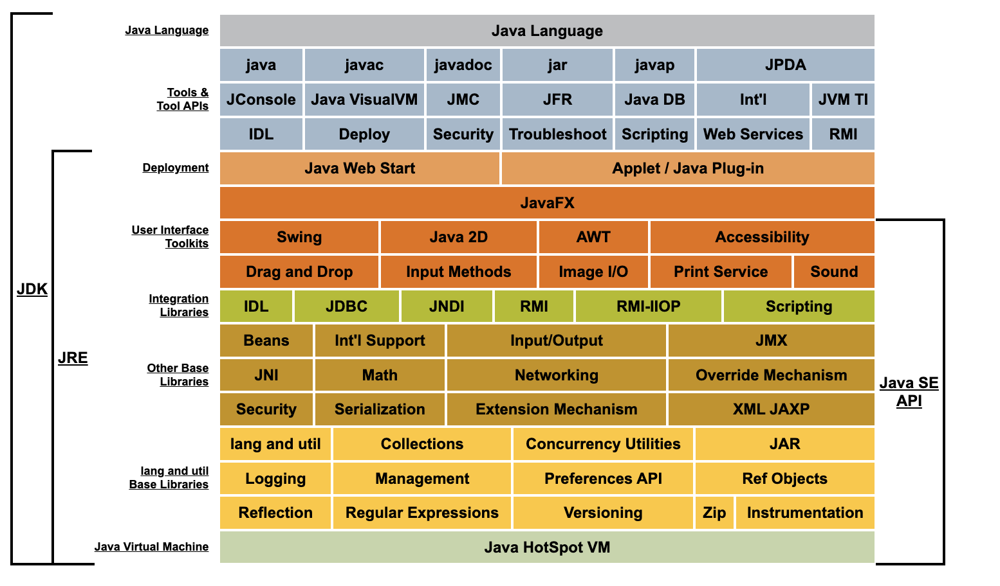
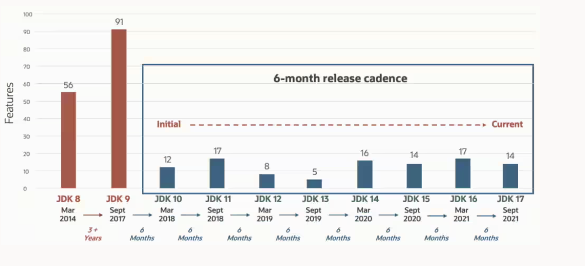
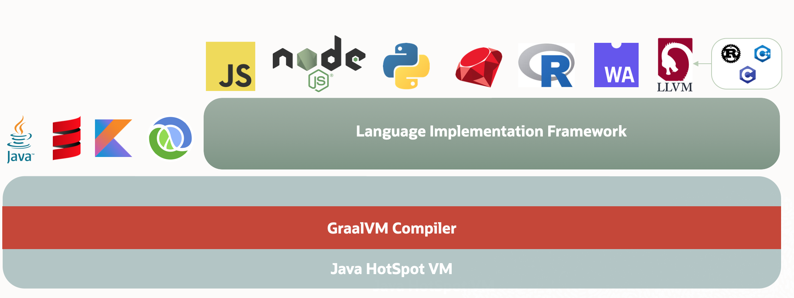

# 자바 기술 시스템 소개

## 들어가며

자바는 프로그래밍 언어뿐 아니라 여러가지 소프트웨어와 명세로 구성된 기술 시스템을 통칭한다. 자바 기술 시스템은 크로스 플랫폼 소프트웨어를 개발하고 배포하는데 모든 것을 제공하기 때문에 다양한 곳에서 아주 널리 쓰고 있다.

자바는 객체지향 프로그래밍 언어라는 점 외에도 다양한 장점들이 존재한다. 대표적인 특징들을 보자.

> 📚 특징
>
> 1. "한 번 작성하면 어디서든 실행이 가능하다."
> 2. 안전한 메모리 관리 시스템
> 3. 런타임에 핫코드를 감지, 컴파일하고 최적화
> 4. 다양하고 풍부한 표준 API 제공 및 다양한 기능의 서드파티 라이브러리를 활용 가능

> 📚 용어정리
>
> 핫 스팟: 데이터 테더링 용어이기도 하지만 자바에서는 빈번하게 실행되어 전체 성능에 영향을 크게 주는 코드를 말한다.

자바를 이용할때 해당 특징들을 이용해 개발하는 것도 중요하지만 자바 기술 시스템 안에서는 어떻게 활용되고 구현되는지 이해도 중요할것 같다.

## 자바 기술 시스템

> 🗒️ 자바 기술 시스템
>
> - 자바 프로그래밍 언어
> - (다양한 하드웨어 플랫폼용) 자바 가상 머신 구현
> - 클래스 파일 포맷
> - 자바 클래스 라이브러리 API(표준 API)
> - 다른 기업과 오픈 소스 커뮤니티에서 제공하는 서드 파티 클래스 라이브러리

> 🗒️ JDK란?
>
> 자바 프로그래밍 언어, 자바 가상 머신, 자바 클래스 라이브러리를 묶어서 JDK라 한다.

> 🗒️ JRE란?
>
> 자바 SE API와 자바 가상 머신 그리고 배포 기술까지를 묶어서 JRE라고 한다.

자바 기술 시스템을 핵심 비즈니스로 관점을 옮겨서 보면 다음과 같이 나눠진다.

> - 자바카드: 소형 기기 및 변조 방지 보안 칩등에서 실행되는 자바 플랫폼
> - 자바ME: 안드로이드 어플리케이션 개발때 자바언어로 사용하는데 이와는 다름. 모바일 기기에서 실행되는 자바 프로그램용 플랫폼
> - 자바 SE: 데스크톱 어플리케이션 용 자바 플랫폼
> - 자바EE: 다층 계층 구조로 이루어진 기업규모 애플리케이션용 자바 플랫폼

## 자바의 과거와 현재

### 자바의 탄생

> - 제임스 고슬링이 다양한 가전제품에서 구동되는 프로그램 개발 목표로 프로젝트 시작. 이 프로젝트는 오크로 시작. 인터넷 급부상으로 오크는 자바언어로 진화
> - 오크를 자바로 바꾸고 자바1.0 발표. 자바의 구호인 '한 번 작성하면 어디서든 실행된다.'라는게 처음 발표
> - JDK1.0이 출시되면서 첫번째 정식 런타임 환경을 갖춤. 처음에는 순수 인터프리터 방식이였음.
> - 많은 기업들이 자바를 이용하여 웹 페이지 구축 및 탑재

### 유년기

> - JDK1.1 등장. JAR 파일 포맷, JDBC, 자바빈스, RMI같은 자바의 가장 기본이 되는 기술 상당 수가 이때 처음 등장. 자바 언어 문법도 개선되면서 내부 클래스와 리플렉션이 등장.
> - JDK1.2 등장. 데스크톱 애플리케이션 개발 중심의 J2SE, 기업용 시스템을 위한 J2EE, 모바일 단말을 위한 J2ME가 등장. EJB, 자바 플러그인, 자바 IDL, 스윙등이 대표적인 기술로 뽑히며 JVM 처음으로 **JIT 컴파일러를 탑재.** 또한 클래식 VM, 핫스팟 VM, 이그잭트 VM이라는 3가지 가상머신이 공존. 핫스팟 VM과 이그잭트 VM은 JIT 컴파일러를 기본 내장. 언어 수준에서는 `strictfp`키워드 추가. 또한 컬렉션 API가 처음 등장. 또한 핫스팟 가상머신이 출시하면서 핫스팟의 놀라운 성능으로 인하여 JDK1.3에 기본 자바 가상 머신으로 승격
> - JDK1.3 등장. 수학연산과 새로운 타이머 API등 자바 클래스 라이브러리가 주로 개선. 또한 확장 기능이였던 JNDI 서비스가 플랫폼 수준 서비스로 제공되기 시작했고 CORBA와 IIOP를 이용해 RMI 커뮤니케이션 프로토콜을 구현. 자바 2D 기술 개선. 또한 메이저 버전 연구 개발 주기가 2년으로 고정.
> - JDK1.4 출시. 정규 표현식, 예외 연쇄, NIO, 로그 클래스, XML 파서, XSLT 변환기등 다수 신기술 개발.
> - JDK5 출시. 이때부터 JDK1.x방식에서 JDK x형태로 변경. 코드 편의성을 개선하는 큰 폭의 변화로 오토박싱, 제네릭스, 동적 어노테이션, 열거형, 가변 길이 매개 변수, `foreach`순환문 등의 문법 변화 일어남.

### 오픈 소스의 세계로

> - JDK6 출시. J2EE, J2SE, J2ME라는 이름을 자바EE 6, 자바 SE 6, 자바ME 6형태로 변경. 스크립트 언어 지원(모질라 자바스크립트 라이노 엔진 내장), 컴파일 타임 어노테이션 처리기, 마이크로 HTTP 서버 API 제공. JVM도 락과 동기화 구현, 가비지 컬렉션, 클래스 로딩등 많은 면 개선. 썬은 자바를 오픈소스로 전환할 계획 확립. 또한 해당 버전부터 JDK의 여러 요소를 GPL v2로 공개하며 이를 OpenJDK이 설립되어 관리 그리고 이때 Sun JDK의 코드가 거의 OpenJDK로 넘어갔고 헤더에 라이센스 공지를 제외한 나머지가 매우 유사한 JDK가 되었다. 또한 JDK6 출시 후 썬은 코드 복잡도 증가, 자바의 오픈 소스화, 자바FX 개발, 세계 경제 위기, 오라클에 썬 매각등에 너무 많은 리소스를 허비하여 자바개발에 진척이 생김. 이 때문에 JDK6는 수명이 길어짐.

### 오라클 품으로

JDK7이 발표. 해당 버전의 목표는 아래와 같았다.

> - 람다 프로젝트: 람다식과 함수형 프로그래밍 지원
> - 직소 프로젝트: 가상 머신 수준에서의 모듈화 지원
> - 동적 언어 지원: 자바**언어**는 정적 언어이지만 자바**가상머신**은 제3의 동적 언어 지원
> - GI 컬렉터: 고성능 가비지 컬렉터
> - 코인 프로젝트: 자바 구문의 세부사항 개선

하지만 이런 계획들은 썬 기업 사정 상 이루지 못했고 JDK8로 연기하였다. JDK7에서는 G1 컬렉터(실험용), 자바 외 언어 호출 지원 강화, 병렬 클래스 로딩 아키텍쳐등이었다. 하지만 오라클이 인수하면서 많은 변화가 일어났다. 가장 큰 것은 JDK 업데이트 지원을 상용 서비스로 변경. 또한 BEA의 JRockit과 썬의 핫스팟을 하나로 합칠 계획을 세움. 하지만 결과는 만족스럽지 못함.

> 📚 참고
>
> 자바 언어 자체는 어떤 회사의 소유도 아닌 JCP(Java Community Process)가 관리한다. 하지만 JCP에 대해 오라클이 어느정도의 영향력을 행사.

### 모던 자바의 시작

JDK8 출시. JDK8부터 차기 JDK에 포함될 기능을 정의하고 관리하는 JDK 개선 제안(JEP) 제도를 도입. 대표적으로 JDK8에서는 아래의 것들이 있었다.

- JEP 126: 람디식 지원(자바 언어로 함수식을 매끄럽게 표현)
- JEP 104: 나스혼 자바스크립트 엔진 내장
- JEP 150: 새로운 시간 및 날짜 API
- JEP 122: 핫스팟에서 영구 세대 완전 제거

JDK8로 밀렸던 직소(모듈화 기능)는 JDK9로 연기.

JDK9 출시. 직소를 자바의 표준 모듈 시스템으로 포함시키는게 많은 회사(IBM, 레드햇..)에서 거부당했고 결국 직소를 표준으로 하는 자바를 독립적으로 개발하겠다고 선언하고 결국 직소와 함께 JDK9출시. 직소 외에 JDK9에는 JShell, JLink, JHSDB등 많은 도구를 개선하고 핫스팟을 구성하는 모듈들의 로깅 시스템을 수정했으며 HTTP2 단일 TCP 연결 API등 총 9개의 JEP를 포함해 출시.

### 기민하게

JDK9 출시 후, 오라클은 자바 연구 개발을 더 기민하게 진행하면서 출시도 지속적 배포 형태로 전환할 것이라 발표. JDK 메이저 버전을 3월과 9월에 출시하기로 하였지만 자바 사용자들 입장에서는 큰 불만이었다. 신 버전을 사용하기도 전에 레거시가 된다고 느꼈고 결국 LTS버전을 만들어 최소 3년이상을 지원하겠다 발표. 그 외 버전들의 수명기간은 6개월.

> ✅ LTS 버전
>
> - JDK8
> - JDK11
> - JDK17
> - JDK21

그리고 2021년에는 다시 정책을 바꿔 LTS버전을 2년주기로 출시하겠다 발표. 그래서 JDK17이후 LTS버전이 JDK21이다.

JDK10 출시. 주된 목표는 내부 리팩터링(소스 저장소 통합, 가비지 컬렉터 인터페이스 통합, JIT 인타페이스 통합). 사용자 입장에서는 지역 변수 타입 추론 말고는 별로 없었다.

이 해에 큰 사건이 있었는데 안드로이드의 자바 저작권 침해 사건이 있었고 처음에는 구글한테 배상을 하라 하였지만 자바 진영 사람들이 구글편에 서고 이후 구글이 상고하여 승소하였다.

오라클의 이윤추구로 인하여 자바EE 잘라냄. 오라클은 JDBC, JMS, 서블릿과 그 외 널리 쓰이는 기본 요소들은 소유하고 자바 EE 소유권은 이클립스 재단으로 넘기고 Java라는 상표도 못 사용하게 해서 자카르타EE로 바뀌었다.

JDK11 출시. 혁신적인 가바지 컬렉터인 ZGC의 실험버전 추가. 오라클이 JDK라이선스에도 손을 댐. 남아있던 상용 기능을 모두 오픈소스로 공개. 그래서 OpenJDK와 Oracle JDK 기능 같아짐. 그리고 두 JDK 동시 출시하겠다 발표. 차이는 OpenJDK는 개발, 테스트, 프로덕션 모두를 무료로 사용하지만 오라클의 직접적인 업데이트 지원은 6개월로 제한. 오라클 JDK 역시 개인 용도로는 제약이 없지만 프로덕션 환경에서 상업적으로 활용하려면 비용을 내야한다. 그리고 직전버전의 OpenJDK 유지보수는 레드햇한테 이양. 하지만 기술개발측면에서 리더는 오라클.

> https://medium.com/@javachampions/java-is-still-free-c02aef8c9e04

JDK12 발표. 레드햇이 셰넌도어 가비자 컬렉터 개발. ZGC와 거의 유사 하지만 오라클이 오라클 JDK에서는 걷어냄. 그래서 셰넌도어는 오직 OpenJDK에서만 이용가능.

JDK13 출시. 소켓 API를 재구현. 문법 측면에서는 텍스트 블록이 미리보기 버전으로 추가.

JDK14 출시. 새로운 switch문이 정식 표준이 됨. 맥과 윈도우에 ZGC를 지원하였지만 CMS 가비지 컬렉터는 모든 플랫폼에 제거. 또한 솔라리스와 스팍(SPARC) 플랫폼 지원 중단.

JDK15 출시. ZGC와 셰넌도어가 정식기능으로 편입. 그외에 텍스트 블록도 정식으로 편입. 데이터그램 소켓 API 재구현. 반면 편향 락은 비활성화됨과 동시에 폐기대상으로 지정.

JDK16 출시. 메타스페이스 관리 방식 개선 및 문법차원으로 `instanceof` 패턴 매칭과 레코드 클래스 도입등의 개선이 이루어짐.

JDK17 출시. `sealed class`가 도입 및 의사 난수 생성기 개선. AOT 컴파일러 삭제.

JDK18 출시. UTF-8이 기본. 메서드 핸들을 이용해서 리플렉션을 다시 구현. `finalize()`가 폐기대상으로 전락.

JDK19 출시. 외부 함수 및 메모리 API, 가상 스레드, 구조화된 동시성등 많은 기능을 미리보기로 선보임.

JDK20 출시.

JDK21 출시. 세대구분 ZGC와 가상 스레드 도입.

### 과거, 현재, 미래

자바는 전례 없이 힘든 위기와 도전에 직면했기에 역설적으로 자바의 미래는 상상력과 가능성으로 가득

## 자바 가상 머신 제품군

많은 자바 개발자가 자바 가상 머신을 오라클 JDK의 핫스팟 가상 머신과 동일시한다. 그럼 이제 자바 가상 머신의 변화 과정을 살펴보자.

### 가상 머신의 조상: 썬 클래식 VM과 이그잭트 VM

썬 클래식 VM은 세계 최초 상용 자바 가상 머신이다.

JDK1.0이 출시되었을 때 가상머신이 클래식 VM이다. 인터프리터 방식을 이용했으며 JIT 컴파일러를 사용하려면 플러그인을 이용해야하는데 플러그인하는 순간 가상 머신의 실행 시스템 전체가 JIT 컴파일러에 넘어가는 구조가 되었다. 비슷한 플러그인으로는 시멘텍 JIT와 shuJIT가 있었다. 또한 이 당시에는 인터프리터와 컴파일러는 함께 구동되지 않기 때문에 컴파일러를 사용하면 실행 빈도 등 컴파일에 따른 득실과 상관없잉 코드 전체를 컴파일해야 했다.

이러한 문제로 인하여 이그잭트 VM이 등장. 이그젝트 VM은 핫스팟 검출, 2단계 JIT 컴파일러, 컴파일러와 인터프리터 혼합모드등을 갖추고 있어 현대적인 고성능 가상 머신의 프로토타입이라 할 수 있다.

이그잭트 VM은 '정확한 메모리 관리' 기반이다.

> 📚 정확한 메모리 관리란?
>
> 가상 머신이 메모리의 특정 위치에 있는 데이터의 구체적인 자료형을 알 수 있다는 뜻이다.

이 정보는 가바지 컬렉션 시 힙에 존재하는 데이터가 여전히 사용 중인지 판단하는 전제조건이다. 이로 인해 클래식 VM의 객체 검색 방식을 벗어나서 핸들을 거쳐야 하는 간접검색 부하가 줄어서 실행 성능 개선.

하지만 이그잭트 VM은 얼마 지나지 않아 핫스팟 VM으로 대체. JDK1.2까지는 클래식 VM으로 나오다가 1.3부터 기본 VM으로 채택.

### 일인자: 핫스팟 VM

핫스팟 VM은 지금까지 가장 널리 사용된 자바 가상 머신이다.

핫스팟은 썬의 기존 상용 가상 머신의 장점(정확한 메모리 관리)을 계승하면서 추가적으로 **핫 코드 감지**라는 기술을 선보였다.

> 📚 핫 코드 감지란?
>
> 컴파일 했을때 효과를 가장 크게 볼 수 있는 코드 영역을 런타임에 알아내어 JIT 컴파일러에게 알려주고 JIT 컴파일러가 해당 코드를 메서드 단위로 컴파일한다. 또한 메서드 내에 순환문이 존재한다면 JIT컴파일을 수행해 스택을 치환한다.

> 📚 온 스택 치환이란?
>
> 런타임에 스택을 치환하는 기술

이렇게 컴파일러와 인터프리터가 조화를 이루어 프로그램 응답속도와 실행 성능 사이의 균형을 잡아주었다. 컴파일 없이 즉시 실행 후 일부 코드만 백그라운드에서 컴파일하여 치환하는 방식이다.

핫스팟은 오라클JDK와 OpenJDK의 공통 가상머신이다. 오라클이 인수 후 BEA JRockit의 뛰어난 기능을 핫스팟에 통합하였고 이 과정에서 핫스팟에 영구세대가 제거되고 JRockit의 JMC 모니터링 도구등의 기능이 흡수.

### 가난한 집의 고운 딸: 모바일&임베디드VM

썬과 오라클은 모바일과 임베디드 시장에 특화한 자바 가상 머신도 개발.

하지만 JavaSE만큼 성공적이지 않아 핫스팟만큼 주목받지는 못함. 자바ME용 가상 머신의 이름은 CDC-HI와 CLDC-HI였다. CDC와 CLDC는 각자 JSR 139, JSR 218 명세에 정의된 자바 API의 부분집합이다. 또한 HI는 Hotspot Implementation의 약자지만 핫스팟 VM을 직접 계승한 것은 아니다.

안드로이드와 ios때문에 자바ME용 자바 가상 머신은 죽어있다. 또한 자바ME는 자바SE 임베디드와도 경쟁하다가 지고 말았다. 성능은 자바SE와 유사했지만 핫스팟 가상머신을 이용하는 자바SE를 쓸수 있는데 굳이 자바ME를 사용하는 사람은 없었다.

저성능 기기용 CLDC-HI는 스마트폰 컨트롤러와 센서등에서 고유한 시장을 만들었지만 지금은 KVM정도에서만 사용한다.

### 이인자: BEA JRockit과 IBM J9 VM

핫스팟 가상 머신 외에 다른 이인자 가상 머신들이 있었는데 바로 BEA 시스템의 JRockit과 IBM의 J9이다.

처음에는 3개의 가상머신이 전반적인 성능이 비슷했다. BEA는 자바 가상 머신을 사들인 후 서버 하드웨어와 애플리케이션 동작 시나리오에 중점을 두고 최적화를 진행. 서버 애플리케이션을 우선하다 보니 프로그램 구동 시간은 우선순위로 밀렸다. JRockit은 인터프리터를 완전 제거 및 모든 코드를 JIT 컴파일러로 컴파일. 하지만 오라클이 인수 후 개발 중단.

IBM이 만든 J9은 스몰토크 가상 머신 프로젝트에서 확장된 것이다. 목표는 핫스팟과 비슷했다. J9는 서버와 데스크톱을 모두 고려해 설계된 다용도 가상머신이었던 것이다. J9의 목표는 IBM의 다양한 자바 제품군의 실행 플랫폼 역할을 하여 IBM 웹스피어, AIX, z/OS같은 플랫폼에 자바 어플리케이션을 배포하는 것이였다.

J9는 아직 현역이다. 그리고 핫스팟보다 역할별로 모듈화가 잘 이루어져 있다. 또한 다른 언어 플래폼에서 사용가능 만약 핫스팟 VM대신에 다른 VM을 이용해보고 싶다면 이클립스 테무린 고려. 이클립스 테무린은 OpenJDK 라이브러리들에 OpenJ9을 결합한 완전한 형태의 JDK이다.

### 하드웨어와의 통합: BEA 리퀴드 VM과 어줄VM

특정 하드웨어 플랫폼에서만 구동되는 소프트웨어와 하드웨어가 통합된 형태의 가상머신도 있다. 대표적으로 BEA 리퀴드 VM과 어줄 VM이다.

리퀴드 VM은 JRockit의 가상화된 버전으로 독자적인 하이퍼바이저 시스템 위에서 직접 실행된다. 즉, 운영체제가 필요가 없다. 다시말해, 필요한 기능을 제공하는 전용 운영체제가 포함되어 있다고 봐도 무방하다. 장점으로는 예컨데 스레드 스케줄링 시 커널모드와 사용자모드 전환이 필요없다. 그 결과 하드웨어 성능을 최대로 끌어 써서 자바 프로그램의 성능을 높인다.

어줄VM은 핫스팟에 기초해 개발된 VM이다. 어줄VM은 인스턴스당 최소 수십개의 CPU와 수백GB의 메모리를 관리한다. 또한 광대한 메모리에서 일시정지시간을 제어할 수 있는 가바지컬렉터나 하드웨어에 최적화된 스레드 스케줄링을 지원.

징VM은 옛 버전 핫스팟의 코드를 기초로 독립적으로 재개발된 고성능 자바 가상머신이다. 짧은 지연시간과 빠른 구동시간이 필요한 시나리오에서 핫스팟보다 더 뛰어나다. 징의 PGC와 C4컬렉터는 수TB의 자바 힙 메모리를 지원하면서 일시 정지 시간을 통제가능했다. 또한 징의 레디나우기능은 이전 실헹에서 얻은 성능 모니터링 데이터를 활용해 가상 머신 재시작 후 빠르고 안정적으로 고성능을 내는 상태로 진입. 즉, 구종 직후 코드를 해석하고 JIT컴파일을 실행하는 시간을 줄여줬다. 또한 실행 중 핫스팟 찾기, 객체 할당 모니터링, 락 경합 모니터링도 가능했다.

### 도전자: 아파치 하모니와 안드로이드 아트 VM

아파치 하모니와 안드로이드 아트 VM은 가상머신은 맞지만 자바 가상 머신은 아니다.

아파치 하모니는 오픈소스제품으로 독자적인 가상머신과 자바 클래스 라이브러리를 제공.

아파치 하모니의 많은 코드는 IBM의 JDK7과 구글 안드로이드 SDK에 큰 기여.

안드로이드는 모바일 기기용 플랫폼이다. 안드로이드는 자바 언어를 모바일 기기에 안착시켰다.

### 성공도 실패도 아닌: 마이크로스프트 JVM

마이크로소프트가 개발해 IE에 탑재하였지만 윈도우에서만 동작. 썬과 소송 후 완전 제거

### 수 많은 아이디어의 각축전

- KVM: 엄격하고 가볍고 이식성이 좋지만 성능이 낮았다. 안드로이드 등장 전까지 널리 쓰인 모바일 플랫폼
- JCVM: 자바 가상 머신의 부분집합. JCVM은 스마트 카드, SIM 카드, 신용 카드, 직불 카드등에 들어갈 정도로 간소화되었고 자바 애플릿을 인터프리터 방식으로 실행
- 스쿽VM: 휴대용 와이파이 기기인 썬 스팟과 자바 카드에 쓰임. 상당 부분 자바 코드로 구현한 임베디드 가상 머신이다.
- 자바 인 자바: 자바 언어 자체를 자바 언어로 구현하려고 시도한 연구목적의 메타순환 가상머신.
- 맥신 VM: 자바인자바와 유사한 메타순환 VM으로 JIT컴파일러와 가비지 컬렉터를 갖추고 있어서 실행효율이 자바인자바보다 좋았다. 나중에 그랄 컴파일러까지 지원하여 더 강력해짐.
- 자이크스 RVM
- IKVM .NET: .NET기반으로 구현된 자바 가상 머신

## 자바 기술의 미래

### 언어 독립

자바 대체로 코틀린, 고, 자바스크립트, 파이썬이 언급된다. 특히 AI의 발전으로 파이썬이 급부상한다. 예전에는 모든것을 자바로 할것 같았지만 새로운 시장이 열리면서 각 시장마다 선두하는 언어들이 있다. 자바만으로는 힘들것 같다.

오라클은 그랄VM이라는 새로운 기술을 발표. 그랄VM은 핫스팟 가상 머신 위에 구축된 크러스 언어 풀 스택 가상머신이다. 그랄VM은 다양한 언어를 지원한다. 그래서 서로 다른 언어들이 데이터를 같은 메모리 공간에서 주고 받을 수 있고 각 언어용으로 작성된 기존 네이티브 라이브러리들도 사용가능하다.

그랄 VM은 기본적으로 각종 언어의 소스코드나 컴파일된 중간 형식을 인터프리터를 통해 그랄VM이 이해할 수 있는 중간표현으로 변환하는 식으로 작동한다. 그랄VM은 새로운 언어용 인터프리터를 빠르게 제작할 수 있는 언어 구현 프레임 워크인 트러플을 제공하며 트러플 위에서 고성능 LLVM 비트코드 인터프리터인 수롱을 제작한다.

그랄VM은 진정한 의미에서 물리머신에 대응하는 고수준 언어 가상머신이다. 물리머신의 명령어 집합과 같은 역할을 하면서 머신의 특성과만 관련이 있을 뿐 특정 고수준 언어의 특성과는 관련이 없다.

프로그래밍언어마다 런타임 환경 성능이 제각각이라 어떤 언어는 성능이 많이 떨어지겠지만 그랄VM은 입력된 중간 표현을 자동으로 최적화하고 런타임에 JIT컴파일까지 해주기 때문에 때로는 네이티브 컴파일러들보다 실행성능이 뛰어나다.

그랄VM은 핫스팟을 기반으로 탄생했고 자바SE와 완벽히 호환이 가능하기에 자바 가상 머신으로도 활용이 가능하다.

### 차세대 JIT 컴파일러

핫스팟 가상머신은 2개의 JIT 컴파일러를 가지고 있다. 하나는 컴파일 속도가 빠른 대신 최적화를 적게 하는 클라이언트 컴파일러이고 다른 하나는 컴파일 속도는 느리지만 더 많은 최적화를 적용하는 서버 컴파일러다. 여기에 인터프리터까지 포함하여 총 3개의 실행 메커니즘이 협력하여 핫스팟 가상머신의 실행 서브시스템을 구성한다.

JDK10부터 그랄 컴파일러가 추가. 그랄 컴파일러는 서버 컴파일러를 대체하기 위해 등장하였다. 그랄VM은 자바언어로 작성되었고 서버 컴파일러와 똑같은 고수준 중간표현을 사용해 서버 컴파일러의 이점을 수용하기 쉬웠다. 그랄 컴파일러는 부분 탈출 분석처럼 서버 컴파일러보다 복잡한 최적화도 수행이 가능하다. 또한 맞춤형 가정등을 추가해 공격적 예측 최적화를 적용하기에도 더 수월하다.

### 네이티브를 향한 발걸음

애플리케이션의 아키텍쳐 중심은 거대한 단일 아키텍쳐에서 작은 마이크로서비스 아키텍쳐로 빠르게 옮겨가고 있다.

마이크로서비스 아키텍쳐에서는 분할된 서비스 각각이 수십에서 수백GB의 메모리를 쓸 일이 없다. 고가용성 서비스 클러스터를 활용하면 단일 서비스를 24시간 무중단으로 실행하기 위해 노력할 이유가 줄어든다. 언제든지 중단 및 업데이트가 가능하기 때문이다. 하지만 자바는 구동시간이 길고 최고성능을 내기까지 예열이 필요하다. 마이크로서비스가 요구하는 특성과 반대이다.

하지만 자바는 이런 경향을 파악해 최근 JDK에서는 애플리케이션 클래스 데이터 공유(AppCDS)와 노옵(no-op) 가바지 컬렉터인 엡실론등의 기술이 포함되어 있다. AppCDS는 로딩한 클래스 정보를 캐시해 두어 다음 번 구동 시간을 줄이는 기술이다.

> 📚 엡실론이란?
>
> 메모리를 할당만 해줄 뿐 회수는 하지 않는 컬렉터로 간단한 작업을 빠르게 처리 후 즉시 종료하는 애플리케이션에 적합하다.

또한 애플리케이션을 실행하기 전에 네이티브 코드로 컴파일을 해두는 AOT 컴파일이 있다. 컴파일을 미리 해두어서 기존의 예열 과정을 건너뛰고 처음부터 네이티브 코드를 실행하는 기법으로 이로 인해 시간 압박 없이 프로그램 전체를 완벽하게 분석하여 최적화가 가능하다.

하지만 단점도 존재했다. 하드웨어와 운영체제별로 따로 컴파일해서 배포했어야 했다. 또한 자바의 동적 링크 특성이 크게 줄어든다. 컴파일할 코드에 대한 모든 것을 컴파일 타임에 알 수 있어야 한다.

이러한 것으로 그랄VM의 한 요소인 서브스트레이트 VM이 등장. 서브스트레이트 VM은 사전 컴파일된 네이티브 코드를 핫스팟 가상 머신 없이 실행하는 기술로 독자적인 예외 처리, 스레드 관리, 매모리 관리, JNI 접근 메커니즘등을 갖춘 극히 작은 런타임 환경이다. 그랄VM은 서브스트레이트 VM과 사용자 프로그램을 하나로 묶어 네이티브 이미지를 생성한다. 이 때 포인터 분석 기술을 활용하여 사용자 프로그램으로부터 도달 가능한 코드만 추려 네이티브 이미지에 담는다. 또한 이 과정에 초기화까지 수행하여 최종 실행파일이 생성되면 초기화된 힙 스냅숏을 저장한다. 이로 인해 초기구동시간을 줄였다.

한편 이 방식은 컴파일러가 찾을 수 없는 코드나 클래스 라이브러리를 동적으로 읽어 들일 수 없다. 그래서 프로그램이 완결된 형태여야 한다. 또한 서브스트레이트 VM은 핫스팟 VM에 비해 메모리 사용량도 크게 줄었다.

서브스트레이트 VM은 '어디서든 더 빠르게 실행한다'라는 비전을 실현하기 위해 그랄VM이 무거운 런타임이란 부담을 떨쳐 버리고 여러 언어를 지원가능케 한다.

### 유연한 뚱뚱이

핫스팟은 다양한 분야의 애플리케이션을 지원할 수 있도록 완전한 기능을 갖춘 자바 가상 머신이다. 또한 최근들어 OpenJDK의 핫스팟 개발팀은 점차적으로 아키텍쳐를 모듈화하고 확장성을 키우기 위해 리팩터링중이다.

핫스팟 가상머신도 이제 J9과 비슷한 능력을 갖췄다. 캄피일할때 원하는 기능을 지정하여 맞춤형 가상 머신을 만들 수 있다.

JDK1.4까지 핫스팟 가상머신은 내부정보를 알려주기 위해 가상 머신 명세에 정의되지 않은 프로파일러 인터페이스와 디버그 인터페이스를 제공했다.

JDK5에는 JVMTI를 도입. JVMTI는 모든 형태의 자바 가상 머신 관련 도구를 위한 프로그래밍 인터페이스를 모아 추상화한 고수준 인터페이스다. 그리고 JDK6에 JVMTI가 JVMPI와 JVMDI의 역할을 완전히 대체.

JDK9에서 컴파일러 인터페이스인 JVMCI가 도입. 가상 머신 외부에서 JIT컴파일러를 추가하거나 교체 가능. 또한 가상 머신의 더 깊은 내부가 열려서 핫스팟 코드를 침법하지 않고도 핫스팟 가상 머신의 고유 기능을 확장하거나 수정하게 되었고 그랄 컴파일러도 이 인터페이스를 통해 핫스팟에 이식되었다.

JDK10에서는 가비지 컬렉터 인터페이스를 리팩터링하여 내부 컬렉터들이 일관되게 동작. 그래서 타회사에서 개발한 셰넌도어 컬렉터를 핫스팟에 추가가 가능해지고 JDK14에서 CMS컬렉터를 제거 가능한 이유도 이 때문이다.

### 언어 문법의 지속적 개선

> 📚 참고자료
>
> https://docs.oracle.com/javase/7/docs/ 
> https://blogs.oracle.com/javakr/post/jdk-17 
> https://medium.com/@javachampions/java-is-still-free-c02aef8c9e04
> https://docs.oracle.com/en/graalvm/enterprise/22/docs/overview/architecture/
