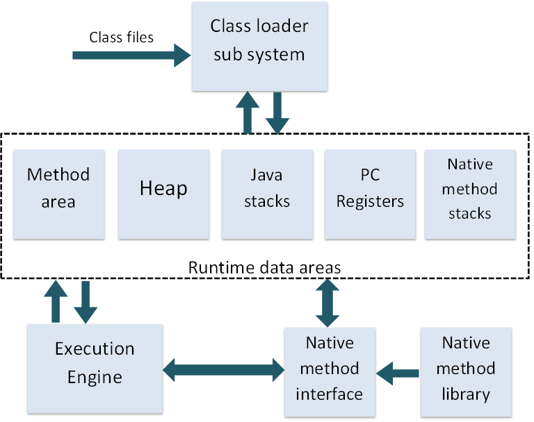
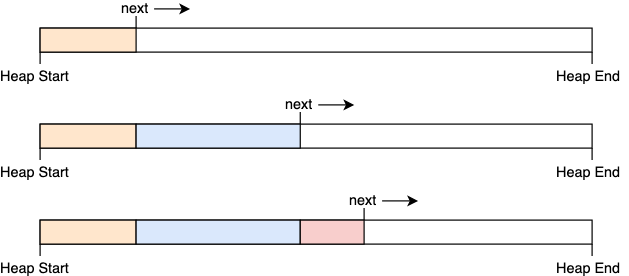
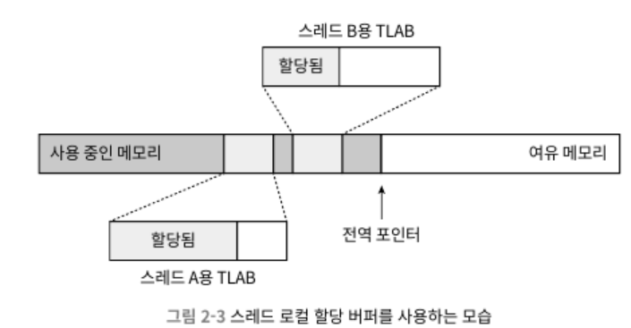
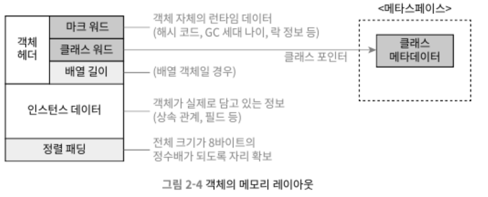

> 이 포스팅은 [JVM 밑바닥까지 파헤치기](https://ebook.insightbook.co.kr/book/164)책을 참고하여 작성된 글이다.

# 자바 메모리 영역과 메모리 오버플로

## 들어가며

메모리 관리 측면에서 C,C++ 개발자는 전권을 가진 황제인 동시에 잡다한 막노동도 직접 하는 일꾼이라 할 수 있다.

자바 개발자는 가상머신이 제공하는 자동 메모리 관리 메커니즘 덕에 메모리 할당과 해제를 짝지어 코딩하지 않아도 메모리 누수나 오버플로 문제를 거의 겪지 않는다. 하지만 이에 대한 단점으로 문제가 터지면 가상 머심의 메모리 관리 방식을 이해하지 못하는 한 해결하기가 상당히 어렵다는 점이다.

## 런타임 데이터 영역

자바 가상 머신은 자바 프로그램을 실행하는 동안 필요한 메모리를 몇개의 데이터 영역으로 나눠 관리한다. 각각 영역들은 목적과 생성/삭제 시점이 있고 영역마다 다르다.

### 프로그램 카운터(PC)

PC는 다음에 실행할 바이트코드의 명령어를 선택하는 식으로 동작한다. 예외처리나 스레드 복원 같은 모든 기본 기능이 바로 이 표시기를 활용해 이루어진다.

PC는 각 스레드마다 고유한 PC가 필요하므로 스레드 프라이빗 메모리에 저장된다. 또한 스레드가 자바 메서드를 실행 중일때는 실행 중인 바이트코드 명령어 주소가 PC에 기록된다. 한편 스레드가 네이티브 메서드를 실행할 때는 PC 값은 undefined이다.

### 자바 가상 머신 스택

자바 가상 머신 스택도 스택 프라이빗 하다. 각 메서드가 호출될 때마다 자바 가상 머신은 스택 프레임을 만들어 지역 변수 테이블, 피연산자 스택, 동적 링크, 메서드 반환 값등의 정보를 저장한다.

사람들은 자바의 메모리 영역을 스택과 힙으로만 구분하는데 자바 메모리 영역 구분은 훨씬 복잡하다. 하지만 이 2가지가 강조되는 이유는 스택과 힙이 객체 메모리 할당과 가장 밀접해서이지 않을까?

스택의 지역 변수 테이블에는 자바 가상 머신이 컴파일 타임에 알 수 있는 기본 데이터 타입, 객체 참조, 반환 주소 타입을 저장한다. 이것들을 저장하는 공간을 지역 변수 슬롯이라 하며 일반적으로 32bit이다. 또한 지역 변수 테이블을 구성하는 데 필요한 데이터 공간은 컴파일 과정에서 할당된다.

자바 가상 머신은 스택 메모리 영역에서 2가지 오류가 발생 할 수 있다.

- StackOverflowError: 스레드가 요청한 스택 깊이가 가상 머신이 허용하는 깊이보다 클때 예외를 던진다.
- OutOfMemoryError: 스택 용량을 동적으로 확장할 수 있는 자바 가상 머신에서 스택을 확장하려는 시점에 여유 메모리가 충분하지 않다면 예외를 던진다.

### 네이티브 메서드 스택

가상 머신 스택과 유사. 네이티브 메서드를 실행할때 사용된다. 자바 가상 머신 명세에 어떤 구조로 어떻게 표현해야한다는 것이 명시되어 있지 않아 구현자가 원하는 형태로 자유롭게 표현이 가능. 그래서 네이티브 메서드 스택과 가상 머신 스택을 합쳐놓은 핫스팟 VM등도 있다.

### 자바 힙

자바 힙은 자바 애플리케이션이 사용할 수 있는 가장 큰 메모리다. 이 영역은 객체 인스턴스를 저장하는 것이고 **거의** 모든 객체 인스턴스가 이 영역에 저장된다. 여기서 **거의**라고 표현한 이유는 기술이 점점 발전함에 따라 모든 객체가 저장된다는것은 절대적 진리가 될 수 없기 때문이다.

자바 힙은 가비지 컬렉터가 관리하는 메모리 영역이기 때문에 GC힙이라고도 부른다.

여러 문헌에서 자바 가상 머신의 힙 메모리는 신세대, 구세대, 영구 세데, 에덴 생존자 공간등으로 나눈다고 말한다. 과거에는 그랬는지 몰라도 오늘날의 가비지 컬렉터 기술은 그 시절에 머물지 않는다. 심지어 핫스팟에서도 세대 단위 설계를 따르지 않는 컬렉터도 포함되었다.

자바 힙은 모든 스레드가 공유한다. 따라서 객체 할당 효율을 높이고자 스레드 로컬 할당 버퍼 여러개로 나뉜다. 하지만 이렇게 나뉘는 이유는 오직 메모리 회수와 할당을 더 빠르게 하기 위함일뿐 그 이상 그 이하도 아니다.

자바 힙은 물리적으로 떨어진 메모리에 위치해도 상관 없으니 논리적으로는 연속되어야 한다. 하지만 대다수 가상 머신들이 큰 객체는 물리적으로 연속된 메모리 공간을 사용하도록 구현한다. 그 이유는 저장 효율을 높이고 구현 로직을 단순하게 유지하기 위해서이다.

자바 힙은 고정 혹은 확장이 가능하다. -Xms와 -Xmx 매개변수를 사용함으로 확장이 가능하다.

### 메서드 영역

메서드 영역도 모든 스레드가 공유한다. 메서드 영역은 가상 머신이 읽어 들인 타입 정보, 상수, 정적 변수 그리고 JIT 컴파일러가 컴파일한 코드 캐시등을 저장하는데 이용한다.

메서드 영역을 이야기하면 영구 세대 이야기가 꼭 나온다. JDK7까지 많은 개발자들이 메서드 영역과 영구세대를 혼동하였다. 그 이유는 핫스팟 개발팀이 가비지 컬렉터 수집의 범위를 메서드 영역까지 확장했고 그 결과 메서드 영역을 영구세대에 구현하는 후부터다.

JDK6 시절, 영구세대를 포기하고 메서드 영역을 네이티브 메모리에 구현할 계획을 세웠다. 그래서 JDK7에 영구세대에서 관리하던 문자열 상수와 정적 변수등의 정보를 자바 힙으로 옮겨 갔다.

메서드 영역은 자바 힙과 마찬가지로 연속될 필요가 없고 크기를 고정할 수도 있고 확장 가능하게 만들 수도 있다. 심지어 가비지 컬렉션을 하지 않아도 좋다.

### 런타입 상수 풀

런타임 상수 풀은 메서드 영역 일부다. 상수 풀 테이블에는 클래스 버전, 필드, 메서드, 인터페이스등 클래스 파일에 포함된 설명 정보에 더해 컴파일 타임에 생성된 다양한 리터럴과 심벌 참조가 저장된다. 가상 머신이 클래스를 로드할 때 이러한 정보가 상수 풀에 담긴다.

자바 가상 머신은 클래스 파일의 각 영역별로 엄격한 규칙을 정해놓았다. 반면 런타임 상수 풀은 요구사항을 상세하게 정의해두지 않아서 가상 머신 제공자가 입맛에 맞게 구현이 가능하다. 그렇지만 클래스 파일에 기술된 심벌 참조는 물론, 심벌 참조로부터 번역된 직접 참조 역시 런타임 풀에 저장되는게 일반적이다.

런타임 상수 풀은 바로 **동적**이라는 특징이 있다. 런타임에 메서드 영역의 런타임 상수 풀에 새로운 상수가 추가될 수 있다. String 클래스의 `intern()` 메서드가 그 예시이다.

### 다이렉트 메모리

JDK1.4에서 NIO가 도입되면서 채널과 버퍼 기반 I/O 메서드가 소개되었다. NIO는 자바 힙과 네이티브 힙 사이에서 데이터를 복사해 주고받지 않아도 돼서 일부 시나리오에서 성능을 크게 개선했다. 일종의 DMA가 아닐까?

## 핫스팟 가상 머신에서의 객체 들여다보기

다음으로 살펴 볼 주제는 메모리 모델이다. 핫스팟이 관리하는 자바 힙에서의 객체 생성(할당), 레이아웃, 접근 방법 등 전체 과정의 상세내용을 살펴보자.

### 객체 생성

자바는 객체지향 언어이다. 언어 수준에서 객체 생성(복사와 역직렬화 제외)은 보통 단순이 `new`키워드로 쓰면 끝난다. 그렇다면 가상 머신 수준에선는 과연 어떤 과정을 거쳐 객체(배열과 Class 객체가 아닌 일반적인 객체)가 생성될까?

자바 가상 머신이 `new` 명령에 해당하는 바이트코드를 만나면 이 명령의 매개변수가 상수 풀 안의 클래스를 가리키는 심벌 참조인지 확인한다. 다음으로 심벌 참조가 뜻하는 클래스가 로딩, 해석, 초기화가 되었는지 확인한다. 준비되지 않은 클래스라면 로딩부터 한다.

로딩이 완료된 클래스라면 새 객체를 담을 메모리를 할당. 객체에 필요한 메모리 크기는 클래스를 로딩하고 나면 완벽히 알 수 있다. 객체용 메모리 공간 할당은 자바 힙에서 특정 크기의 메모리 블록을 잘라 주는 일이라 할 수 있다.

자바 힙이 완벽히 규칙적이라면 한쪽에는 사용 중인 메모리를 다른 한쪽에는 여유 메모리가 있고 포인터는 정확히 두 메모리 사이를 가리킬 것이다. 여기서 객체를 생성하여 메모리를 할당하면 포인터를 여유 공간 쪽으로 객체 크기만큼 옮겨질텐데 이것을 **포인터 밀치기**라고 한다.

하지만 자바 힙은 규칙적이지 않다. 사용 중인 메모리와 여유 메모리가 뒤섞여 있어서 포인터를 밀쳐 내기가 그리 간단하지 않다. 그래서 가상 머신은 가용 메모리 블록들을 목록으로 따로 관리하고 객체가 할당되면 해당 목록을 갱신한다. 이런 방식을 여유목록이라 한다.

어떤 방식을 쓸지는 자바 힙이 규칙적이냐 아니냐에 따라 달라지며 이 부분은 가비지 컬렉터가 컴팩트를 할 수 있느냐에 달렸다.

가상 머신에서 객체 생성 과정은 매우 빈번히 일어난다. 특히 멀티스레딩 환경에서 여유 메모리의 시작 포인터 위치를 수정하는 단순한 일도 스레드 safe하지 않기 때문에 여러 스레드가 동시에 객체를 생성하려고 할 때 문제가 생길 수 있다.

해법은 2가지다. 첫번째는 메모리 할당을 동기화 하는 방법이다. 둘째는 스레드 마다 다른 메모리 공간을 할당하는 방법이다. 여기서 다른 메모리 공간을 스레드 로컬 할당 버퍼(TLAB)라고 한다. 각 스레드는 로컬 버퍼에서 메모리를 할당받아 사용하다가 버퍼가 부족해지면 그때 동기화를 해 새로운 버퍼를 할당 받는 식이다.

메모리 할당이 끝났으면 가상 머신은 할당받은 공간을 0으로 초기화한다. 스레드 로컬 할당 버퍼를 사용한다면 초기화는 TLAB 할당 시 미리 수행된다. 자바에서 객체의 인스턴스 필드를 초기화하지 않고도 사용할 수 있는 이유가 바로 이 덕이다.

다음 단계로 자바 가상 머신은 각 객체에 필요한 설정(어느 클래스 인스턴스인지, 클래스의 메터정보, 해시코드, GC 세대 나이)을 하고 이 정보가 객체 헤더에 저장된다.

이제 `new` 명령어에 이어서 생성자까지 실행되어야 객체를 개발자의 의도대로 초기화해야 비로소 사용 가능한 진짜 객체가 된다.

> ✅ 자바 컴파일러는 자바의 new 키워드를 발견하면 바이트코드 명령인 new(자바 가상 머신 관점에서 객체 생성(메모리 할당등))와 invokespecial(자바 프로그램 관점에서 객체 생성(생성자 실행))로 변환한다.

OpenJDK의 기본 인터프리터는 템플릿 인터프리터이므로 바이트코드 인터프리터가 실제로 쓰일 일은 거의 없다. 하지만 템플릿 인터프리터에는 다양한 최적화가 적용되어 있어 코드를 이해하기 어렵고 JIT 컴파일러가 쓰인다면 소스코드와 바이트코드의 차이는 훨씬 커진다.

### 객체의 메모리 레이아웃

핫스팟 가상머신은 객체를 세 부분으로 나눠 힙에 저장된다. 바로 객체 헤더, 인스턴스 데이터, 길이 맞추기용 정렬 패딩이다.

#### 객체 헤더

객체 헤더에 두 유형의 정보를 담는다. 첫 번째 유형은 객체 자체의 런타임 데이터(해시코드, GC 세대 나이, 락 상태 플래그, 스레드가 점유하고 있는 락들, 편향된 스레드의 아이디, 편향된 시각의 타임스태프등)이다.

객체는 아주 많은 런타임 데이터를 필요로 해서 해당 메모리 구조에 다 담을 수 없다. 객체 헤더에는 객체 자체가 정의한 데이터와 관련없는 정보까지 담아야 해서 한정된 메모리를 최대한 효율적으로 써야 한다. 그래서 마크워드라는 런타임 데이터의 구조는 동적으로 의미가 달라진다.

객체 헤더에서 마크 워드 다음에는 클래스 워드가 온다. 클래스 워드에는 객체의 클래스 관련 메타데이터를 가리키는 클래스 포인터가 저장된다. 이 포인터를 통해 자바 가상 머신은 특정 객체가 어느 클래스의 인스턴스인지 런타임에 알 수 있다.

추가로 자바 배열의 경우 배열 길이도 객체 헤더에 저장한다.

#### 인스턴스 데이터

인스턴스 데이터는 객체가 실제로 담고 있는 정보다. 코드에서 정의한 다양한 타입의 필드 관련 내용, 부모 클래스 유무, 부모 클래스에서 정의한 모든 필드가 이 부분에 기록된다.

이러한 정보의 저장한 순서는 가상 머신의 할당 전략 매개 변수와 자바 소스 코드에서 필드를 정의한 순서에 따라 달라진다. 핫스팟 가상 머신은 기본적으로 long·double, int, short·char byte·boolean, 일반 객체 포인터 순으로 할당한다.

#### 정렬 패딩

정렬 패딩은 존재하지 않을 수 있으며, 특별한 의미 없이 자리를 확보하는 역할만 한다. 핫스팟 가상머신의 자동 메모리 관리 시스템에서 객체의 시작 주소는 반드시 8바이트의 정수배다. 그래서 모든 객체는 8바이트 정수배여야 한다. 그래서 객체헤더 또한 이렇게 잘 맞춰져 있으므로 인스턴스 데이터만 조건 충족을 못할 시 채워주는 역할을 해준다.

### 객체에 접근하기

대다수 객체는 다른 객체 여러개를 조합해 만들어진다. 스택에 있는 참조 데이터를 통해 힙에 들어 있는 객체들에 접근해 이를 조작한다. 주로 핸들아니 다이렉트 포인터를 사용해 구현한다.

핸들 방식에서는 자바 힙에 핸들 저장용 풀이 별도로 존재할 것이다. 참조에는 객체의 핸들 주소가 저장되고 핸들에는 다시 해당 객체의 인스턴스 데이터, 타입 데이터, 구조등의 정확한 주소 정보가 담길 것이다.

핸들 방식의 가장 큰 장점은 참조에 '안정적인' 핸들의 주소가 저장된다. 핸들을 이용하면 이렇게 객체의 위치가 바뀌는 상황에서도 참조 자체는 손댈 필요 없이 핸들 내의 인스턴스 데이터 포인터만 변경하면 된다.

다이렉트 포인터 방식의 가장 큰 장점은 속도다. 핸들을 경유하는 오버헤드가 없기 때문이다.

핫 스팟은 주로 다이렉트 포인터 방식을 사용한다.
