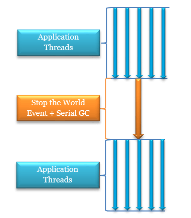
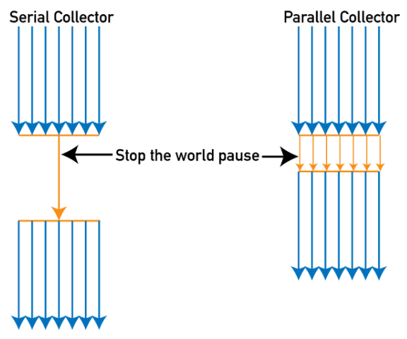
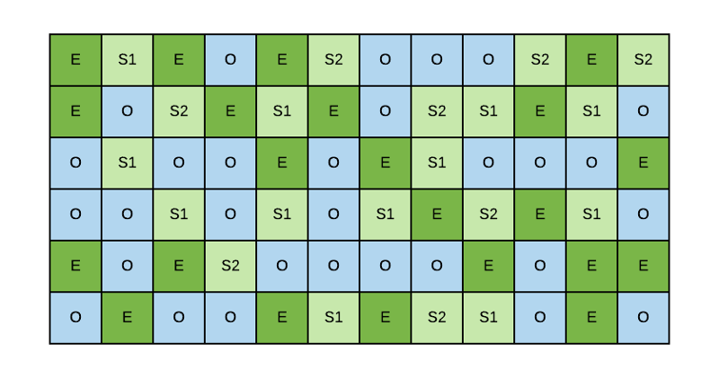

> 이 포스팅은 [JVM 밑바닥까지 파헤치기](https://ebook.insightbook.co.kr/book/164)책을 참고하여 작성된 글이다.

## 가비지 컬렉터와 메모리 할당 전략

### 들어가며

가비지 컬렉션의 역사는 자바보다 오래되었다. 가비지 컬렉션이 처리해야 할 문제를 제기하였다.

- 어떤 메모리를 회수해야 하나?
- 언제 회수해야 할까?
- 어떻게 회수해야 할까?

오늘날 동적 메모리 할당과 가비지 컬렉션 기술은 상당히 발전되었다. 왜 가비지 컬렉션과 메모리 할당의 내부를 이해해야 할까?

정답은 다양한 메모리 오버플로우와 누수 문제를 해결해야 하는 상황이나 더 높은 동시성을 달성하는 데 가비지 컬렉션이 방해가 되는 상황때문이다.

자바 힙과 메서드 영역은 요구하는 메모리 크기가 다를 수 있다. 그래서 이 메모리 영역들의 할당과 회수는 동적으로 이루어진다. 가비지 컬렉터는 바로 이런 영역을 관리하는 데 집중한다.

### 대상이 죽었는가?

자바 세계에서 거의 모든 객체 인스턴스가 힙에 저장된다. 가바지 컬렉터가 힙을 청소하려면 가장 먼저 객체의 생사유무를 알아야 한다.

#### 참조 카운팅 알고리즘

많은 교재에서 객체가 살아 있는지 판단하는 알고리즘은 아래와 같이 말한다.

- 객체를 가리키는 참조 카운터를 추가한다. 참조하는 곳이 하나 늘어날 때마다 카운터 값을 1씩 증가시킨다.
- 참조하는 곳이 하나 사라질때마다 카운터 값을 1씩 감소시킨다.
- 카운터 값이 0이 된 객체는 더는 사용될 수 없다.

하지만 자바 가상 머신에서는 참조 카운팅을 쓰지 않는다. 이 간결한 알고리즘에서도 고려해야 할 특이 상황이 적지 않고 모든 상황에서 문제없이 동작하게 하려면 계산할 게 상당히 늘어나기 때문이다.

#### 도달 가능성 분석 알고리즘

오늘날의 주류 프로그래밍 언어들은 객체 생사 판단에 도달 가능성 분석 알고리즘을 이용한다. 이 알고리즘의 기본 아이디어는 GC루트라고 하는 루트 객체들을 시작 노드 집합으로 쓰는 것이다. 탐색 과정에서 만들어지는 경로를 참조 체인이라 한다. 그리고 어떤 객체와 GC 루트 사이를 이어주는 참조 체인이 없다면 이 객체는 더 이상 사용하는게 아닐 것이다.

자바에서 GC루트로 이용할 수 있는 객체는 아래와 같다.

- 가상머신스택에서 참조하는 객체: 실행중인 메서드에서 쓰는 매개변수, 지역변수, 임시변수
- 메서드 영역에서 클래스가 정적 필드로 참조하는 객체: 자바 클래스의 참조 타입 정적 변수
- 메서드 영역에서 상수로 참조되는 객체: 문자열 테이블 안의 참조
- 네이티브 메서드 스택에서 JNI가 참조하는 객체
- 자바 가상 머신 내부에서 쓰이는 참조: 기본 데이터 타입에 해당하는 Class 객체, 일부 상주 예외 객체, 시스템 클래스 로더
- 동기화 락으로 잠겨 있는 모든 객체
- 자바 가상 머신 내부 상황을 반영하는 JMXBean: JVMTI에 등록된 콜백, 로컬 코드 캐시등

세대 단위 컬렉션과 부분 컬렉션의 경우, 자바 힙의 일부 영역부터 분석을 시작한다. 또한 객체는 다른 영역에 있는 객체도 참조할 수 있으므로 연관된 영역의 객체들도 GC루트 집합에 포함시켜야 도달 가능성을 정확하게 분석할 수 있다.

#### 다시 참조 이야기로

- 강한 참조: 가장 전통적인 정의의 참조를 뜻한다. 즉, 프로그램 코드에서 참조를 할당하는 걸 말한다. 강한 참조 관계가 남아 있는 객체는 GC가 절대 회수하지 않는다.

- 부드러운 참조: 유용하지만 필수는 아닌 객체를 표현한다. 부드러운 참조만 남은 객체라면 메모리 오버플로가 나기 직전에 두 번째 회수를 위한 회수 목록에 추가된다.

- 약한 참조: 부드러운 참조와 비슷하지만 연결 강도가 더 약하다. 약한 참조뿐인 객체는 다음번 GC까지만 살아 있다. GC가 동작하기 시작하면 메모리가 넉넉하더라도 약하게 참조된 객체는 모두 회수된다.

- 유령참조: 참조 중에 가장 약함. 유령참조는 객체 수명에 아무런 영향을 주지 않으며 유령 참조를 통해 객체 인스턴스를 가져오는 것마저 불가능하다. 유령 참조를 거는 유일한 목적은 대상 객체가 회수될 때 알림을 받기 위해서다.

> 파이널 참조
>
> 참조 강도는 약한 참조와 유령 참조 사이로 `finalize()` 메서드를 구현한 객체는 모두 파이널 참조의 대상이 되어 별도의 대기열에 등록되며 해당 객체에 도달할 수 있는 강한 참조, 부드러운 참조, 약한 참조가 모두 없어지면 finalize() 메서드 호출.

#### 살았나 죽었나?

도달 가능성 분석 알고리즘이 '도달 불가능'으로 판단한 객체라고 해서 반드시 죽어야 하는 것은 아니고 유예단계가 남아 있다. GC루트와 연결된 참조 체인을 찾지 못한 객체에는 첫번째 표시가 이루어지면 이어서 필터링이 진행된다.

> 필터링 조건
>
> finalize() 메서드를 실행해야 하는 객체

finalize()가 필요없는 객체이거나 가상머신이 finalize()를 이미 호출한 경우 모두 실행할 필요없음으로 처리된다.

필터링이 되면 그 객체는 F-큐라는 대기열에 추가된다. 그러면 나중에 가상머신이 우선순위가 가장 낮은 종료자 스레드를 생성해 F-큐에 들어 있는 객체들의 finalize 메서드를 실행한다.

finalize 메서드를 통해 부활한 객체는 참조 체인상의 아무 객체와 다시 연결하면 된다.

> finalize 사용X jdk9부터 폐기 대상

#### 메서드 영역 회수하기

메서드 영역의 가비지 컬렉션은 상수와 클래스를 회수한다. 다 쓴 상수를 회수하는 방법도 자바 힙에서 객체를 회수하는 방법과 매우 비슷하다.

다 쓴 상수는 이 리터럴을 누군가 쓰고 있는지 판단만 하면 되지만 클래스는 더 복잡하다. 아래의 3가지 조건을 동시에 만족해야 한다.

- 이 클래스의 인스턴스가 모두 회수되었다. 즉, 자바 힙에는 해당 클래스와 하위 클래스의 인스턴스가 하나도 존재하지 않는다.
- 이 클래스를 읽어 들인 클래스 로더가 회수되었다. 이 조건은 OSGi나 JSP 리로딩처럼 세심하게 설계된 대안 클래스 로더 없ㅇ이는 충족하기 어렵다.
- 이 클래스에 해당하는 `java.lang.Class` 객체를 아무 곳에서도 참조하지 않고 리플렉션 기능으로 이 클래스의 메서드를 이용하는 곳도 전혀 없다.

### 가바지 컬렉션 알고리즘

객체의 생사를 판별하는 방식을 기준으로 GC 알고리즘을 '참조 카운팅 GC', '추적 GC'로 나눌 수 있다. 이 둘을 '직접 가비지 컬렉션'과 '간접 가비지 컬렉션'이라고 부르기도 한다. 참조 카운팅 GC는 주류 가상 머신에 사용하지 않기 때문에 아래의 알고리즘들은 전부 추적 GC이다.

#### 세대 단위 컬렉션 이론

현재 상용 가상 머신들이 채택한 가비지 컬렉터는 대부분 세대 단위 컬렉션 이론에 기초해 설계하였다. 세대 단위 컬렉션 이론의 본질은 대다수 프로그램에서 관측된 실제 상황들에서 얻은 경험 법칙을 구현한 것이다.

- 약한 세대 가설: 대다수 객체는 일찍 죽는다.
- 강한 세대 가설: 가비지 컬렉션 과정에서 살아남은 횟수가 늘어날수록 더 오래 살 가능성이 커진다.

이 2가지 가정을 합쳐서 자바 힙을 몇개의 영역으로 나누고 객체들을 나이에 따라 각기 다른 영역에 할당하는 것이다. 곧바로 죽을 운명의 객체는 한 곳에 몰아 넣고 살아남는 소수의 객체를 유지시키는데 집중함으로 가비지 컬렉션에 드는 전체 시간도 줄고 메모리 공간도 효율적으로 이용할 수 있다.

각 영역에 담긴 객체들의 생존 특성에 따라 가비지 컬렉션 알고리즘을 구분해 적용한다.

세대 단위 컬렉션 이론을 가상 머신에 적용한 설계자들은 자바 힙을 최소 2개 영역으로 나눈다. 바로 신세대와 구세대다. 신세대는 가비지 컬렉션 때마다 다수의 객체가 죽고 살아남은 소수만 구세대로 승격된다.

원래 핫스팟은 개발자들에게 새로운 가비지 컬렉터를 되도록 이 프레임워크 위에서 개발하라 장려하였지만 그러지 않았고 이유는 당시 세대 단위 컬렉션 이론 자체가 계속 발전하는 중이어서 구현 방식 역시 개선할 점이 많았기 때문이다.

또한 신세대는 영역을 나누는 것 외에 복잡한 상황이 있는데 바로 신세대 객체를 구세대 객체가 참조하는 경우다. 따라서 살아남을 객체를 찾으려면 도달 가능성을 분석할 때 고정된 GC 루트들뿐 아니라 구세대 객체까지 모두 탐색해야 결과를 신뢰할 수 있다.

이 문제를 풀려면 또 하나의 법칙을 추가해야 한다.

> 세대 간 참조의 개수는 같은 세대 안에서의 참조보다 훨씬 적다.

위의 가설을 통해 세대 간 참조의 수는 아주 적고 구세대 전체를 훓는 것은 낭비일 수 있다. 그저 신세대에 기억 집합이라는 전역 데이터 구조를 하나 두면 될 것이다. 그리고 마이너 GC가 수행되면 세대 간 참조를 포함하는 작은 메모리 블록 안의 객체들만 GC루트에 추가된다. 이 방식에서는 객체 사이에서의 참조 관계 변화를 정확히 관리해야 한다. 그래서 런타임에 할 일이 늘어나지만 구세대 전체를 훓지는 않는다.

#### 마크-스윕 알고리즘

가장 기본적인 가비지 컬렉션 알고리즘. 작업을 표시와 쓸기라는 두 단계로 나눠 진행. 먼저 회수할 객체들에 모두 표시하고 표시된 객체들을 쓸어 담는 방식.

단점으로는 아래와 같다.

- 실행효율이 일정하지 않다. 객체가 많아질수록 표시하고 쓸어 담는 작업의 효율이 떨어지는 구조이다.
- 메모리 파편화가 심하다.

#### 마크-카피 알고리즘

카피 알고리즘. 회수할 객체가 많아질수록 효율이 떨어지는 마크-스윕 알고리즘의 문제를 해결하기 위해 나옴. 이 알고리즘은 가용 메모리를 똑같은 크기의 두 블록으로 나눠 한 번에 한 블록만 사용. 한쪽 블록이 꽉 차면 살아남은 객체들만 다른 블록으로 카피하고 기존 블록은 쓱 청소한다.

또한 복사 과정에서 객체들이 메모리의 한쪽 끝에서부터 차곡차곡 쌓이기 때문에 골치 아픈 메모리 파편화 문제로부터 해방된다. 게다가 실행효율도 좋다. 하지만 심각한 단점으로는 가용 메모리를 절반으로 줄여 낭비가 제법 심하다.

이로 인해 더 최적화된 전략이 나왔는데 바로 아펠 스타일 컬렉션이다.

구체적으로 보면 먼저 신세대를 하나의 큰 에덴 공간과 2개의 작은 생존자 공간으로 나뉜다. 그리고 메모리 할당할 때는 생존자 공간중 하나와 에덴을 이용한다. 가비지 컬렉션이 시작되면 에덴과 생존자 공간에서 살아남은 객체들을 나머지 생존자 공간으로 하나씩 복사 후 에덴과 이전 생존자 공간을 곧바로 비운다.

또한 메모리 할당 보증이라는 메커니즘으로 마이너 GC에서 살아남은 객체를 생존자 공간이 다 수용하지 못 할 경우 다른 메모리 영역(구세대)을 활용해 메모리 할당을 보증하는 것이다.

#### 마크 컴팩트 알고리즘

구세대 객체들의 생존 특성을 감안해서 마크-컴팩트 알고리즘 개발. 표시단계는 마크-스윕과 같다. 다만 컴팩트 단계에서 회수 대상 객체를 쓸어버리는 대신에 생존한 모든 객체를 메모리 영역의 한쪽 끝으로 모은 다음 나머지 공간을 한번에 비운다.

마크 스윕과의 핵심적인 차이는 메모리 이동이 일어난다는 것이다. 생존한 객체를 이동 시키는 것은 매우 부담이 될 것이다. 상식적으로 CPU를 많이 쓰는 작업이기도 하고 이동된 객체들을 가리키던 기존 참조들을 모두 갱신하긴 어려울 것이다. 또한 이러한 작업은 애플리케이션이 모두 멈춘 상태에 진행되어야 하는 단점이 있다. 이런 것을 stop the world라고 표현한다.

하지만 마크 스윕 알고리즘처럼 살아 있는 객체를 전혀 이동시키지 않는다면 힙이 결국 파편화가 진행될 것이다. 그래서 메모리 할당과 접근 방식 자체를 더욱 복잡하게 만들어야 한다.

핫스팟 가상머신에서 처리량에 중점을 둔 패러렐 올드 컬렉터는 마크 컴팩트 알고리즘에 기초하고 지연시간에 중점을 둔 CMS 컬렉터는 마크 스윕 알고리즘에 기초한다.

### 핫스팟 알고리즘 상세 구현

#### 루트 노드 열거

루트 노드 열거란 도달 가능성 분석 알고리즘에서 GC 루트 집합으로부터 참조 체인을 찾는 작업을 말한다. GC 루트로 고정할 수 있는 노드는 주로 전역참조와 실행 콘텍스트에 존재한다.

오늘날 자바 어플리케이션은 거대해지고 있고 그만큼 클래스와 상수의 수도 증가하여 모든 참조를 하나하나 확인하려면 엄청난 시간이 걸린다.

지금까지 모든 컬렉터는 루트 노드 열거 단계에서 사용자 스레드를 일시정지해야 했다. 즉, stop the world 문제를 피할 수 없었다.

현재 도달 가능성 분석 알고리즘은 다행히도 참조 체인 찾기 과정에서 사용자 스레드와 동시에 실행이 가능하다. 하지만 루트 노드 열거만큼은 반드시 일관성이 보장되는 스냅숏 상태에서 수행되어야 한다. 즉, 루트 노드들의 참조관계가 변하지 않아야 한다는 것이다.

이것이 가비지 컬렉션 시 모든 사용자 스레드가 일시정지 해야 하는 이유다.

현재 주류 자바 가상 머신들은 정확한 가바지 컬렉션을 사용한다. 따라서 스레드가 정지한 후 실행 콘텍스트와 전역 참조의 위치를 빠짐없이 확인할 필요가 없는 대신에 가상 머신이 객체 참조가 저장된 위치를 직접 알아낼 방법이 있어야 한다.

핫스팟은 OopMap이라는 데이터 구조를 이용해 문제를 해결한다. 먼저 클래스 로딩이 완료되면 객체에 포함된 각 데이터 타입을 확인한다. 그리고 JIT 컴파일 과정에서 스택의 어느 위치와 어느 레지스터의 데이터가 참조인지 기록한다.

#### 안전 지점

핫스팟의 OopMap을 사용하면 뒤 따르는 문제가 있다. 참조 관계나 OopMap의 내용을 변경할 수 있는 명령어가 많으며 이런 명령어 모두에 OopMap을 만들어 넣으면 메모리를 더 많이 사용해야 한다. 실제로 가비지 컬렉션에 드는 공간 비용을 감당하기 어려울 것이다.

그래서 핫스팟은 모든 명령어 각각에 OopMap을 생성하지 않는다. 그 대신 안전 지점이라고 하는 특정한 위치에만 기록한다.

안전 지점의 위치를 선택하는 기준은 기본적으로 '프로그램이 장시간 실행될 가능성이 있는가'이다. 메서드 호출, 순환문, 예외 처리등이 명령어 흐름을 다중화하는 대표적인 예이며 이런 기능을 하는 명령어만이 안전 지점을 생성한다.

또한 가비지 컬렉션이 시작되면 JNI 호출을 실행 중인 스레드를 제외한 모든 스레드가 가장 가까운 안전 지점까지 실행하고 멈추게 할 방법이 필요하다. 선제적 멈춤과 자발적 멈춤이라는 2가지 선택지가 있다.

선제적 멈춤 방식은 스레드의 코드가 가비지 컬렉터를 신경쓰지 않는다. 즉, 가비지 컬렉션이 실행되면 시스템은 모든 사용자의 스레드를 인터럽트하고 중지된 지점이 안전 지점이 아니면 스레드를 재개하고 안전 지점으로 갈때까지 인터럽트를 반복한다. 인터럽트 많이 발생되니 요즘 사용X

자발적 멈춤 방식은 가비지 컬렉터가 스레드 수행에 직접 관여하지 않는다 그 대신 간단히 플래그 비트를 설정하고 각 스레드가 실행 중에 플래그를 적극적으로 폴링한다. 그러다 플래그 값이 true면 가장 가까운 안전지점에 스스로 멈춘다.

폴링은 코드에서 자주 일어나므로 매우 효율적이어야 한다. 핫스팟은 메모리 보호 트랩이라는 방법을 써서 폴링을 어셈블리 명령어 하나만으로 수행할 수 있게 단순화했다.

#### 안전 지역

안전지점 메커니즘은 다 좋지만 실행중이지 않은 프로그램의 경우가 문제가 된다. 이 프로그램들은 가상 머신의 인터럽트에 요청에 응답할 수 없고 따라서 안전 지점까지 수행한 후 인터럽트되어 스스로를 일시 정지시킬 수 없다. 그래서 안전 지역 개념이 나온것이다.

안전 지역은 일정 코드 영역에서는 참조 관계가 변하지 않음을 보장한다.

사용자 스레드는 안전 지역의 코드를 실행하기 앞서 안전 지역에 진입했음을 표시한다. 그러면 가비지 컬렉터는 안전 지역에 있다고 선언한 스레드들을 신경 쓸 필요가 없다.

#### 기억집합과 카드 테이블

세대 간 참조가 신세대와 구세대 사이로 국한되는 것은 아니다. G1, ZGC, 셰넌도어 컬렉터등 부분 GC를 지원하는 모든 가비지 컬렉터가 세대간 참조 문제를 겪을 수 있다. 따라서 기억 집합의 원리와 구현을 더 명확히 이해할 필요가 있다.

기억집합은 비회수 영역에서 회수 영역을 가리키는 포인터들을 기록하는 추상 데이터 구조다.

가비지 컬렉션 시 컬렉터는 기억 집합을 이용해 특정 비회수 영역에서 회수 영역을 가리키는 포인터가 존재하는지만 확인하면 된다. 따라서 기억 집합 설계자는 정밀도를 낮춰서 즉 기록 단위를 더 크게 잡아서 공간과 관리 비용을 절약 할 수 있을 것이다. 다음은 가능한 선택지다.

- 워드 정밀도: 레코드 하나가 메모리의 워드 하나에 매핑된다. 특정 레코드가 마킹되어 있다면 해당메모리 워드가 세대 간 포인터라는 뜻이다.

- 객체 정밀도: 레코드 하나가 객체 하나에 매핑된다. 특정 레코드가 마킹되어 있다면 해당 객체에 다른 세대의 객체를 참조하는 필드가 있다는 뜻이다.

- 카드 정밀도: 레코드 하나가 메모리 블록 하나에 매핑된다. 특정 레코드가 마킹되어 있다면 해당 블록에 세대 간 참조를 지닌 객체가 존재한다는 뜻이다.

카드 정밀도로 기억 집합을 구현한 것을 카드 테이블이라고 한다. 카드 테이블과 기억 집합의 관계는 자바 언어에서 `HashMap`과 `Map`의 관계정도이다.

카드 페이지 하나의 메모리에는 보통 하나 이상의 객체가 들어가 있다. 이 객체들 중에 하나에라도 세대 간 포인터를 갖는 필드가 있다면 카드 테이블에서의 해당 원소를 1로 표시하고 그 원소는 더럽혀졌다고 말한다. 세대 간 포인터를 갖는 객체가 하나도 없다면 0이라고 한다.

그리고 객체를 회수할 때는 카드 테이블에서 더렵혀진 원소만 확인하면 어떤 카드 페이지의 메모리 블록이 세대 간 포인터를 포함하는지 쉽게 파악할 수 있다.

#### 쓰기 장벽

이제 더 추가적인 문제가 남았다 바로 더렵혀졌다는 표시를 어떻게 하느냐, 즉 객체가 대입되는 순간 해당 카드 테이블을 어떻게 갱신하느냐다. 바이트 코드를 해석해 실행하는 경우라면 상대적으로 쉽지만 컴파일해 실행하는 경우는 어떨까? JIT 컴파일 후의 코드는 순수한 기계어 명령어들이다. 따라서 대입 연산 시 카드 테이블을 갱신하려면 기계어 코드 수준의 방법이 동원되어야 한다.

핫스팟 가상 머신은 쓰기 장벽 기술을 이용해 카드 테이블을 관리한다.

쓰기 장벽은 가상 머신 수준에서 '참조 타입 필드 대입'시 끼어드는 AOP aspect에 비유할 수 있다. 참조 타입에 객체가 대입되면 어라운드 어드바이스가 생성되어 대입 전후로 추가 동작을 수행할 수 있게 하는 것이다. 이런 기능 모두를 쓰기 장벽으로 구현할 수 있다.

쓰기 장벽을 적용하면 가상 머신은 추가로 실행할 명령어를 생성해 대입 연산 모두에 추가한다. 그래서 컬렉터가 쓰기 장벽으로 카드 테이블 갱신 연산을 추가한다면 참조가 갱신될 때마다 오버헤드가 더해진다.

쓰기 장벽에 의한 오버헤드 말고도 카드 테이블은 멀티스레드 시나리오에서 거짓 공유 문제를 일으킬 수 있다.

> 거짓 공유는 낮은 수준에서 동시성을 다룰 때 고려해야 하는 문제다.

#### 동시 접근 가능성 분석

루트 노드 열거가 끝나면 가비지 컬렉터는 GC루트로부터 객체 그래프를 탐색할 수 있다. 이 단계의 일시 정지 시간은 자바 힙 크기에 비례한다.

참조 관계를 추적하는 가비지 컬렉션 알고리즘들에는 공통적으로 '표시' 단계가 등장한다. 표시 단계의 일시 정지 시간이 힙 크기에 비례해 증가한다면 거의 모든 가비지 컬렉터에 악영향을 준다는 뜻이다.

사용자 스레드의 일시 정지 문제를 해결하거나 줄이고 싶다면 일관성이 보장되는 스냅숏 상태에서 객체 그래프를 탐색해야 하는 이유를 먼저 파악해야 한다. 삼색 표시 기법을 활용해 확인해보자.

- 흰색: 가비지 컬렉터가 방문한 적이 없는 객체다. 도달 가능성 분석을 시작하면 처음에는 당연히 모든 객체가 흰색이다. 분석을 마친 뒤에도 흰색인 객체는 도달 불가능함을 뜻한다.

- 검은색: 가비지 컬렉터가 방문한 적이 있으며 이 객체를 가리키는 모든 참조를 스캔했다. 검은 객체는 스캔되었고 확실히 생존한다는 뜻이다. 다른 객체에서 검은 객체를 가리키는 참조가 있다면 다시 스캔하지 않아도 된다.

- 회색: 가비지 컬렉터가 방문한 적 있으나 이 객체를 가리키는 참조 중 스캔을 완료하지 않은 참조가 존재한다.

접근 가능성 분석의 스캔동안 사용자 스레들은 멈춘 채로 컬렉터의 GC 스레드만 실행된다면 아무런 문제가 발생하지 않는다. 하지만 사용자 스레드와 컬렉터가 동시에 실행된다면 어떨까? 컬렉터가 객체 그래프에 색을 칠해 가는 도중에 사용자 스레드가 참조 관계를 변경하는 것이다. 그럼 아래와 같은 결과를 야기한다.

- 죽은 객체를 살았다고 잘못 표시

- 살아 있는 객체를 죽었다고 표시

동시 스캔 도중 객체 사라짐 문제를 해결하려면 두가지 조건중 하나만 깨트리면 된다. 그래서 해법도 증분 업데이트와 시작 단계 스냅숏 방식 2가지다.

증분 업데이트는 검은색 객체에 흰색 객체로의 참조가 추가되면 새로 추가된 참조를 따로 기록해 둔다. 그리고 동시 스캔이 끝난 후 기록해 둔 검은색 객체들을 루트로 다시 스캔한다.

시작 단계 스냅숏은 회색 객체가 흰색 객체로의 참조관계를 끊으려 하면 그 사실을 기록한다. 동시 스캔이 끝난 후 기록해둔 회색 객체들을 루트로 하여 다시 스캔한다.

### 클래식 가비지 컬렉터

JVM은 업체나 버전에 따라서 다른 가비지 컬렉터를 제공하고, 매개변수를 활용하여 다른 컬렉터를 활용할 수도 있다. 이에따라 jDK7~11까지의 가비지 컬렉터에 대해 알아보자.

#### 시리얼 컬렉터

시리얼 컬렉터는 가장 기초적이고 오래된 컬렉터로 JDK1.3.1 전까지 핫스팟 가상머신의 구세대용 컬렉터로는 유일한 선택지다. 이 컬렉터는 단일 스레드로 동작한다. 또한 이 컬렉터는 가비지 컬렉션이 시작되면 회수가 완료될때까지 다른 모든 작업 스레드가 멈춰 있어야 한다는 점이다.

시리얼 컬렉터는 최신 JDK에서도 꾸준히 지원하고 있다. 다만 신세대/구세대 구분 없이 모든 세대를 아우른다. 시리얼 컬렉터는 다른 컬렉터의 단일 스레드 알고리즘보다 간단하고 효율적이라는 이점을 지닌다. 요약하자면 이는 간단하고 효율적이다. 하지만 그 만큼 Stop the World의 시간도 증가하게 된다.

#### 파뉴 컬렉터

파뉴 컬렉터는 여러 스레드를 활용하여 시리얼 컬렉터를 병렬화한 버전이다. 스레드 회수에 멀티스레드를 이용한다는 점만 제외하고 시리얼 컬렉터와 동일하다. 이 컬렉터는 핫스팟 서버 저전에서는 큰 의미가 있어서 JDK7 전까지의 시스템들에서 신세대용 컬렉터로 특히 인기가 높았다. 그 이유는 시리얼 컬렉터를 제외하고는 CMS 컬렉터와 조합하여 사용할 수 있는 유일한 컬렉터였기 때문이다.

JDK5의 핫스팟에는 CMS 컬렉터가 탑재되었다. 이 컬렉터는 역사상 진정한 동시성을 지원하는 최초의 가비지 컬렉터다. GC 스레드와 사용자 스레드가 동시에 실행된다는 목표를 최초로 실현해 낸 것이다.

CMS 등장과 함께 파뉴의 입지가 탄탄해졌지만 G1의 등장으로 실패가 되었다.

G1의 등장으로 파뉴는 CMS에 통합되어 신세대를 전담하게 되었다. CMS의 일부가 되었다라고 볼 수 있다.

#### 페러랠 스캐빈지 컬렉터

PS컬렉터라고 한다. 마크-카피 알고리즘에 기초하여 여러 스레드를 이용해 병렬로 회수하는 등 많은 면에서 파뉴 컬렉터와 닮았다. PS 컬렉터는 다른 컬렉터와 다르게 처리량을 제어하는게 목표이다. 여기서 처리량이란 프로세서가 사용자 코드를 실행하는 데 사용하는 시간과 프로세서가 소비하는 총 시간 비율이다.

> 처리량 = 사용자 코드 실행 시간 / (사용자 코드 실행 시간 + 가비지 컬렉터 실행 시간)

응답시간이 빠르면 사용자 경험을 개선할 수 있다. 하지만 처리량이 높다면 프로세서 자원을 가장 효율적으로 써서 프로그램이 전체 작업을 최대한 빠르게 끝낼 수 있도록 한다. 계산 중간에 상호 작용할 일이 많지 않은 분석 업무 등에 특히 알맞다.

#### 시리얼 올드 컬렉터

시리얼 올드 컬렉터는 시리얼 컬렉터의 구세대용 버전이다. 단일 스레드 컬렉터이며 마크-컴팩트 알고리즘을 쓴다. 이 컬렉터도 주로 클라이언트용 핫스팟 가상 머신에 사용한다.

#### 페러렐 올드 컬렉터

PS 컬렉터의 구세대용 버전이며 멀티 스레드를 이용한 병렬 회수를 지원하며 마크-컴팩트 알고리즘을 기초로 구현되었다.

이 컬렉터는 JDK6까지는 이용이 불가했다. 신새대용으로 PS를 선택하면 구세대는 자연스럽게 시리얼 올드를 선택해야 했다. CMS처럼 더 나은 구세대용 컬렉터는 PS와 함께 사용할 수 없기 때문이다.

#### CMS 컬렉터

CMS 컬렉터는 표시와 쓸기 단계 모두를 사용자 스레드와 동시에 수행한다. CMS 컬렉터의 목적은 가비지 컬렉션에 따른 일시 정지 시간을 최소로 줄이는 것이다.

요즘 인터넷을 기반한 서비스는 서비스 응답 시간이 중요하므올 시스템의 일시 정지 시간이 짧아야 사용자에게 더 나은 경험을 선사할 수 있다. CMS는 이런 종류의 애플리케이션 요구에 적합한 컬렉터다.

이 컬렉터는 마크-스윕 알고리즘을 기초로 구현되었다. 동작방식도 다른 컬렉터에 비해 복잡하며 전체 과정은 아래와 같다.

- 최초 표시(stop the world o)

- 동시 표시

- 재표시(stop the world o)

- 동시 쓸기

촤초 표시 단계에서는 GC 루트와 직접 연결된 객체들만 표시하기 때문에 아주 빠르게 끝난다.

동시 표시 단계에서는 GC 루트와 직접 연결된 객체들로부터 시작해 객체 그래프 전체를 탐색한다. 시간이 오래 걸리지만 사용자 스레드를 멈추지 않는다. 즉, 동시에 실행된다.

재표시 단계에서는 동시 표시 도중 사용자 스레드가 참조 관계를 변경한 객체들을 바로 잡는다. 이 단계의 일시 정지 시간은 보통 최초 표시 단계보다 살짝 길다. 하지만 동시 표시 단계보다는 훨씬 짧다.

동시 쓸기 단계에서는 앞의 3가지 표시 단계에서 죽었다고 판단한 객체들만 쓸어 담는다. 사용자 스레드를 멈추지 않고 동시에 수행한다.

CMS는 동시 회수 능력 덕분에 정지 시간이 매우 짧다. 하지만 단점도 존재한다.

첫째, 프로세서 자원에 아주 민감하다. 사실 동시성을 위해 설계된 프로그램은 모두 프로세서 자원에 민감하다. 동시 수행 단계에서 사용자 스레드를 멈추지는 않더라도 어플리케이션을 느리게 하고 전체 처리량을 떨어뜨린다. (GC 쓰레드가 일을 잡아 먹는다.)

둘째, CMS가 부유 쓰레기를 발생시킬 수 있다. 어떤 객체는 표시 스레드가 지나간 후에 쓰레드기 될 수 있다. 이러한 객체는 쓸기 단계에서 회수할 수 없으며 이는 다음 GC때까지 기다려야 한다.

가비지 컬렉션 단계 동안 사용자 스레드는 계속 일을 해야 하므로 사용자 스레드가 사용할 메모리 공간이 충분히 확보되어야 한다. 따라서 다른 컬렉터들과 달리 CMS는 구세대가 거의 가득 찰 때까지 여유룝게 기다릴 형편이 못된다. 동시 쓸기 동안에도 프로그램이 올바르게 구동되는데 필요한 메모리 공간을 확보해 두어야 하기 때문이다.

마지막 세번째 마크-스윕 알고리즘의 고질적인 문제로 상당한 파편화를 일으킨다는 사실이다. 이런 파편화를 해결하기 위해서는 앞서 전체 GC를 수행해야 한다.

> CMS 컬렉터는 발전된 기능의 콜렉터인 G1, 셰년도어, ZGC가 등장하며 JDK14에서 완전히 제거되었다.

#### G1 컬렉터(가비지 우선 컬렉터)

G1은 부분 회수라는 컬렉터 설계 앙이디어와 리전을 회수 단위로 하는 메모리 레이아웃 분야를 개척했다.

G1은 주로 서버용 애플리케이션에 집중한 컬렉터다.

G1 설계자들은 정지 시간 예측 모델을 만들고자 했다. 정지 시간 예측 모델은 목표 시간을 밀리초로 설정하면 가비지 컬렉터가 쓰는 시간이 밀리초가 넘지 않도록 통제하는 것이다.

G1 등장 전까지 CMS를 포함한 모든 컬렉터의 회수 범위는 신세대 전체, 구세대 전체 또는 자바 힙 전체였다. 그리고 G1이 등장하면서 G1은 힙 메모리의 어느 곳이든 회수 대상에 포함할 수 있다. 이를 회수집합이라 하며 짧게 CSet라고 한다. 어느 세대에 속하느냐가 아니라 어느 영역에 쓰레기가 가장 많으냐와 회수했을 때 이득이 어디가 가장 크냐가 회수 영역을 고르는 기준이 된 것이다. 이것이 G1의 혼합 GC모드다.

G1도 여전히 세대 단위 컬렉션 이론에 기초하고 있다. 하지만 힙 메모리 레이아웃은 다른 컬렉터와 매우 다르다. 연속된 자바 힙을 동일 크기의 여러 독립 리전으로 나눈다. 각 리전은 필요에 따라 신세대의 에덴이나 생존자 공간이 될 수도, 구세대용 공간으로 쓰일 수 있다. 그래서 모든 리전은 새로 생성된 객체를 담을 수도 긴 시간 동안 몇 차례의 컬렉션에서 살아남은 객체를 담을 수도 있다. G1은 리전 각각에 역할별 전략을 구분하여 적용할 수 있어서 회수 효율을 극대화 한다.

- E : 에덴
- O : 구세대 (Old generation)
- S1 : Survivor Space 1
- S2 : Survivor Space 2

G1은 여전히 신세대/구세대 개념을 사용하지만 세대가 고정되어 있지는 않다. 리전별 역할을 동적으로 바꿀 수 있고 같은 역할을 리전이 연이어 배치될 필요도 없다. G1에서 정지 시간 예측 모델이 가능한 이유는 리전을 최소 회수 단위로 사용하기 때문이다.

처리방식을 더 살펴보자. G1은 각 리전의 쓰레기 누적값을 추적한다. 여기서 값이란 가비지 컬렉션으로 회수할 수 있는 공간의 크기와 회수에 드는 시간의 경험 값이다. 그리고 우선순위 목록을 관리하며 사용자가 매개변수로 설정한 일시 정지 시간이 허용하는 한도내에서 회수 효과가 가장 큰 리전부터 회수하는 것이다.

그러면 G1이 해결했어야 하는 문제를 살펴보자.

첫째, 힙을 다수의 독립된 리전으로 나눈다면 객체들의 리전 간 참조 문제를 해결해야 한다. 이전에도 관련 문제를 해결하기 위해 기억집합을 도입하였다.

G1의 기억 집합은 기본적으로 해시 테이블 구조이다. 키는 다른 리전들로부터의 시작 주소고, 값은 하나의 집합이다. 값에 저장되어 있는 원소들은 카드 테이블의 인덱스 번호이다. 내가 가르키는 대상과 나를 가르키는 대상을 모두 기록하는 양방향 기억집합이기에 카드테이블 구현이 매우 복잡하다. 그리고 리전 개수 역시 전통적인 컬렉터보다 훨씬 많기 때문에 더 많은 메모리를 사용한다.

둘째, 동시 표시 단계 동안 GC스레드와 사용자 스레드가 서로 간섭하지 않도록 보장해야 한다. 가장 먼저 해결해야한 문제는 사용자 스레드가 객체 참조 관계를 수정해도 원래의 객체 그래프 구조를 파괴하지 않도록 보장하는 일이다.

G1은 스냅샷 알고리즘을 활용해 이를 해결한다. GC수행중에도 새로 만들어진 객체는 계속 만들어진다.TAMS라는 두 개의 포인터를 설계해 활용한다. 상세 동작 과정은 아래와 같다.

리전 공간 일부를 동시회수되는 동안 새로운 객체를 할당하기 위한 공간으로 나눈다.
동시회수 동안 새로 생성되는 객체의 주소는 반드시 이 두 포인터보다 높은 주소 영역에 할당된다.
이 주소보다 높이 있는 객체는 암묵적으로 표시된 것을 간주하여 회수 대상에서 제외한다.
메모리 회수 속도가 메모리 할당 속도를 따라가지 못하면 Stop The World를 경험하게 된다.

셋 째, 신뢰할 수 있는 정지 시간 예측 모델을 구현한다. 사용자가 매개 변수로 설정한 일시 정지 시간은 가비지 컬렉션이 일어나기 전의 기댓값일 뿐이며, G1이를 지키기 위해 최선을 다해야 한다.

G1이 이를 구현하기 위한 이론적 기초는 감소 평균이다. 가비지 컬렉션이 이루어지는 동안 G1은 리전별 회수 시간, 쓰레기 수 등을 기반해 예측시간을 분석한다. 감소 평균은 일반 평균과 비교해 새로운 데이터에 더 민감하다. 즉, 최근은 평균적인 상태를 더 정확하게 알려주고, 리전의 상태를 더 최근에 게산할수록 얻는 이득을 더 높게 쳐준다. 이 정보를 기초로 어느 리전을 회수해야 예측 시간을 맞출 수 있을지 예측한다.

사용자 스레드가 실행되는 동안 수행하는 작업을 제외한다면 G1의 동작은 다음고 같다.

- 최초표시: GC루트가 직접 참조하는 객체들을 표시하고 TAMS포인터 값을 수정한다. 즉, 시작 단계 스냅숏을 생성한다. 사용자 스레드와 동시에 수정되는 다음 단계에서 개로운 객체들은 상위 포인터 공간에 저장되게 된다.

- 동시표시: GC로부터 시작하여 객체들의 도달 가능성을 분석하고, 전체 힙 객체 그래프를 재귀적으로 스캔하며 회수할 객체를 찾는다. 객체 그래프 스캔이 끝난 후 시작 단계 스냅숏과 비교하여 동시 실행 도중 참조가 변경된 객체들을 다시 스캔해야 한다.

- 재표시: 또 한 번 사용자 스레드를 잠시 멈춰야 하는 단계다. 시작 단계 스냅숏 이후 변경된 소수의 객체만 처리하면 되므로 매우 빠르게 끝난다.

- 복사 및 청소: 통계 데이터를 기초로 리전들을 회수 가치와 비용에 따라 줄 세운 다음 목표한 일시 정지 시간에 부합하도록 회수 계획을 세운다. 회수할 리전들을 적절히 선별하고 선별된 리전들에서 살아남은 객체들을 빈 리전에 이주시킨다.

위 과정에서 알 수 있듯이 G1은 동시 표시 단계를 제외하고는 모두 사용자 스레드를 멈춘다. 즉 짧은 지연 시간만을 추구하는게 아니라, 지연 시간을 제어한 동시에 처리량을 최대한 높이는 것이다.

정지 시간의 기댓값을 사용자가 설정할 수 있다는 건 G1의 매우 큰 강점이다. 이 값을 잘 조율하면 우리가 운영하는 애플리케이션에 이상적인 처리량 대 지연시간 균형점을 찾을 수 있다.

G1을 시작으로 최신 가비지 컬렉터 대다수는 자바 힙 전체를 한 번에 청소하는 대신 애플리케이션의 메모리 할당 속도에 맞춰 회수하는 방향으로 변화했다. 애플리케이션은 쓰레기를 버리고 동시에 컬렉터는 청소를 한다.

#### 오늘날의 가비지 컬렉터들

오늘날은 신세대용과 구세대용의 구분이 사라졌다.

시리얼 컬렉터가 시리얼 올드를 흡수했고 PS와 패러렐 올드가 합쳐져 패러렐이 되었다. CMS는 G1의 자리를 완전히 내주었다.

ZGC와 셰넌도어는 지연 시간 최소화를 목표로 하는 최첨단 컬렉터들이다.

### 저지연 가비지 컬렉터

#### 가비지 컬렉터의 핵심 지표

자바 애플리케이션에서 메모리 관리는 중요한 과제이며, 가비지 컬렉터(GC)는 이를 해결하는 핵심 기술이다. GC를 평가하는 주요 지표는 다음 세 가지이다.

- 처리량(Throughput): 애플리케이션이 실행되는 동안 얼마나 많은 작업을 완료했는지.
- 지연 시간(Latency): GC로 인해 발생하는 응답 지연 시간.
- 메모리 사용량(Memory Usage): GC가 얼마나 많은 메모리를 사용하는지.

모든 지표에서 최상의 결과를 내는 GC는 존재하지 않으며, 보통 두 가지 정도에서 최적화를 이룬다. 최근에는 메모리 사용량보다는 지연 시간이 더 중요한 고려 요소로 떠오르고 있다. 이는 힙 메모리가 증가할수록 GC의 일시 정지 시간이 길어지는 경향 때문이다.

#### 저지연 가비지 컬렉터의 등장

기존의 GC(예: CMS, G1)는 Stop-The-World(STW) 단계가 필요했으나, 저지연 가비지 컬렉터는 대부분의 과정을 애플리케이션 스레드와 동시에 수행하며 힙 크기와 무관한 짧은 일시 정지 시간을 자랑합니다. 대표적인 저지연 GC로는 **셰넌도어(Shenandoah)**와 ZGC가 있습니다.

#### 셰넌도어(Shenandoah): G1을 계승한 발전된 GC

셰넌도어는 G1 가비지 컬렉터의 힙 레이아웃을 기반으로 설계되었으며, 짧은 일시 정지 시간과 동시 처리를 목표로 합니다.

##### 주요 개선 사항

- 동시 모으기(Simultaneous Compaction):
G1과 달리, 셰넌도어는 사용자 스레드와 동시에 리전을 정리하고 객체를 이동할 수 있습니다.

- 비세대 단위(G1과 다른 점):
JDK 21까지는 세대 구분 없이 작동하며, 이로 인해 성능적인 부분에서는 약간의 제약이 있습니다.

- 연결 행렬(Connection Matrix):
셰넌도어는 G1이 사용하는 기억 집합 대신 효율적인 연결 행렬로 리전 간 참조 관계를 기록합니다.

#### 셰넌도어의 동작 방식

- 최초 표시(Initial Mark, STW):
GC 루트에서 직접 참조하는 객체를 짧은 일시 정지를 통해 표시합니다.

- 동시 표시(Concurrent Mark):
힙의 객체 그래프를 탐색하며 도달 가능한 모든 객체를 표시합니다. 사용자 스레드와 동시에 진행됩니다.

- 최종 표시(Final Mark, STW):
도달 가능 객체를 최종 표시하고, 회수할 리전을 선정합니다.

- 동시 청소(Concurrent Cleanup):
살아있는 객체가 없는 리전을 정리합니다.

- 동시 이주(Concurrent Evacuation):
리전의 객체를 다른 리전으로 이동하며 사용자 스레드와 동시에 실행됩니다. 이동 후에는 포인터를 수정하기 위해 읽기 장벽(Read Barrier)과 포워딩 포인터를 활용합니다.

#### 셰넌도어의 핵심 기술: 읽기 장벽과 포워딩 포인터

- 읽기 장벽(Read Barrier): 객체를 참조하는 모든 포인터를 동적으로 수정해 GC와 애플리케이션 스레드의 동시 실행을 지원합니다.

- 포워딩 포인터(Forwarding Pointer): 이동된 객체의 새 위치를 참조하며 사용자 스레드가 오래된 객체를 참조하지 않도록 돕습니다.

#### ZGC: 오라클의 저지연 GC

ZGC는 오라클이 설계한 저지연 가비지 컬렉터로, JDK 11에서 실험적으로 도입된 이후 JDK 15부터 정식 버전이 되었습니다. ZGC의 목표는 지연 시간을 10ms 이내로 유지하면서 힙 크기와 무관하게 동작하는 것입니다.

##### ZGC의 주요 기술

- 컬러 포인터(Color Pointer):
객체 상태를 나타내는 메타데이터를 포인터 자체에 저장합니다. 이를 통해 객체 헤더에 접근하지 않고도 객체의 상태를 확인할 수 있습니다.

- 메모리 다중 매핑(Memory Multi-Mapping):
같은 힙 메모리를 여러 가상 주소에 매핑하여 효율적인 메모리 관리를 지원합니다.

- 동적 리전 관리:
ZGC는 리전을 Small(2MB), Medium(32MB), Large(2MB 배수)로 나누고, 필요에 따라 동적으로 생성/제거합니다.

#### ZGC의 동작 방식

- 표시 단계(Marking Phase):
GC 루트에서 객체를 탐색하며 참조 가능 여부를 컬러 포인터에 표시합니다.

- 동시 재배치 준비(Relocation Preparation):
청소할 리전을 선정하고 재배치 집합을 구성합니다.

- 동시 재배치(Relocation):
객체를 새로운 리전으로 복사하며, 사용자 스레드가 접근하면 메모리 장벽을 통해 참조를 갱신합니다.

- 동시 재매핑(Remapping):
힙 전역에서 오래된 객체를 참조하는 포인터를 업데이트합니다.

#### 세대구분 ZGC

JDK 21부터는 세대 구분 ZGC가 도입되어, 신세대와 구세대를 구분하여 처리합니다. 이를 통해 젊은 객체를 더 자주 회수하여 성능을 개선합니다.

#### GC 선택 가이드

가비지 컬렉터를 선택할 때는 애플리케이션의 목적과 요구 사항에 따라 선택해야 합니다.

- 시리얼 컬렉터: 작은 데이터 처리 및 단일 프로세서 사용.
- G1 컬렉터: 짧은 일시 정지와 응답 시간이 중요할 때.
- 셰넌도어/ZGC: 초저지연이 필요할 때.