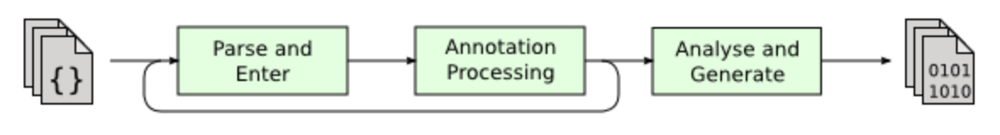

# 10장 프런트엔드 컴파일과 최적화

## 들어가며

컴파일타임

- 컴파일러의 프런트엔드가 .java 파일을 .class 파일로 변환하는 과정

---

- 자바 가상 머신에서 JIT 컴파일러가 바이트코드를 기계어로 변환하는 과정
- AOT 컴파일러를 사용하여 특정 하드웨어용 바이너리 코드로 곧바로 컴파일하는 방식

컴파일러

- 프런트엔드 컴파일러: JDK의 javac, 이클립스 JDT의 증분 컴파일러(ECJ)

---

- JIT 컴파일러: 핫스팟 가상 머신의 C1, C2 컴파일러, 그랄 컴파일러
- AOT 컴파일러: 그랄 컴파일러, JDK용 jaotc, 자바용 GNU 컴파일러(GCJ), 예흐켈시오르 JET

최적화

- 컴파일타임에는 개발자의 코딩 효율을 높이는 최적화를 프런트엔드 컴파일러가 수행한다.
    - javac는 개발자가 작성한 코드를 단순화하는 등 개발 단계에서 코딩 효율을 개선하는 최적화를 지원한다고 볼 수 있다. 최신 자바 문법 중에는 가상 머신 내부나 바이트코드 수준의 변경 없이 컴파일러가 편의 문법을 해석해 구현하는 게 많다.
- 런타임에는 코드 실행 효율을 높이는 최적화를 JIT 컴파일러가 지속해서 수행한다.
    - 자바 가상 머신 설계진이 성능 최적화는 런타임 컴파일러에 집중하기로 결정했는데, 그 이유로는, javac로 생성하지 않는 클래스 파일(JRuby, 그루비 등으로 작성한 클래스 파일)들도 최적화 효과를 공평하게 누리도록 하기 위함이다.

## javac 컴파일러

컴파일 과정



- 단계 0(준비). 플러그인 애너테이션 처리기들 초기화
- 단계 1. 구문 분석 및 심벌 테이블 채우기
    - 1.1 어휘 및 구문 분석: 소스 코드를 토큰화하여 추상 구문 트리 구성
    - 1.2 심벌 테이블 채우기: 심벌 주소와 심벌 정보 생성
- 단계 2. 플러그인 애너테이션 처리기들로 애너테이션 처리
- 단계 3. 의미 분석 및 바이트코드 생성
    - 3.1 특성 검사: 문법의 정적 정보 확인
    - 3.2 데이터 흐름 및 제어 흐름 분석: 프로그램의 동적 실행 과정 확인
    - 3.3 편의 문법 제거: 코드를 단순화하는 편의 문법을 원래 형식으로 복원
    - 3.4 바이트코드 생성: 지금까지 생성된 정보를 바이트코드로 변환

<aside>
💡

이 프로세스는 JavaCompiler 클래스에서 처리한다.

</aside>

```java
public class JavaCompiler {

	// ... 중략 ...
	
	public void compile(Collection<JavaFileObject> sourceFileObjects,
	                        Collection<String> classnames,
	                        Iterable<? extends Processor> processors,
	                        Collection<String> addModules)
	    {
	        if (!taskListener.isEmpty()) {
	            taskListener.started(new TaskEvent(TaskEvent.Kind.COMPILATION));
	        }
	
	        if (processors != null && processors.iterator().hasNext())
	            explicitAnnotationProcessingRequested = true;
	        // as a JavaCompiler can only be used once, throw an exception if
	        // it has been used before.
	        if (hasBeenUsed)
	            checkReusable();
	        hasBeenUsed = true;
	
	        // forcibly set the equivalent of -Xlint:-options, so that no further
	        // warnings about command line options are generated from this point on
	        options.put(XLINT_CUSTOM.primaryName + "-" + LintCategory.OPTIONS.option, "true");
	        options.remove(XLINT_CUSTOM.primaryName + LintCategory.OPTIONS.option);
	
	        start_msec = now();
	
	        try {
	            initProcessAnnotations(processors, sourceFileObjects, classnames); // 단계 0. 플러그인 애너테이션 처리기들 초기화
	
	            for (String className : classnames) {
	                int sep = className.indexOf('/');
	                if (sep != -1) {
	                    modules.addExtraAddModules(className.substring(0, sep));
	                }
	            }
	
	            for (String moduleName : addModules) {
	                modules.addExtraAddModules(moduleName);
	            }
	
	            // These method calls must be chained to avoid memory leaks
	            processAnnotations( // 단계 2. 애너테이션 처리
	                enterTrees( //단계 1.2 심벌 테이블 채우기
	                        stopIfError(CompileState.ENTER,
	                                initModules(stopIfError(CompileState.ENTER, parseFiles(sourceFileObjects)))) // 단계 1.1 어휘 분석, 구문 분석
	                ),
	                classnames
	            );
	
	            // If it's safe to do so, skip attr / flow / gen for implicit classes
	            if (taskListener.isEmpty() &&
	                    implicitSourcePolicy == ImplicitSourcePolicy.NONE) {
	                todo.retainFiles(inputFiles);
	            }
	
	            if (!CompileState.ATTR.isAfter(shouldStopPolicyIfNoError)) {
	                switch (compilePolicy) {
	                case SIMPLE:
	                    generate(desugar(flow(attribute(todo)))); // 단계 3.1 특성 검사 > 3.2 흐름 분석 > 3.3 편의 문법 제거 > 3.4 바이트코드 생성
	                    break;
	                    
	                    // ... 중략 ...
	                    
}
```

`1.1 parseFiles()` 어휘 및 구문 분석

- 어휘 분석: 소스 코드의 문자 스트림을 토큰 집합으로 변환하는 일
    - 프로그램을 작성할 때는 가장 작은 단위가 문자이지만
    - 컴파일 시에는 키워드, 변수 이름, 리터럴, 연산자 같은 토큰이 가장 작은 단위다.
- 구문 분석: 일련의 토큰들로부터 추상 구문 트리를 구성하는 과정
    - 추상 구문 트리는 프로그램 코드의 문법 구조를 트리 형태로 기술하는 기법이다.
    - 추상 구문 트리에서 각 노드는 프로그램 코드의 구문 구조를 나타낸다.
    - 예를 들어 패키지, 타입, 한정자, 연산자, 인터페이스, 반환값은 물로 코드 주석도 모두 하나의 구문 구조가 될 수 있다.
    - 추상 구문 트리가 만들어진 후에는 원래의 소스 코드 문자 스트림은 더 이상 쓰이지 않는다. 이후 작업은 모두 추상 구문 트리를 써서 수행하기 때문이다.

`1.2 enterTrees()` 심벌 테이블 채우기

- 심벌 테이블: 심벌 주소와 심벌 정보의 집합으로 구성된 데이터 구조다
    - 키-값 쌍을 담은 해시 테이블을 떠올리면 쉽게 이해될 것이다.
    - 심벌 테이블에 등록된 정보는 컴파일 과정 곳곳에 사용된다.
    - 예를 들어 의미 분석 과정에서는 의미를 확인하거나(이름을 원래 선언과 일치하게 사용하는지 확인 등) 중간 코드를 생성할 때 참고한다. 목적 코드 생성 단계에서도 주소 할당에 심벌 테이블을 활용한다.
    - 이 단계의 결과로 컴파일 단위 각각에 대한 추상 구문 트리의 최상위 노드와 package-info.java의 최상위 노드(존재하는 경우) 목록이 만들어진다.

`2. processAnnotations()` 애너테이션 처리

- 자바 언어는 JDK 5부터 애너테이션을 지원하기 시작했다.
- JDK 6에서는 ‘플러그인할 수 있는 애너테이션 처리 API’라는 표준이 도입되었다.
- 플러그인 애노테이션 처리기: 특정 애너테이션은 컴파일타임에 미리 처리될 수 있기 때문에 프런트엔드 컴파일러의 동작에 영향을 준다. 이 과정에서 추상 구문 트리의 임의 요소를 읽고 수정하고 추가할 수 있는 컴파일러용 플러그인이다.
    - 애너테이션 처리 중에 구문 트리를 수정하면 컴파일러는 ‘구문 분석 및 심벌 테이블 채우기’ 단계로 돌아가야 하는데, 이 일을 모든 플러그인 애너테이션 처리기가 구문 트리를 더는 수정하지 않을 때까지 반복한다.
    - 컴파일러의 애너테이션 처리 API를 이용하면 개발자의 코드가 컴파일러 동작에 영향을 줄 수 있다. 구문 트리의 모든 요소, 심지어 코드 주석에도 접근할 수 있다.
    - 창의력이 넘치는 개발자라면 기존에는 수동으로 코딩할 수밖에 없던 많은 작업을 이 처리기를 사용하여 수행할 수 있다. 예를 들어 코딩 효율 개선 도구로 유명한 롬복(Lombok)이 있다. 롬복은 자바 코드의 장황한 부분(getter/setter, null 확인, 검사 예외 테이블 생성,  equals와 hashCode  메서드 생성 등)을 자동으로 작성하여 개발자의 수고를 덜어 준다.
    - `0. initProcessAnnotation()` 에서 초기화하며, 실행은 `2. processAnnotations()` 가 담당한다. 실행할 새 애너테이션 처리기가 있는지 살펴서, 존재한다면 JavaProcessingEnvironment 클래스의 doProcessiont()을 호출한다. 이 메서드는 새로운 JavaCompiler 객체를 생성하여 컴파일 이후 단계들을 처리한다.

3 의미 분석과 바이트코드 생성

의미 분석의 주된 목적은 구조적으로 올바를 소스가 ‘맥락상으로도 올바른지’ 확인하는 것

예를 들어 타입 검사, 제어 흐름 검사, 데이터 흐름 검사 같은 작업을 수행한다.

통합 개발 환경으로 작업하다 보면 코드에 빨간 밑줄로 오류를 표시해주는 경우가 많은데, 대부분 의미 분석 단계에서 발견된 문제를 경고하는 것이다.

`3.1 attribute()` 특성검사

- 변수를 사용하기 앞서 선언이 되어 있는지, 변수와 할당될 데이터 타입이 일치하는지 등을 확인한다.
- 이 과정에서 상수 접기(constant folding)라는 최적화도 수행한다.
    - javac 컴파일러가 소스 코드에 대해 수행하는 몇 안 되는 최적화다(거의 모든 최적화는 JIT 컴파일러가 수행한다).
    - `int a = 1 + 2;`
        - 추상 구문 트리에는 리터럴 1, 2와 연산자 + 가 존재한다.
        - 하지만 상수 접기 최적화가 적용된 후에는 리터럴 3 하나만 남는다.
        - 그 결과, 런타임에 a = 1 + 2를 처리하는 속도는 애초에 a = 3으로 선언했을 때와 완전히 같아진다.

`3.2 flow()` 데이터 흐름 분석과 제어 흐름 분석

- 프로그램이 맥락상 논리적으로 올바른지 확인하는 추가 검사다.
- 예를 들어 지역 변수가 사용되기 전에 값이 할당되었는지, 메서드의 모든 실행 경로에서 값을 반환하는지, 검사 예외는 모두 올바르게 처리되는지 등을 확인한다.
- 지역 변수에 final 한정자 사용
    - 오직 컴파일타임에만 검사하는 대표적인 예다.
    - 컴파일된 바이트코드를 보면 매개 변수와 지역 변수에 final 키워드를 붙였는지 여부와 상관없이 동일하다. 변수의 불변성은 오직 컴파일타임에 javac 컴파일러에 의해서만 보장됨을 짐작할 수 있다.

`3.3 desugar()` 편의 문법 제거

- 편의 문법: 컴파일 결과와 언어 기능에 실질적인 영향은 없지만 개발자가 언어를 더 쉽게 사용할 수 있게끔 프로그래밍 언어에 추가된 구문을 뜻한다.
    - 제네릭, 가변 길이 매개 변수, 오토박싱/언받싱 등
    - 이러한 구문은 자바 가상 머신의 런타임에서 직접 지원하지 않기때문에 컴파일 과정 중 편의 문법 제거 단계에서 원래의 기본 구문 구조로 복원한다.

`3.4 generate()` 바이트코드 생성

- 이전 단계에서 생성한 정보(구문 트리, 심벌 테이블)를 바이트코드 명령어로 변환하여 저장소에 기록한다. 이때 컴파일러가 소량의 코드를 추가하거나 변경할 수 있다.
    - 인스턴스 생성자 <init>(), 클래스 생성자 <clinit>()가 구문 트리에 추가된다.
    - + 연산자를 사용한 문자열 합치기를 StringBuffer나 StringBuilder의 append()를 이용해서 프로그램 로직 일부를 최적화한다.
- 구문 트리를 순회하며 필요한 수정을 다 마쳤다면 정보가 다 채워진 심벌 테이블을 ClassWriter 클래스로 전달한다. 그리고 ClassWriter의 writeClass() 메서드가 최종 클래스 파일에 해당하는 바이트코드를 출력한다.

## 자바 편의 문법의 재미난 점

편의 문법은 기능을 실질적으로 개선해 주지는 않지만, 효율을 높이거나 구문을 더 엄격하게 적용하거나 코딩 오류를 줄여 준다. 그렇지만 편의 문법에 지나치게 의존하면 프로그램 코드의 본래 모양이 편의 문법에 가려져서 개발자가 이를 직접 볼 수 없다.

전반적으로 편의 문법은 프런트엔드 컴파일러가 부리는 ‘작은 속임수’로 볼 수 있다. 작은 속임수 덕에 커다란 효율 개선을 맛볼 수도 있지만, 개발자라면 뒤에 숨겨진 실제 모습도 이해해야 속지 않고 적재적소에 이용할 수 있다.

### 제네릭

제네릭의 본질은 매개 변수화된 타입 또는 매개 변수화된 다형성이라 할 수 잇다.

특수한 매개 변수를 사용하여 작업 대상의 데이터 타입을 지정할 수 있게 한다.

클래스, 인터페이스, 메서드를 생성할 대 매개 변수 타입을 이용해 제네릭 클래스, 제네릭 인터페스, 제네릭 메서드로 만들 수 있다.

제네릭을 이용하면 개발자가 데이터 타입에 구애받지 않는 알고리즘을 작성할 수 있어서 프로그래밍 언어의 타입 시스템과 추사오하 능력이 크게 향상된다.

### 타입 소거

자바의 제네릭은 타입 소거 제네릭이다. 컴파일 과정에서 자바는 타입 정보가 사라지기 때문에, 런타임에는 구체적인 제네릭 타입 정보가 남지 않는다.

따라서 자바의 제네릭은 컴파일 타임에 타입 안전성을 보장하지만, 런타임에는 제네릭 타입 정보가 제거되기 때문에 코딩 단계에서 겪는 자바 제네릭의 한계가 존재한다.

자바 제네릭의 한계

- 제네릭에 대해서는 인스턴스 여부 판단 불가
- 제네릭으로 객체 생성 불가
- 제네릭으로 배열 생성 불가

자바의 타입 소거 제네릭은 C#의 구체화된 제네릭보다 사용성과 실행 효율 모두에서 확실히 뒤떨어진다. 유일하게 더 나은 부분은 호환 범위뿐이다.

### 제네릭의 역사적 배경

자바 언어 명세에서 자바 사용자에게 `바이너리 하위 호환성`을 보장하겠다고 약속했기 때문에, 제네릭이 등장하기  이전 환경(JDK 1.4 이전 환경)에서 컴파일된 자바 프로그램이 JDK 5 이상의 가상 머신에서도 동작해야 했다.

그래서 자바는 기존 타입들을 직접 제네릭화했다.

- ArrayList → ArrayList<T>
- 그 전부터 ArrayList를 사용하던 코드가 제네릭 버전에서도 똑같은 컨테이너를 계속 사용하도록 보장해야 하므로, ArrayList<Integer>와 ArrayList<String>은 모두 자동으로 ArrayList의 하위 타입이 되어야 한다. 그렇지 않으면 형 변환이 안전하게 이루어지지 않는다.
- 원시 타입: 타입이 같은 모든 제네릭 인스턴스의 공통 상위 타입을 말한다.

원시 타입 구현 방법

- 원시 타입에서 파생되는 제네릭 타입을 자바 가상 머신이 런타임에 자동으로 생성하는 방식
- 컴파일타임에 제네릭 타입을 원시 타입으로 변환한 다음, 필요한 형 변환 코드를 적절히 추가하여 원소가 추가되거나 수정될 때마다 확인하는 방식 ⇒ 자바가 선택한 방식.

자바의 제네릭 등장으로 가상 머신의 구문 분석과 리플렉션 등 다양한 시나리오에서 메서드 호출 구현에 영향을 주었다.

- 예를 들어 제네렉 클래스 타입에서 입력 매개 변수를 얻는 방법과 같은 새로운 요구 사항을 충족시켜야 했다. 그래서 자바 가상 머신 명세의 내용을 약간 수정할 수밖에 없었다.
    - 제네릭에 수반되는 매개 변수 타입 식별 문제를 해결하기 위해 Signature와 LocalVariableTypeTable과 같은 새로운 속성을 도입했다.
    - Signature는 매오 중요한 속성으로, 메서드의 시그니처를 바이트코드 수준에서 저장하는 역할을 한다. 이 속성에 저장된 매개 변수 타입은 기본 타입이 아니라 매개 변수화된 타입에 관한 정보까지 포함된다.

## 참고

- https://openjdk.org/groups/compiler/doc/compilation-overview/index.html