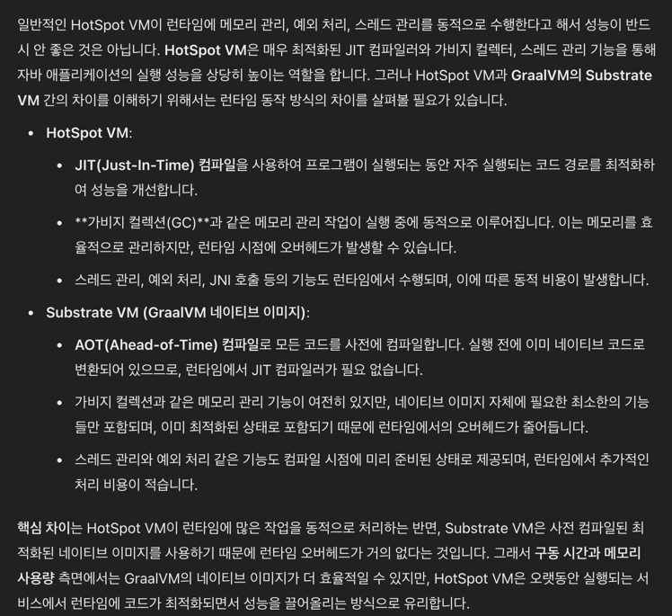
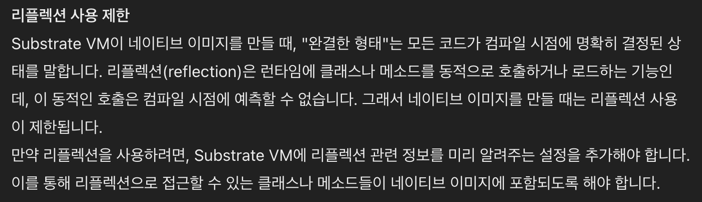

# 1. 자바 기술 시스템 소개

## Java의 등장
Java는 1991년 James Gosling의 Green Project로 시작 되었고 1995년 Sun Microsystems에서 발표되었다.  
Java는 `어떤 플랫폼에서도 실행될 수 있는 프로그래밍 언어`라는 슬로건을 가지고 있다.   
이는 Java의 특징 중 하나인 `Write Once, Run Anywhere`를 의미한다.  

이러한 Java의 기술 시스템의 구조는 크게 5가지로 나눌 수 있다.  

- Java Programming Language
- Java Virtual Machine
- Class File Format
- Java Class Library API
- Open Source Third Party Libraries

## HotSpot VM

HotSpot VM은 JVM의 구현체 중 가장 널리 사용된다.   
sun, oracle JDK와 OpenJDK의 기본 JVM이다.  
HotSpot VM은 정확한 메모리 관리, hot code 감지를 제공한다.  
여기서 hot code란 자주 실행되는 코드를 의미하고 hot code 감지 기능은 `컴파일했을 때 효과를 가장 많이 볼 수 있는 코드`를 찾아내는 기능이다.    
동작 원리를 알아보면 자주 실행되는 코드를 찾아내고 이를 JIT 컴파일러가 해당 코드를 메서드 단위로 컴파일하여 최적화된 기계어로 변환한다.  
그렇기에 자주 호출되거나 반복되는 코드는 JIT 컴파일러에 의해 최적화되어 더 빠르게 실행된다.
인터프리터로 코드를 실행하다가 자주 실행되는 코드를 JIT 컴파일러로 최적화하여 실행하는 것이 HotSpot VM의 특징이다.

## GraalVM

GraalVM은 Oracle에서 2018년에 발표한 JVM이다.  
어디서든 더 빠르게 실행된다는 슬로건을 가지고 있으며 hot spot VM 위에 구축된 Cross Language Full Stack VM이다.   
여기서 `Cross Language Full Stack VM`이란 JVM위에서 돌아가는 언어 뿐만 아니라 LLVM 기반 컴파일러를 사용하는 C, C++, Rust와 같은 언어들, Javascript, WebAssembly, Python, Ruby, R등 다양한 언어를 지원한다.  
이 서로 다른 언어들을 하나의 메모리 공간에서 데이터를 주고 받을 수 있고 각 언어마다의 Native Library도 사용할 수 있다.  
GraalVM은 각종 언어의 소스 코드나 컴파일된 중간 코드를 인터프리터를 통해 GraalVM이 이해할 수 있는 중간 코드로 변환하고 이를 최적화하여 실행한다.  
프로그래밍 언어마다 런타임 환경 성능이 다르기 때문에 특정 상황에서 성능이 떨어질 수 도 있는데 GraalVM은 입력된 중간 표현을 자동으로 최적화하여 실행하기 때문에 오히려 Native Compiler보다 더 빠르게 실행될 수 도 있다.   
그렇기에 자주 호출 되면 오버헤드가 발생해서 성능이 떨어지는 JNI를 대체 할 수 있다.  

## 차세대 JIT 컴파일러

일반적으로 C1 컴파일러는 빠르게 컴파일하고 C2 컴파일러는 최적화를 많이 한다고 알려져있다.  
그런데 JDK10 버전부터는 Graal Compiler가 추가되었다.  
Graal Compiler는 C2 컴파일러를 대체하기 위해 만들어졌다.  
Graal Compiler의 특징은 컴파일된 코드의 품질은 더 좋게 유지하고 개발 효율과 확장성이 C2에 비해 비교도 안되게 좋다.  
그리고 C2컴파일러보다 복잡한 최적화나 공격적 예측 최적화를 적용하기에도 더 좋다.  
몇개를 제외한 대부분의 항목은 C2 컴파일러를 뛰어넘었다.  
이러한 성과 때문일까 Graal Compiler가 OpenJDK로 복귀한다는 소식이 정해지게 되었다.

## Native 를 향한 발걸음

현재 개발 트렌드는 Micro Service로 가고 있다.     
그렇기 때문에 서버는 가볍고 구동 시간이 빨라야 한다.  
하지만 Java는 JVM을 통해 실행되기 때문에 무겁고 느리다는 단점이 있다.  
일단 Java는 100MB가 넘는 JRE가 필요하기도 하기에 최신 트렌드에 맞지 않는다.  
Java 진영에서는 이러한 단점을 극복하기 위해 `실행하기 전에 네이티브 코드로 컴파일`하는 AOT 컴파일을 지원한다.  
AOT(ahead of time)은 JIT(just in time) 컴파일러와 반대 되는 개념으로 실행하기 전에 미리 컴파일하여 네이티브 코드로 만드는 것을 의미한다.  
JIT 컴파일러 같은 경우 일단 실행하고 자주 실행되는 코드를 최적화하는 것이고 AOT 컴파일러는 실행하기 전에 미리 컴파일을 하기 때문에 application 구동, 런타임 중 예열 과정이 필요 없게 되고 처음부터 최적화된 네이티브 코드를 실행할 수 있다.  
하지만 AOT 컴파일러는 Java의 슬로건인 `Write Once, Run Anywhere`를 깨는 것이기 때문에 Java의 특징을 잃게 된다.  
그래서 Java 진영에서는 이러한 단점을 극복하기 위해 `GraalVM`을 사용한다.    
GraalVM의 서브스트레이트 VM은 사전 컴파일된 네이티브 코드를 독자적인 예외처리, 스레드 관리, 메모리 관리, JNI 지원을 포함한 기능을 hot spot VM 없이 실행할 수 있는 이미지로 생성해준다.    
이때 포인터 분석 기술까지 사용하여 사용자 프로그램으로부터 도달 가능한 코드만 추리고 초기화도 진행한 뒤 네이티브 이미지에 담는다.  
그래서 기존 JVM이 수행하던 초기화 과정을 건너뛰고 프로그램을 곧바로 실행하기에 초기 구동 시간이 획기적으로 줄어든다.  
하지만 이 기술을 사용하려면 프로그램이 완결한 상태여야한다.  
여기서 완결한 형태란 컴파일러가 찾을 수 없는 코드나 Class Library를 동적으로 읽어 들이는 코드가 없어야 한다는 것이다.  

개인적으로 궁금했던 부분을 ChatGpt에게 물어보았다.

- `일반 hot spot vm은 메모리 관리, 예외 처리, 스레드 관리 를 런타임에 동적으로 해서 구동할 때 성능이 안좋다`는거야?

- `Class Library를 동적으로 읽어 들이는 코드가 없어야 한다면 리플렉션을 사용못한다`는거야?
