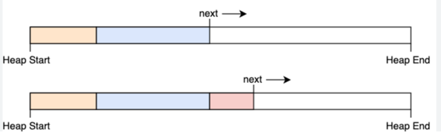
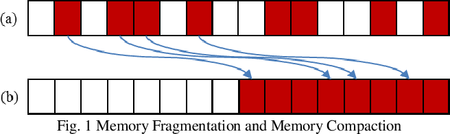

# 자바 메모리 영역과 메모리 오버플로우

## 런타임 데이터 영역

application이 실행될 때 생성되고 종료될 때 소멸되는 데이터를 저장하는 메모리 영역이다.  
이 런타임 데이터 영역은 여러 영역으로 나뉘어져 있는데 어떤 영역은 사용자의 요청에 따라 생성될 때도 있다.

### 프로그램 카운터

CPU 레지스터에서의 프로그램 카운터와 같은 역할을 한다.
스레드가 생성될 때마다 생성되고 실행 중인 JVM 명령의 주소를 가리킨다.  
예외 처리나 스레드 복원 같은 모든 기본 기능도 이 프로그램 카운터를 활용해서 이뤄진다.

### 자바 가상 머신 스택

메서드 호출 시 생성되는 스택 프레임을 만들어서 지역 변수 테이블, 피연산자 스택, 동적 링크, 반환값 등을 저장한다.  
지역 변수 테이블에서 데이터 타입을 저장하는 공간을 지역 변수 슬롯이라고 하며 이 슬롯은 컴파일 과정에 결정된다.  
이 부분에서 메모리 오버플로우 에러가 발생할 수 있는데 주로 스레드의 스택 크기가 가상 머신이 허용하는 크기를 초과할 때 발생한다.

### 네이티브 메서드 스택

네이티브 메서드 스택은 자바 가상 머신 스택과 비슷하지만 자바 코드가 아닌 네이티브 코드를 위한 스택이다.

### 자바 힙

java application에서 가장 큰 메모리 영역이며 거의 모든 객체 인스턴스를 저장하고 공유한다.  
아마 언어가 발전한다면 값 타입이 추가 될 수 있을 것이다.   
이 영역은 GC에 의해 관리되며 GC는 더 이상 참조되지 않는 객체를 찾아서 메모리를 회수한다.  
힙 메모리는 객체 할당 효율성을 높이기 위해 스레드 로컬 할당 버퍼(TLAB)을 여러개로 사용한다.  
이렇게 된다면 여러 스레드가 동시에 객체를 생성할 때 힙 메모리에 대한 경쟁을 줄일 수 있고 자바 힙 영역이 작아져서 GC의 부담을 줄일 수 있다.

### 메서드 영역

메서드 영역도 힙 영역과 같이 모든 스레드가 공유하는 영역이다.  
메서드 영역은 클래스 로더에 의해 로드된 타입 정보, 상수, 정적 변수, JIT 컴파일러의 코드 캐시 등을 저장한다.  
Java8 버전부터 permanent generation 영역에 저장되던 문자열 상수, 정적 변수등이 힙 영역으로 통합되었으며 GC의 대상이 되었다.   
원래 permanent generation 영역에 저장되던 데이터들은 GC가 돌지 않아도 되는 데이터들이었지만 이 문제로 메모리 누수가 발생할 수 있었다.

### 런타임 상수 풀

런타임 상수 풀은 클래스 버전, 필드, 메서드, 인터페이스 등 클래스 파일에 포함된 설명 정보와 컴파일 타임에 생성 되는 상수와 심벌 참조를 저장한다.  
심벌 참조란 클래스가 로딩, 해석, 초기화가 되었는지 확인하는 것을 의미한다.  
런타임 상수는 일반 상수 풀과 다르게 동적으로 생성되며 힙 영역에 저장되고 GC의 대상이 된다.(Java8 버전부터)

### 다이렉트 메모리

다이렉트 메모리는 Java에 NIO 패키지가 도입되면서 등장한 Channel, Buffer 기반의 I/O 처리를 위한 메모리 영역이다.  
힙이 아닌 네이티브 메모리를 사용하고 이 메모리에 저장되어 있는 DirectByteBuffer를 통해 작업을 수행한다.  
다이렉트 메모리가 등장함으로 인해 자바 힙과 네이티브 메모리 사이의 복사가 일어나지 않아 성능이 향상되었다.  `-> 이 방법을 조금 더 구체적으로 알고 싶다. 발표 때 다른 사람에게 물어봐야겠음.`  
당연히 운영체제에 의해 관리되는 OS의 메모리를 사용하기 때문에 메모리 총량에 제한이 있다.

## 핫스팟 가상 머신에서 객체 들여다보기

### 객체 생성

Java에서는 객체를 만들 때 new 키워드를 사용한다.  
이 new 키워드가 어떻게 동작하는지 알아보려면 구조를 알아야 한다.  
jvm이 new 키워드를 만나면 이 명령의 매개 변수가 상수 풀 안의 클래스를 가리키는 심벌 참조인지 확인한다.  
만약 상수 풀에 없다면 클래스 로더를 통해 클래스를 로드한다.  
이처럼 로드가 되었다면 메모리를 할당하고 해당 클래스의 메타데이터를 사용하여 객체를 생성한다.  
메모리에 할당이 된다면 그 때 객체의 크기가 결정된다.

이렇게 객체가 생성이 되었다면 사용중인 메모리에서 객체의 크기만큼 포인터를 이동시킨다.  
하지만 위 경우는 객체의 생성, 삭제가 규칙적일 때 발생하는 일이다.  
규칙적이지 않은 경우에는 위 방법이 문제가 될 수 있다.  
그래서 가용 메모리 블록들의 목록을 따로 관리해서 객체를 할당할 때마다 가용 메모리 블록을 찾아서 할당하는 방법을 사용한다.  
메모리를 동일한 크기로 여러 등분한 다음 메모리 블록에 객체를 할당한다고 생각하면 된다.  
이렇게 여러 공간에 메모리를 나눠서 할당하다보면 메모리가 조각화되어 큰 객체를 할당할 때 이 문제가 발생할 수 있고 메모리 블록을 찾기 어려워질 수 있다.

그래서 compaction이라는 방법을 사용해서 메모리 블록을 이동시켜서 연속된 공간에 할당하게 한다.  
compaction을 지원해주는 gc라면 단순하고 효율적인 메모리 할당을 할 수 있다.

#### TLAB

객체가 생성되고 포인터의 이동이 끝나기 전에 다른 객체가 생성되어서 메모리 블록을 차지할 수 있기 때문에 객체가 동시에 생성되는 상황을 고려해야 한다.  
이런 상황을 방지하기 위해 동기화 방법과 TLAB(Thread Local Allocation Buffer)를 사용한다.  
TLAB는 각 스레드 내부에 작은 크기로 가용 메모리 블록을 미리 할당한다.  
TLAB의 용량이 다 차게 되면 추가로 메모리를 할당받는다.  

### 객체 메모리 레이아웃
핫스팟 가상 머신은 객체를 메모리에 저장할 때 효율적으로 저장하기 위해 3부분으로 나눠서 저장한다.  

#### 객체 헤더
객체 헤더는 객체의 메타데이터를 저장하는 공간이고 객체 헤더도 아래와 같이 총 3부분으로 나뉜다.

 - 마크워드 : 해시 코드, GC 정보, 락 정보 등을 저장한다.  
 - 클래스 워드 : 객체가 클래스 메타데이터(어떤 클래스의 인스턴스인지)를 가리키는 포인터를 저장한다.  
 - 배열 길이 : 객체가 배열일 경우에 배열의 길이를 저장한다.

#### 인스턴스 데이터
인스턴스 데이터는 필드 관련 내용, 부모 클래스 유무, 보무 클래스의 필드 등 모든 필드가 이 부분에 저장된다.  
여기서 필드 관련 내용은 필드의 타입, 접근 제어자, 필드의 값 등을 저장한다.  

#### 정렬 패딩
정렬 패딩은 모든 객체의 크기를 8의 배수로 맞추기 위해 사용한다.  

#### 핸들
핸들은 객체가 어떤 인스턴스를 가리키는지, 객체 타입이 무엇인지 등을 가르키는 포인터이다.  
핸들은 객체의 참조를 가리키는 포인터이기 때문에 객체가 이동해도 핸들은 변하지 않는다.  

#### 다이렉트 포인터
다이렉트 포인터는 핸들과 다르게 객체 인스턴스 자체를 가리키는 포인터이다.  
핸들과 동일하게 객체 참조를 가리키기도 한다.
이러한 이유는 성능 때문인데 핸들을 사용하면 객체를 참조할 때마다 핸들을 참조해야 하기 때문에 성능이 떨어진다.  

## OutOfMemoryError

### 자바 힙 메모리 부족

## StackOverflowError

### 상수 풀 오버플로우

### 네이티브 다이렉트 메모리 오버플로우 