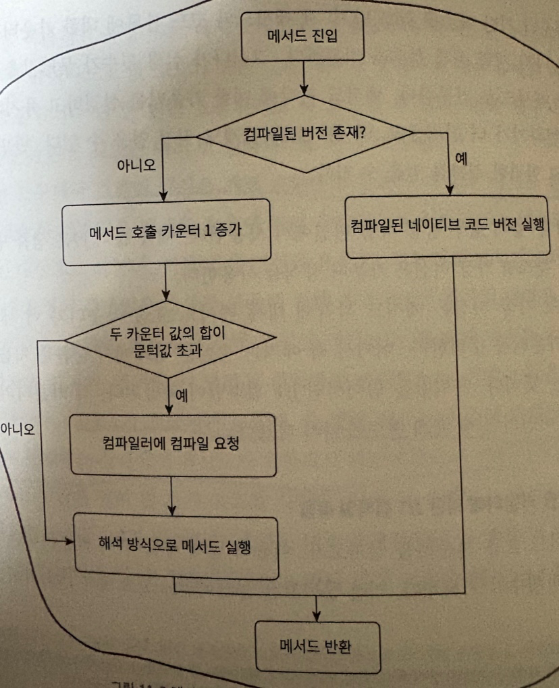
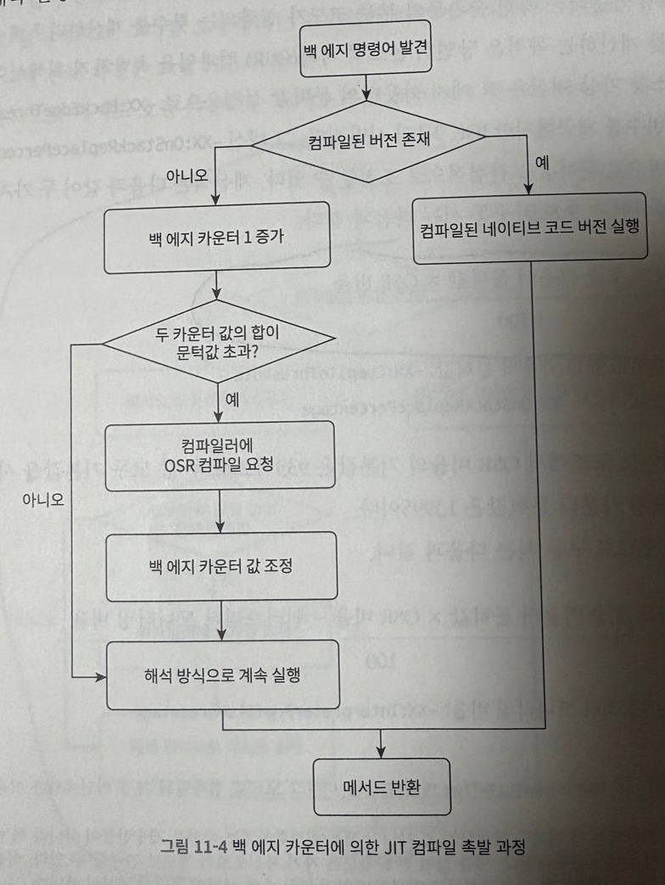
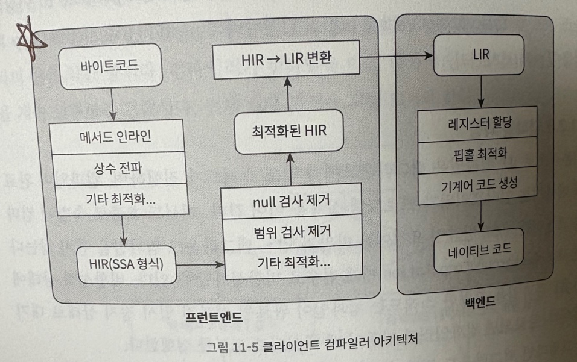

# 백엔드 컴파일러 최적화

프론트엔드 컴파일러와 다르게 백엔드 컴파일러는 네이티브 코드로 변환하는 과정을 담당한다.  
이 과정에서 프론트엔드 컴파일러에서 생성된 중간 코드를 최적화하고, 최종적으로 네이티브 코드로 변환한다.

## JIT 컴파일러

JIT 컴파일러는 런타임에 실행 효율을 높이는 최적화를 담당한다.  
자주 실행되는 메서드나 코드 블럭이 발견되면 해당 코드를 네이티브 코드로 컴파일하고 다양한 최적화 기법을 적용해서 실행 효율을 높인다.  
이런 코드 블록을 핫스팟 코드, 핫 코드라고 불리며, JIT 컴파일러는 이런 핫 코드를 런타임에 찾아내서 최적화한다.

### 인터프리터와 컴파일러

프로그램을 빠르게 실행해야할 땐 인터프리터가 컴파일 과정 없이 먼저 실행한다.  
이렇게 실행된 후 시간이 지날수록 컴파일러의 역할이 커지게 된다.  
그런데 꼭 컴파일이 된다고 해서 장점만 존재하는 것은 아니다.  
예를 들어 컴파일된 네이티브 코드 같은 경우 별도의 메모리에 저장되기 때문에 메모리 사용량이 늘어난다.  
또 원본 코드와 네이티브 코드가 동기화되어야 하기 때문에 코드 변경이 빈번하게 일어날 때는 컴파일된 코드를 다시 컴파일해야 한다.  
그렇기 때문에 메모리가 부족한 환경에서는 인터프리터 방식으로만 동작하게 해서 메모리 사용량을 줄일 수 도 있다.  
참고로 인터프리터와 컴파일러가 혼홥해서 사용하는 방식은 혼합 모드라고 한다.

JIT 컴파일러가 바이트코드를 네이티브 코드로 컴파일하려면 시간이 걸리는데 당연하게도 코드 블럭이 크거나 많이 할 수록 컴파일 되는 시간도 증가한다.  
그리고 인터프리터가 프로파일링(성능 모니터링)을 진행하면서 자주 사용된다고 판단되는 코드 블럭을 찾아내고 JIT 컴파일러에게 넘겨주는 작업도 성능에 영향을 준다.  
이렇듯 프로그램을 시작 속도와 운영 효율의 사이에서 최상의 균형을 잡기 위해 핫스팟 가상 머신은 컴파일 서브시스템에 계층형 컴파일 기능을 추가했다.

- 계층 0: 인터프리터가 성능 모니터링을 키지 않은 채 순수하게 해석 실행한다.
- 계층 1: 클라이언트 컴파일러를 사용해서 바이트코드를 네이티브 코드로 컴파일한다. 이때 간단하고 안정적인 최적화만 수행하고 성능 모니터링을 키지 않는다.
- 계층 2: 이때도 클라이언트 컴파일러를 사용하고 메서드, 반환 횟수 통계와 같은 몇가지 성능 모니터링만 진행한다.
- 계층 3: 이때까지 클라이언트 컴파일러를 사용하고, 분기 점프와 가상 메서드 호출 버전 등 모든 성능 모니터링 정보를 수집한다.
- 계층 4: 서버 컴파일러를 사용하고 이때부터는 성능 모니터링 정보를 기반으로 오래 걸리는 최적화까지 수행한다. 이때 신뢰도가 낮은 공격적인 최적화도 수행한다.

지금까지를 요약하자면 빠르게 컴파일해야할땐 클라이언트 컴파일러를 사용하고 안정적으로 모니터링 정보가 수집되고 성능을 더 높여야할 때는 서버 컴파일러를 사용한다.  
서버 컴파일러가 매우 복잡한 최적화 알고리즘을 수행해야할때는 클라이언트 컴파일러로 간단하게 최적화를 하고 서버 컴파일러로 넘겨서 천천히 최적화를 수행한다.

### 컴파일 대상과 촉발 조건

핫 코드로 분류 되는 조건은 여러번 호출되는 메서드, 여러번 실행되는 순환문의 본문이 대표적이다.  
그리고 이 두 분류 모두 개별 순환문의 본문이 아니라 메서드 전체가 컴파일의 대상이 된다.  
이때 발생하는 이슈 중 하나는 온스택 치환이다.  
온스택 치환은 간략하게 실행 중인 코드의 특정 부분을 동적으로 다른 코드로 교체하는 기술이다.  
여기서 중요한건 메서드가 실행되는 도중에 해당 메서드의 스택 프레임이 여전히 스택에 존재하는 상태에서 메서드의 본문을 다른 코드로 교체하게 된다.

특정 코드 블록이 핫 코드인지 아닌지 판단하 동작을 핫스팟 탐지라고 한다.  
핫스팟을 탐지하기 위해서 크게 두가지 방법이 존재한다.

1. 샘플 기반 핫스팟 코드 탐지: 각 스레드의 호출 스택 상단을 주기적으로 모니터링하고 특정 메서드가 여러번 호출되는지 확인한다. 그런데 여기서 문제는 스레드가 블로킹 당할 때나 외부 요인에 의해서 스레드 탐지를
   방해가 되는 경우가 많기 때문에 정확도가 떨어지기도 한다.
2. 카운터 기반 핫스팟 코드 탐지: 각 메서드나 코드 블록에 대한 카운터를 설정하고 개별 실행 횟수를 별도로 저장한다. 그러다가 실행 횟수가 일정 횟수 이상이 되면 핫스팟으로 판단한다. 이 방법은 샘플 기반
   방법보다 정확도가 높다. 하지만 구현의 난이도가 높다.

---
메서드 호출 카운터에 의한 JIT 컴파일 촉발 과정

---

카운터 기반 핫스팟 코드 탐지를 할 때 백 엣지 카운터가 카운팅 경계값을 계산한다.  
백엣지 카운터가 횟수를 계산하는 이유는 온스택 치환을 수행할 때 호출 스택에 존재하는 메서드의 실행 횟수를 알아야 하기 때문이다.  
클라이언트 컴파일러는 `(메서드 호출 카운터 문턱값 * 온스택 치환 비율) / 100`으로 계산해서 백엣지 카운터를 계산한다.  
서버 컴파일러는 `(메서드 호출 카운터 문턱값 * 온스택 치환 비율 - 인터프리터 모니터링 비율) / 100`으로 계산해서 백엣지 카운터를 계산한다.

---
백 에지 카운터에 의한 JIT 컴파일 촉발 과정

---

---
클라이언트 컴파일러 아키텍쳐

---

### 서버 컴파일러의 컴파일 과정

서버 컴파일러는 대표적으로 `죽은 코드 제거, 순환문 언롤링, 순환문 표현식 호이스팅, 공통 하위 표현 제거, 상수 전파, 기본 블록 재정렬` 등등 다양한 최적화 기법을 사용한다.  
또 범위 검사 제거, null 검사 제거와 같은 자바 언어에 특화된 최적화도 수행한다.  

## AOT 컴파일러

JIT 컴파일러는 런타임에 컴파일을 진행하지만 AOT 컴파일러는 빌드 타임에 백엔드 컴파일을 진행하고 캐시에 저장한 뒤 다음번 실행 때 캐시된 네이티브 코드를 사용한다.  
JIT 컴파일러 같은 경우에는 런타임에 컴파일을 진행하기 때문에 런타임에 컴퓨팅 자원을 더 많이 사용하지만 AOT 컴파일러는 빌드 타임에 컴파일을 진행하기 때문에 런타임에 컴퓨팅 자원을 덜 사용한다.  
아무리 최신 JIT 컴파일러가 계층형 컴파일을 지원해서 빠르게 컴파일을 진행한다고 해도 결국 런타임에 컴파일을 진행되기 때문에 런타임 리소스가 더 많이 사용된다.  

시간이 가장 오래 걸리는 최적화는 프로시저간 분석(전체 프로그램 분석)이다.  
이 분석에서는 특정 변수의 값이 상수여야 하는지, 특정 코드 블록이 전혀 사용되지 않는지, 특정 시점의 특정 가상 메서드 호출 시 버전이 하나뿐인지 등을 분석한다.  
이런 분석은 전체 프로그램을 분석해야 하기 때문에 시간이 오래 걸린다.  
이런 작업을 하는 이유는 고품질의 최적화 코드를 얻기 위해서 진행하지만 시간이 매우 오래 걸리기 때문에 성능에 영향을 줄 수 있다.  
그래서 자바 가상 머신 대부분은 이러한 프로시저간 분석을 부분적으로만 수행한다.  

지금까지는 JIT 컴파일러에 대해서 알아봤는데 위에서 말했던 내용을 기반으로 AOT 컴파일러에 대해서도 알아보려한다.  
AOT 컴파일러는 위에서 말했던 프로시저간 분석을 하면서 느려지는 문제에 대해서 빌드 타임에 컴파일을 진행해서 이런 문제조차 발생시키지 않는다.  
하지만 처음 실행할 때는 네이티브 이미지를 만들기 때문에 다소 느릴 수 있지만 그렇게 사용자가 체감을 할 정도로 느리지는 않다.  

이렇게 보면 AOT 컴파일러가 JIT 컴파일러보다 더 좋아 보이지만 꼭 장점만 있는 것은 아니다.  
AOT 컴파일러 같은 경우는 많이 사용될 코드를 미리 예측해서 컴파일을 진행하기 때문에 정확도가 JIT 컴파일러보다 떨어진다.  
JIT 컴파일러는 실제로 많이 호출되는 메서드를 카운팅해서 컴파일을 진행하기 때문에 정확도가 높다.  
정확도가 높으면 당연하게도 레지스터나 캐시와 같은 하드웨어 자원을 더 효율적으로 배분해서 성능을 극한까지 끌어올릴 수 있다.  
JIT 컴파일러의 또 다른 장점은 링크 타임 최적화를 지원한다는 것이다.  
AOT 컴파일러는 다른 언어와 연동할 때 런타임에 연동을 해야하는데 JIT 컴파일러는 링크 타임 최적화를 지원하기 때문에 더 효율적으로 연동할 수 있다.  
AOT 컴파일러는 최적화를 진행 할 때 경계가 존재하는 동적 링크 라이브러리를 호출하기 매우 어렵다.  
메인 프로그램 코드와 동적 링크 라이브러리는 완전히 독립적으로 컴파일이 진행되기 때문이다.  
간략하게 코드 작성자와 컴파일된 시간, 컴파일러가 모두 다르기에 이론적으로 최적화가 가능하다해도 구현의 난이도가 매우 높다.  

## 컴파일 최적화 기법 

JIT 컴파일러나 AOT 컴파일러 모두 프로그램 코드를 기계어로 변환하는 것이 목적이다.  
출력 코드가 얼마나 잘 최적화되었는지가 컴파일러의 우수성을 판단하는 기준이 된다.  
이제 우리는 최적화 기법에 대해서 알아보겠다.

메서드 인라인은 고전적인 컴파일 원칙, 최적화 이론에 따르면 자바 메서드는 최적화 할 수 없다고 나와있다.  
invokespecial로 호출된 private 메서드나 인스턴스 생성자, 슈퍼 클래스의 메서드, invokespecial로 호출된 정적 메서드가 여기에 해당한다.  

---
일단 여기까지 정리하고 다음에 이어서 작성하겠습니다.